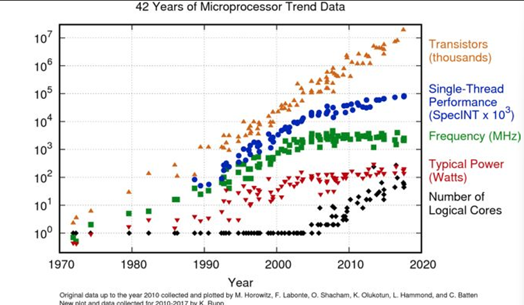

# Introducción 

## Conceptos de materias anteriormente vistas

    • Programación concurrente: Sincronizar procesos.
    • Paralelizar tareas o concurrencia de las mismas  pero en los recursos más allá de un mismo sistema, sino que en distintos.

## ¿Qué es la programación distribuida?

La programación distribuida es un paradigma de programación que se encarga de la comunicación entre procesos que se ejecutan en distintos sistemas, es decir, en distintos nodos de una red.

## Ley de Moore 

La ley de Moore es una observación empírica que establece que el número de transistores en un microprocesador se duplica aproximadamente cada dos años.

## Algunas definiciones de sistemas distribuidos 

* “Colección de computadoras independientes que el usuario ve como un solo sistema coherente” (Tanenbaum) 

* “Es un sistema de computadoras interconectadas por una red que se comunican y coordinan sus acciones intercambiando mensajes” (Coulouris) 

* “Aquel en el que el fallo de un computador que ni siquiera sabes que existe, puede dejar tu propio computador inutilizable” (Lamport)

Desglose de las definiciones: 

• Colección de computadoras  =>  multiprogramación 

• Independientes  =>  autónomos 

• Un solo sistema  =>  el usuario no conoce su distribución 

• Interconectadas por red  =>  sistemas aislados no son distribuidos 

• Comunican y coordinan acciones  =>  colaborativos 

• Intercambiando mensajes  =>  protocolos de comunicación 

Fallo de un computador  =>  nuevos problemas no determinísticos. Hay cosas que van a fallar y no se ni dónde ni como suceden. Puede pasar que uno  de los procesos que se estan ejecutando en un servidor se caiga y por lo tanto los demás servidores fallen.

## Parametros de diseño

* Transparencia: El usuario no tiene que saber que está trabajando con un sistema distribuido.

* Escalabilidad: Capacidad de añadir más nodos a la red.

* Tolerancia a fallos: Si un nodo falla, el sistema sigue funcionando. 

* Acceso a recursos compartidos: Poder acceder a recursos que están en otros nodos.

* Sistemas distribuidos abiertos: Poder añadir nuevos nodos a la red sin tener que cambiar el sistema.

    * Interfaces, Interoperability, Portability
    
     
## Modelos para el analisis

El modelo de eventos se basa en que un evento paso antes que otro. Lo que más importa en este caso es que los eventos previos de los procesos son la causa de lo que esta sucediendo ahora.

## Topologías de comunicación 

## Centralizados vs distribuidos 

### Centralizados

* Sin conexión 
* Con conexión pero: 
    * Sin trabajo colaborativo
    * Sin un objetivo común
    * Sistemas de tiempo compartido: 
    * Terminales de conexión 

* Muy dificiles de escalar:
    * CPUs, Memoria, HD

### Distribuidos

Componentes conectados y:
* Realizando trabajo colaborativo
* Buscando un objetivo común 

Escalan distribuyendo trabajo y recursos:
* Nodos, regiones, canales

## Ventajas de centralizar 

* **Control**: lógica de control muy simple, efectiva y, en ocasiones, eficiente. 
* **Homogeneidad**: la centralización incita a definir estándares para software y hardware. 
* **Consistencia**: es posible definir fuertes políticas de consistencia de información y monitoreo del estado global del sistema. 
* **Seguridad**: se disminuye la 'superficie de ataque' frente a amenazas.

## Ventajas de Distribuir 

* **Disponibilidad**: aún frente a fallos aislados, el sistema general puede prestar servicios. 
* **Escalabilidad**: mejores alternativas de adaptarse a nuevas escalas 
* **Reducción de Latencia**: al favorecer principios de localidad de recursos. 
* **Colaboración**: permite interacciones entre sistemas de forma orgánica y natural. 
* **Movilidad**: no están circunscriptos al alcance de un único computador. 
* **Costo**: componentes más simples. Subsistemas delegados en servicios terceros.

## Conceptos 
* **Centralizar** implica la concentración de la autoridad en los niveles más altos de un jerarquía. 
* **Descentralizar** implica transferir la toma de decisiones a eslabones inferiores de cierta organización. 
* **Distribuir** implica utilizar un modelo descentralizado de control de computadoras para la coordinación de actividades con una coherencia dada.

## Ley de Conway 

La ley de Conway establece que las organizaciones que diseñan sistemas están limitadas a producir diseños que son copias de la comunicación de esas organizaciones.

# Virtualización

* Necesidad de independencia real de los recursos
    * Seguridad en el acceso 
    * Diferenciación en instrucciones con privilegio y sin privilegio

* Hypervisor(Virtual Machine Vector)
    * Manager de VMs
    * Emulación de Hardware Capabilities
    Administración de recursos de host OS hacia el guest OS 
    * Implementación de mecanismo de seguridad

## Docker 

* Desarrolado en Golang 
* Pierma versión en 2013
Basado fuertemente en features provisots por el kernel del OS y el Hypervisor:
    * Linux: cgroups, namespaces, union mount 
    * Mac: recientemente soportado con HyperKit
    * Windows: recientemente soportado con Hyper-V

* Rápida adopción por parte de la industria 
    *Kubernetes, AWS, GCP, Azure, etc.

### Soporte de OS

* Namespace: Aisliamiento de recursos
    * NET (Network Stack)
    * PID (Process ID)
    * MNT (Mount Points)
    * USER (User and groups ID)

* Cgroups: Seguridad y administraciónde recursos
* Union Mount: Multiples directorios vistos como uno
 
### Engine

* Docker Daemon:
    * Es el proceso que corre en segundo plano y se encarga de administrar los containers del sistema.    
    * Manejo de todos los recursos(imagenes, volumes, networks, containers, etc.)
    * Nueva funcionnalidad a través de Plugíns(Ej. [convoy](https://github.com/rancher/convoy)).

* Docker REST API
    * Interfaz de comunicación con el Daemon
    * Sumamente flexible 
    * Fácil de crear nuevos clientes con funcionalidades específicas

* Docker CLI (interfaz de linea de comandos)
    * Acceso de REST API a través de unix socket
    * Gran cantidad de conmandos disponibles 

### Conceptos básicos 

* **Dockerfile**
    * Secuencia de comandos que genera la imagen
    * Instalación de dependencias y librerias 
    * Cada comando agrega un nuevo layer
    * Agregado de archivos a utilizar 

* **Imagen**
    * Bloques estáticos construidos a traves de dockerfile 
    * Distros de Linux proveen base imagenes (Unbutu, Debian, Centos, Alpine, etc.)     
    * Se puede reutilizar para contruir nuevas imagenes

* **Container**
    * Ejecución de comandos dentro de una imagen
    * Kernel compartido entre el Host OS y el Container
    * Al terminar el comando ejecutar, el container deja de existir 
    * No proveen la persistencia 

* **Volume**
    * Directorios compartidos entre el Host OS y el Container
    * Necesario para dar persistencia a las aplicaciones 

 

### Docker Compose

* Desarrollado en Python 
* Administración de multiples containers
    * DNS resolution 
    * Container en la misma red por defecto

* Configuración a través de un archivo YAML
    * Definición de servicios
    * Definición de redes
    * Definición de volúmenes
    * Intutitivo 
    * Mayoria de los comandos de docker disponibles

