# Datos en sistema a gran escala

<div style="text-align: center;">
   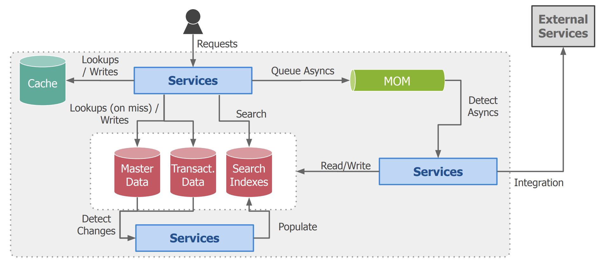
</div>

Arquitectura donde nos llegan muchos request y muchos datos.

Tenemos servicios que responden a los request y tenemos distintos tipos de almacenamiento de datos:

- Master Data: Se almacenan las entidades que tienen poco crecimiento. Datos limitados por definición(cantidad de provincias, localidades, etc).

- Transaction Data: Donde se van acumulando más registros a medida que se venden más elementos por ejemplo.

- Search Indexes: Los usuarios suelen hacer busquedas de algun tipo. Cada vez que escribo un indice suelo tardar mucho tiempo, entonces lo que hago es ver la información que cambia dentro de un servicio y lo que hago es actualizar el indice, para que cuando el usuario busque no tenga que esperar tanto tiempo.

Para que los servicios puedan responder rapidamente hay una cache de datos que se va actualizando constantemente, y se va guardando en memoria para que los servicios puedan responder rápidamente.

En el caso que tenga una gran cantidad de usuarios con una gran demanda de recursos lo que se hace es tomar las consultas de forma asincrónica, y se van guardando en una cola de mensajes, y luego son procesados por un servicio que vuelve a repetir los pasos anteriores, actualizando la cache y el indice de busqueda.

## Transaction data - Relacional vs NoSQL

**Relacional**

- Predomina hasta 2010 con la estandarización de SQL. Almacenamiento en tablas y filas.
- Buen soporte para joins, relaciones many-to-one o many-to-many

**No relacionales**

- A partir del 2010, la industria impone otros almacenamientos: clave-valor, documentales, orientadas a grafos, columnares.
- Beneficios claros para modelos afines: sin relaciones, one-to-many (jerárquicos), alta conectividad (grafos).
- Se adapta mejor a modelos con esquemas (schemas) cambiantes o no definidos.

## Transaccional (OLTP) vs Analítico (OLAP)

- Online Transaction Processing (OLTP): Orientado a unidades lógicas: grupos de reads/writes (o transacciones). No necesariamente ACID. Son las que usamos todos los días.

- Online Analytical Processing (OLAP): Orientadas a analizar un conjunto de datos. Grandes procesamientos de funciones de agregación sobre enorme cantidad de datos.

<div style="text-align: center;">
   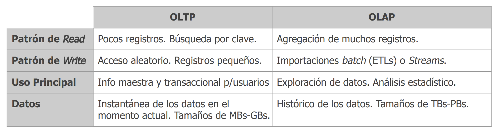
</div>

## Almacenamiento

### Relacional - OLTP

- Normalmente: Un archivo de alamacenamiento por tabla.
- Relaciones entre tablas: Foreign keys.
- Lectura de toda la fila para retornar proyecciones.

<div style="text-align: center;">
   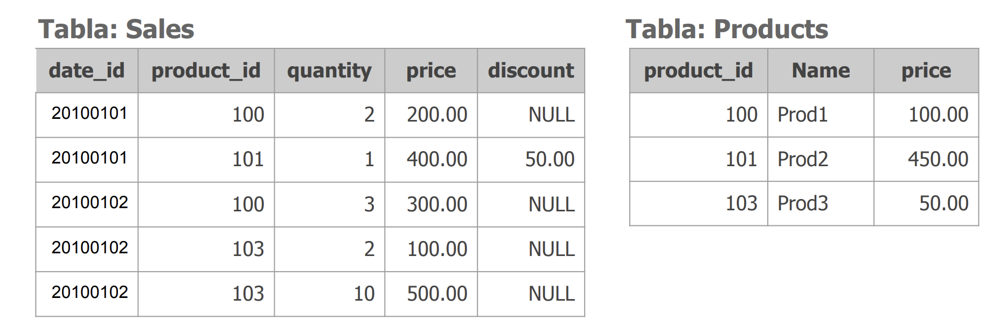
</div>

En este caso vamos a tener que la tabla de ventas va a ser la **tabla de transacciones** y la tabla de productos va a ser la **tabla maestra**.

Se hacen operaciones fila a fila.

### Columnar - OLTP

- Normalmente: Un archivos de almacenamiento por columna.
- Lectura de cada columna para retornar proyecciones.
- Grandes beneficios para compresión, lectura y agregaciones.

Se puede hacer con tablas relacionales pero se considera NoSQL por definición.

<div style="text-align: center;">
   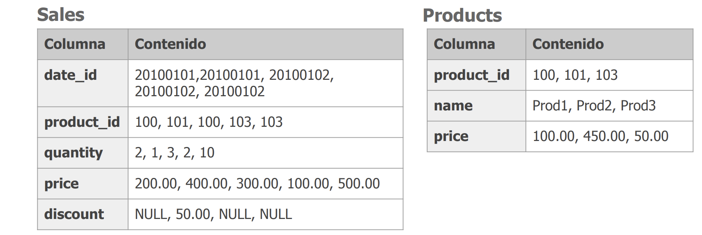
</div>

Es muy usando cuando los valores de los campos se repiten mucho. En el caso de ejemplo, los valores de los precios se pueden repetir mucho, porque los productos son siempre los mismos. Una compresión en este caso puede ser muy eficiente, porque los datos tienen mucho que ver entre sí(a esto me refiero que los datos son de la misma magnitud, medida, etc).

Esto puede no darse en la situación en el caso de la tabla por filas, porque los datos pueden ser muy variados, y no se puede hacer una compresión eficiente.

También es eficiente en el caso de querer hacer por ejemplo un SELECT COUNT(\*) FROM ventas WHERE precio > 1000, porque en este caso no necesito leer toda la fila, sino que solo necesito leer la columna de precios.

### Cubos de información - OLAP

- Normalmente: mantienen vistas materializadas con pre-calculós estadisticos.
- Se crean grillas agrupadas por diferentees dimensiones.
- Operaciones como SUM, COUNT, AVG, etc. se consultan a estos cubos.

<div style="text-align: center;">
   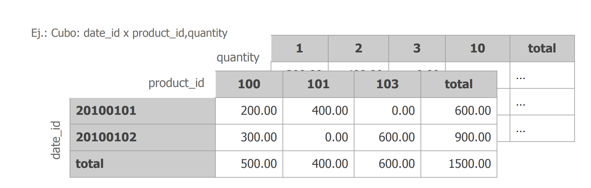
</div>

Suele haber vistas que ya hacen el precalculo de los datos, y se pueden consultar directamente. Esto es muy eficiente para hacer consultas de agregación, porque no tengo que hacer el cálculo en el momento, sino que ya tengo los datos precalculados.

# Particiones y replicaciones

## Replicación

### Leader base

- Una replica se designa como master o leader.
- Otras replicas se designan como slaves o followers.
- Solo se aceptan escrituras en el master.
- Tanto el master como los slaves pueden leer.
- La replicación se hace de forma síncrona o asíncrona.
- Problemas de la replicación:
  - Read your own writes: si escribo en el master, no puedo leer inmediatamente en el slave, porque todavía no va a estar actualizado.
  - Si escribo en el master no puedo hacer que la transacción termine cuando escribo en todos los slaves porque va a tardar mucho tiempo.
  - Monotonic reads: si leo en el master, no puedo leer en el slave.

<div style="text-align: center;">
   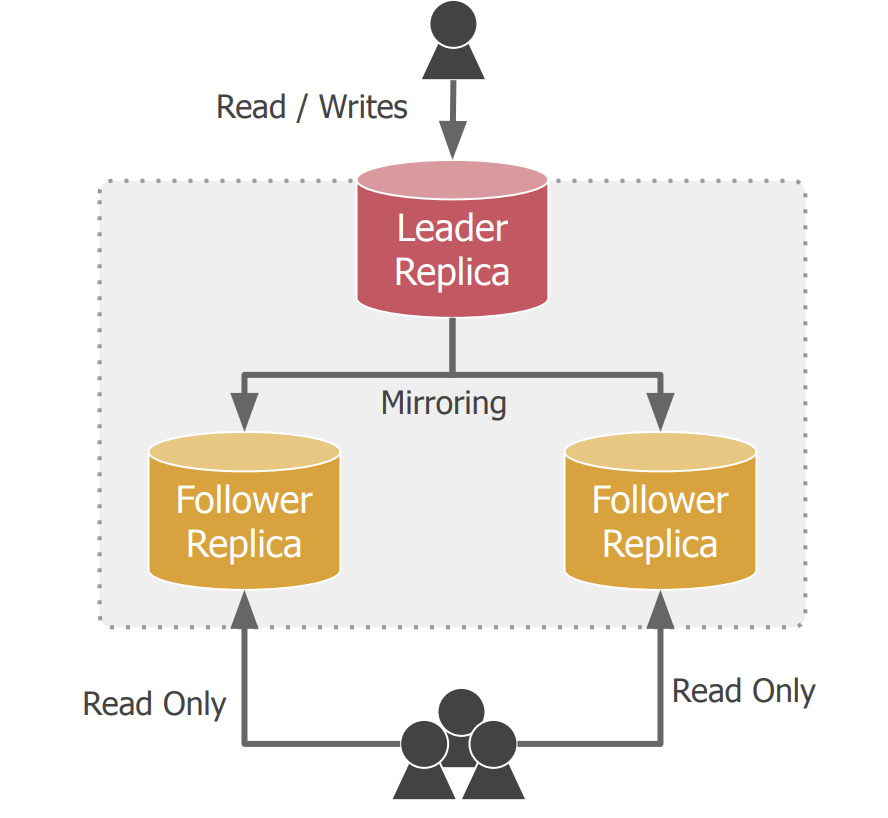
</div>

Hago la replicación porque quiero tener mayor performance, puedo hacer muchas lecturas en todas las replicas. Entonces lo que se hace es tomar una foto(un espejo) de el leader para tener todas las replicas que quiera(followers).

Las replicas que son los followers, pueden leer, pero no pueden escribir. Solo el leader puede escribir.

### Multi-leader base

- Modelo normal en escenarios de múltiples data-centers.
- Frente a caídas de un data-center, se puede promover al otro como líder global.
- Problemas de la replicación:
- Idem a leader based más la posibilidad de conflictos por concurrencia.

<div style="text-align: center;">
   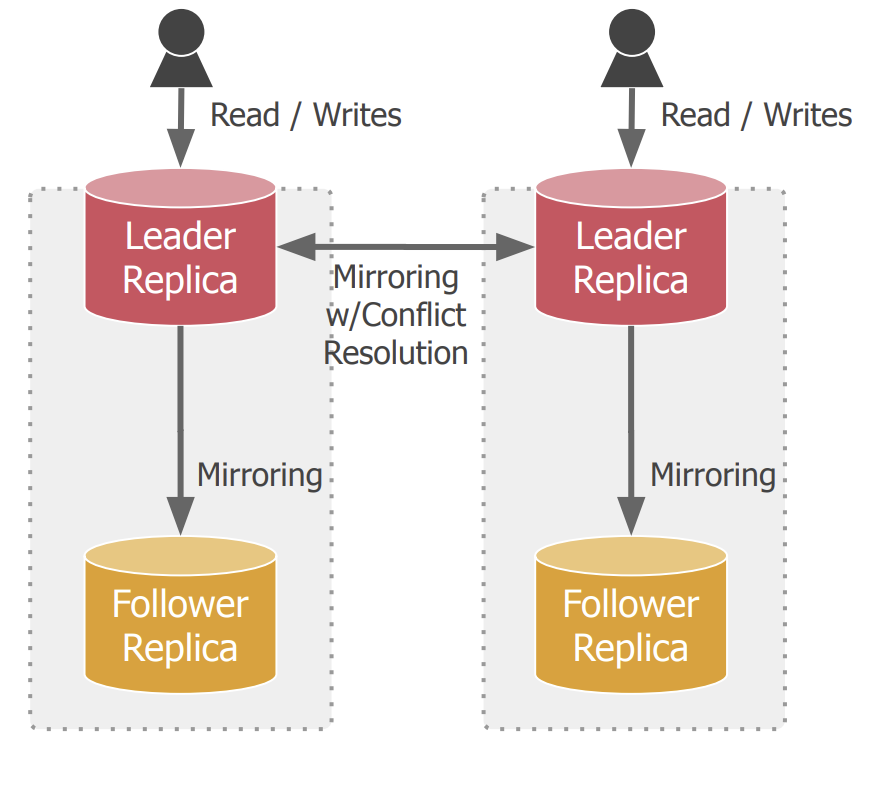
</div>

Es común tener este escenario cuando tengo separados la ubicación de los usuarios de forma física. Por ejemplo, si tengo usuarios en Argentina y en España, lo que hago es tener un leader en cada data center, y las replicas son los followers.

Complicaciones:

- integridad de relaciones.

- Claves incrementales: Cada uno de los lideres agregar un mismo registro pero con un id diferente, entonces tengo que tener una forma de resolver los conflictos.
- Manejo de triggers: Se coloca un evento y cuando se dispara dicho envento se ejecuta una acción. Entonces puede pasar que si pongo los trigger en un solo lado el otro no se va a enterar.

El protocolo de comunicación que se hace para hacer el mirroring es tener canales abiertos con las replicas. Se puede hacer de dos formas:

- Transacciones consistentes: Envian las mismas operaciones que recibieron esperando que el otro lado la pueda aplicar para luego responder al usuario
- Transacciones eventualente consistente: Le responden al usuario que todo esta bien y luego se encargan de enviar las operaciones a las replicas, en el caso de econtrar algun conflicto, le suelen encontrar solución dependiendo del caso.

### Leaderless base

- Sistema de replicación totalmente distribuido.
- Las replicas deben sicronizarse mutuamente.
- Se pueden definir topologías para la sincronización:
  - Anillo
  - Jerarquicas
  - Todos contra todos.
- Los conflicotos son muy frecuentes a menos que se particione.
- Otro metodo es obtener concenso de las repllicas para aplicar escrituras.

<div style="text-align: center;">
   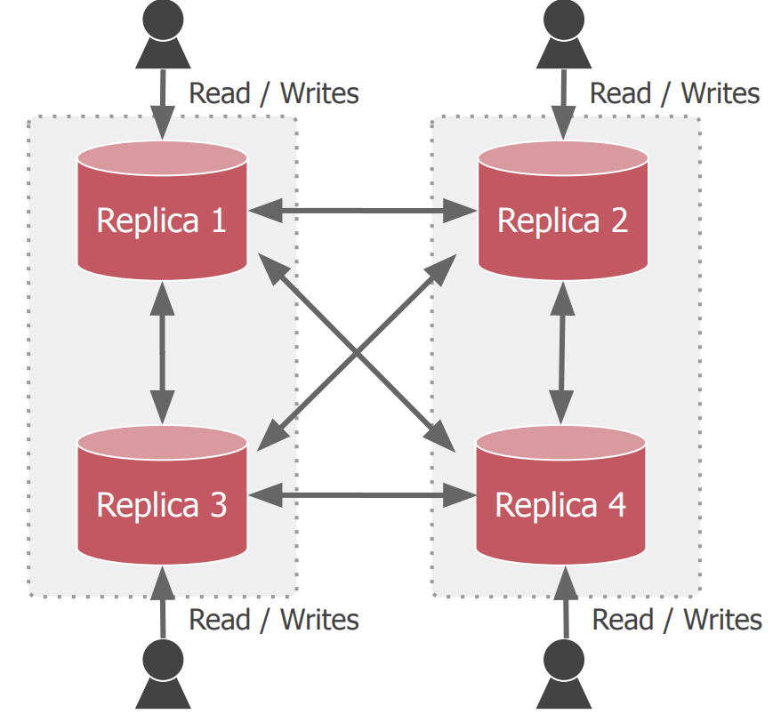
</div>

## Particionamiento

### Motivaciones

Distintos puntos de contacto con la estrategia de replicación:

- Performance:
  - Velociad de escritura y lectura.
- Conflictos:
- Evitar colisiones y/o resolución de conflictos.
- Redundancia:

  - Permite recuperación frente a fallos

<div style="text-align: center;">
    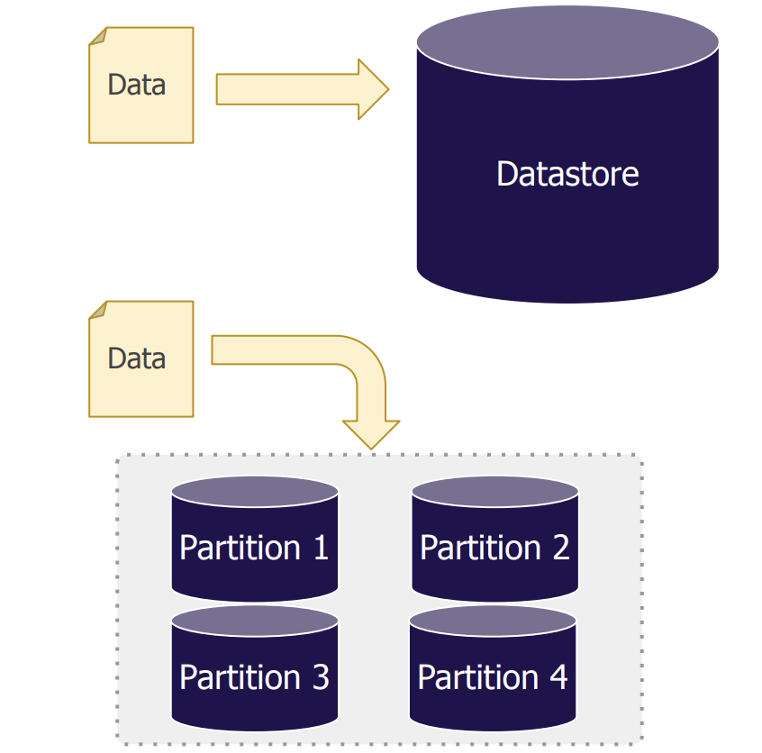
</div>

La escritura en una de las particiones no afecta a las otras, entonces puedo escribir en una partición y leer de otra partición sin problemas. Esto me permite tener una mayor performance, porque no tengo que esperar a que se escriba en todas las particiones.

Los criterios de particionamiento pueden ser por fecha, por usuario, por geolocalización, etc. Lo importante es que cada partición tenga una cantidad de datos similar para que no haya cuellos de botella en la lectura o escritura.

Con particiones puedo también hacer replicación, esto sucede si la función de hash no me daría una sola particion, sino que me daría varias. Entonces yo podría grabar el mismo registro en varios lugares a la vez, y podría leer de cualquiera de ellos. Entonces si se cae una partición, puedo seguir leyendo de las otras particiones sin problemas, en el tiempo que la otra partición se recupera.

### Particionamiento horizontal

- La información se segrega de a registros en entre cada partición.
- El registro se encuentra en UNA partición a la vez.

Se cortan coomo las tablas del modelo por filas.

<div style="text-align: center;">
    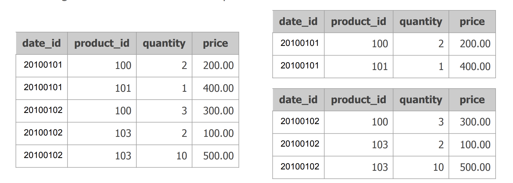
</div>

### Particionamiento vertical

- La información se segrega respecto a sus atributos entre cada partición.
- El registro se encuentra en TODAS las particiones.

<div style="text-align: center;">
    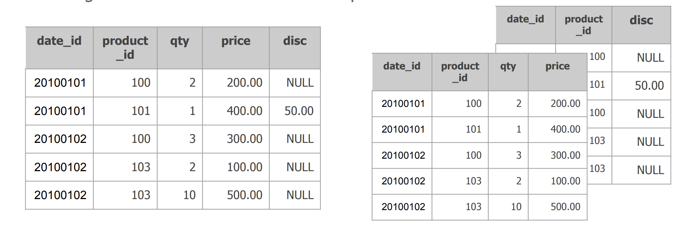
</div>

### Particionamiento - Enrutamiento

Puedo tener dos escenarios:

- Cuando conozco la función de particionamiento, puedo hacer un enrutamiento directo a la partición que me interesa.
- Cuando no conozco la función de particionamiento, puedo hacer distintas implementaciones para poder obtener la información:
  - Puedo intentar hacer un enrutamiento a una de las particiones y ver si tiene el dato que estoy buscando, en el caso de que lo tenga me lo devuelve, en el caso de que no, me va a indicar quien lo tiene para poder ir a busacarlo.
  - Puedo ir a un router(llamada sentinela) el cual tiene conocimiento de todas las particiones y de la función de hash y le responde al usuario a donde tiene que ir a buscar el dato.
  - El usuario tiene la función de hash y puede calcular a donde tiene que ir a buscar el dato.(también hay que tener la ip de cada uno de los nodos para poder hacer la consulta).

<div style="text-align: center;">
    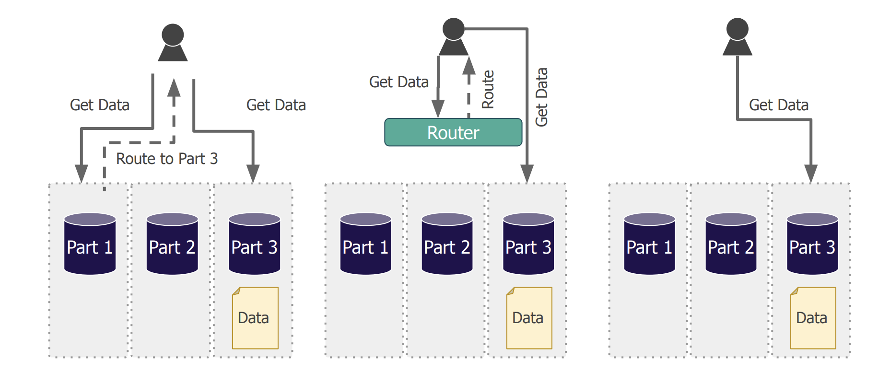
</div>

## Distributed Share Memory(DSM)

#### Objetivo

- Brindar la ilusión de una memoria compartida centralizada: Los algoritmos distribuidos pueden ser traducidos fácilmente.

#### Ventajas

- Muy intuitivo para desarrollo de sistemas distribuidos.
- Información conocida entre nodos sin que requieran conocerse.

#### Desventajas

- Desalienta la distribución, genera latencia, cuello de botella y punto unico de falla(arquitectura cliente-servidor).

### Enfoque Naive

- La inforamción es almacenada en memoria por el servidor.
- Los clientes acceden mediante request a escribir o leer paginas.
- El servidor puede garantizar la consistencia muy facilmente serializando los request.
- Muy baja performance para las aplicaciones cliente.

<div style="text-align: center;">
    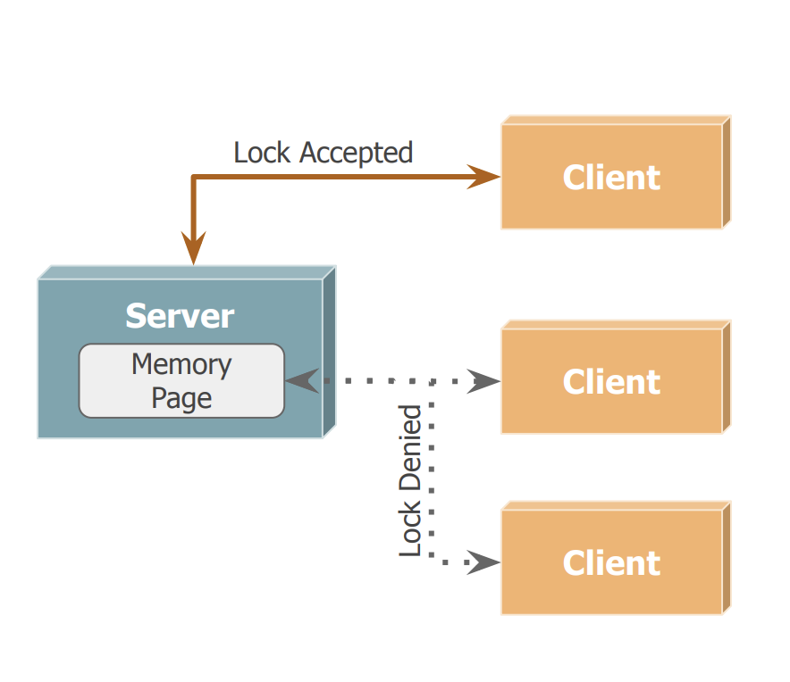
</div>

Todos los clientes saben que la información esta en el servidor y van a buscar la información ahí. Hay un problema de acceso a la lectura y escritura, porque si un cliente esta escribiendo, los otros clientes no pueden leer hasta que el cliente termine de escribir. Esto genera un cuello de botella en el servidor, porque todos los clientes tienen que esperar a que el servidor responda.

### Busca de más performance - Migración de Memory Pages

- La información es almacenada en memoria por el servidor y delegada a los clientes.
- Los clientes pueden optimizar la localidad de acceso pidiendo una memory page prestada.
- Otros clientes pueden pedir la misma página y quedar bloqueados, salvo que se permita una subdelegación.
- Garantiza consistencia. No se accede concurrentemente a las paginas.

<div style="text-align: center;">
    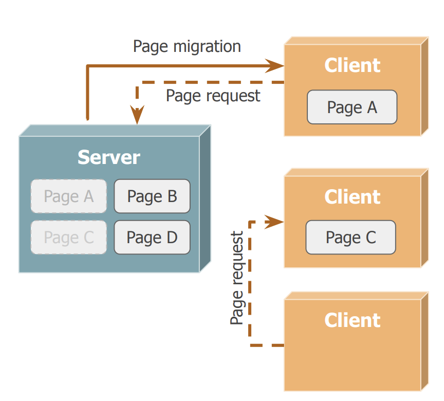
</div>

El cliente pide una pagina, si esta disponible, el servidor se la entraga al cliente, en el caso de que no, el cliente queda bloqueado hasta que la pagina este disponible. En el caso de que no esta la pagina disponible puede ir a preguntarle al cliente que la tiene si se la puede prestar, en caso afirmativo se hace la migración de un cliente a otro. Hay que tener en cuenta que la información del cliente que tiene la pagina es brindada por el servidor.

Los clientes no se hablan entre si para ejecutar operaciones.

### Replicación de Memory Pages (solo lectura)

- Favorece escenarios con muchas lecturas y pocas escrituras
- Las escrituras son coordinadas por el servidor
- Las lecturas implican una replicación de la página en modo read-only
- El servidor invalida las réplicas frente a cambios

<div style="text-align: center;">
    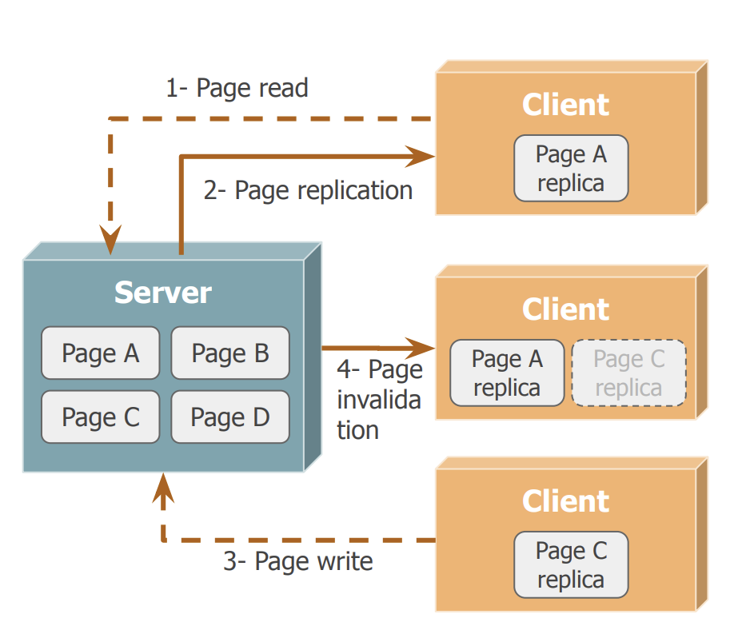
</div>

Las replicas de las paginas se piden solo para lectura, pero no se prestan sino que se duplican(mirroring).

Cuando alguien quiere hacer una escritura, el servidor que en este caso esta funcionando como lider lo que hace es que tienen que invalidar las replicas que tienen los cliientes, y el cliente tienen que volver a pedir la pagina al servidor.

#### Replicación de Memory Pages (lectura-escritura)

- El servidor mantiene las páginas de memoria hasta que los clientes las requieren
- Los clientes toman control total de las réplicas
- El servidor se transforma en un secuenciador de las operaciones
- El servidor aplica también los cambios ante caídas de los clientes

<div style="text-align: center;">
    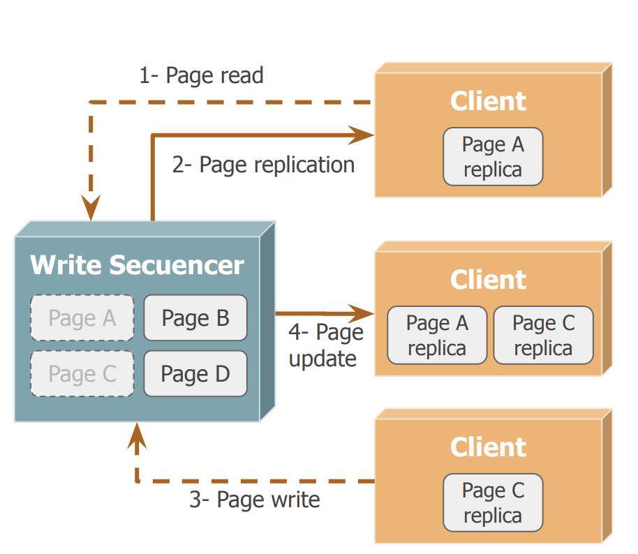
</div>

Sigue siendo replicación, pero en este caso el servidor funciona como un secuenciador de operaciones. Esto es así porque las paginas pueden estar en varios lugares a la vez y de alguna forma hay que comunicarlo a todos los lados que tenian esa replica que hubo un cambio en la misma. En este caso lo que hace el servidor cuando recibe una escritura es actualizar la pagina en el servidor y cada una de las replicas.

# Distributed File System(DFS)

Elemento que me permite escribir grandes aplicaciones y montarlas sobre este esquema de archivos.

## Motivaciones

- Para compartir archivos entre distintos nodos(en la red).
- Poseer un sistema centralizado de información persistente.

  - Control de Backups.
  - Control de acceso y monitoreo.

- Optimización de recursos por la concentración:
  - Discos de mayor capacidad permiten economizar
  - El costo de administración se reduce.

El DFS es el que hace la administración de los archivos y carpetas, y permite que los nodos puedan acceder a ellos de forma transparente. Esto es, que los nodos no tienen que preocuparse por donde esta el archivo, sino que pueden acceder a él como si estuviera en su propia máquina.

### Factores de diseño

- Transparencia a los clientes:
  - Acceso: obtención de los recursos con credenciales usuales
  - Localización: operación de los archivos como si fueran locales
  - Movilidad: el movimiento interno de archivos no debe ser percibido
  - Performance y Escala: las optimizaciones no deben afectar al cliente
- Concurrencia: el acceso concurrente no debe requerir operaciones particulares al cliente
- Heterogeneidad de Hardware: adaptación automática a diferentes HWs. El hardware puede no ser unico, puedo colocar discos rigidos de distintas cappacidades, marcas, y en distintas maquinas.
- Tolerancia a Fallos: capacidad de ocultar o minimizar los fallos (permitir operaciones como at-least-once o at-most-once)

## Caso de estudio | Network File System (NFS)

- Diseñado para ser independiente de plataformas (pero desarrollado sobre UNIX)
- Primera versión en 1984 por Sun Microsystems
- Requiere una nueva abstracción en el kernel: Virtual File System.
- Arquitectura de cliente-servidor utilizando RPC sobre TCP o UDP
- Las aplicaciones utilizan el VFS para acceder a los archivos, lo que requiere una invocación remota
- Los servidores proveen operaciones idénticas a las requeridas por Posix:
  - Soporta ser montado como una unidad virtual

<div style="text-align: center;">
    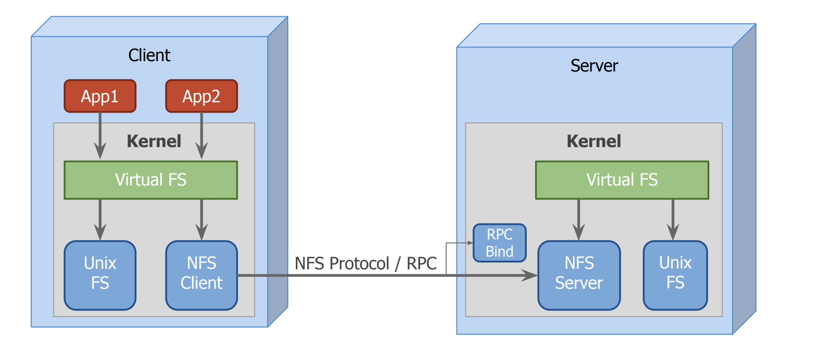
</div>

Sistema de archivos con un sistema operativo que se monta y que no termina estando en la misma computadora, sino que esta en otro lugar.

Linux lo que hace con esta implementación es acceder a los archivos pensando que es virtual, sabiendo que existe la posibilidad de que no este en la misma máquina, y entonces entonces lo que hacía UNIX era tener un cliente que se comunicaba con un servidor que tenía los archivos de verdad.

Esta nueva etapa hace que el proceso de escritura t lectura sea más lento. pero nos da control para poder acceder a los archivos que tenemos localmente y a aquellos que tenemos en otro lugar.

## Caso de estudio | Hadoop DFS (HDFS)

https://hadoop.apache.org/docs/stable/hadoop-project-dist/hadoop-hdfs/HdfsDesign.html#Cluster_Rebalancing

- Sistema de archivos distribuido diseñado para utilizar hardware de bajo costo
- Implementación de Apache basada en el diseño de Google File System (GFS)
- No soporta POSIX por lo que se lo considera un Data Storage en lugar de FS
- Base del ecosistema de tecnologías Hadoop para procesamiento distribuido.

### Factores de diseño

- Tolerancia a Fallos: Los fallos de HW son normales. Es más económico adaptarse que defenderse
- Volumen y Latencia: Favorece las operaciones de streaming y los archivos volumétricos frente operaciones de usuarios finales de baja latencia
- Portabilidad: Preparado para ser utilizado en hardware de bajo costo. Utiliza TCP entre servidores y RPC con clientes
- Performance: Favorece operaciones de lectura. Política de write-once-read-many

**"Moving Computation is Cheaper than Moving Data"**

Con esto quiero decir que mover las computadoras cerca de nuestros datos que mover los datos a las computadoras. Entonces lo que hace HDFS es mover las computadoras cerca de los datos, y no al revés. Esto es porque mover los datos puede ser muy costoso, y mover las computadoras puede ser más barato.

### Arquitectura

- Arquitectura maestro-esclavo
- Namenode: Contiene la información de metadata de archivo. Coordina a los Datanodes
- Datanodes: Almacena los datos de archivo.
- Los clientes consultan al Namenode por el 'File system' y ubicación de los datos.
- Los clientes se comunican luego con Datanodes para obtener la información

<div style="text-align: center;">
    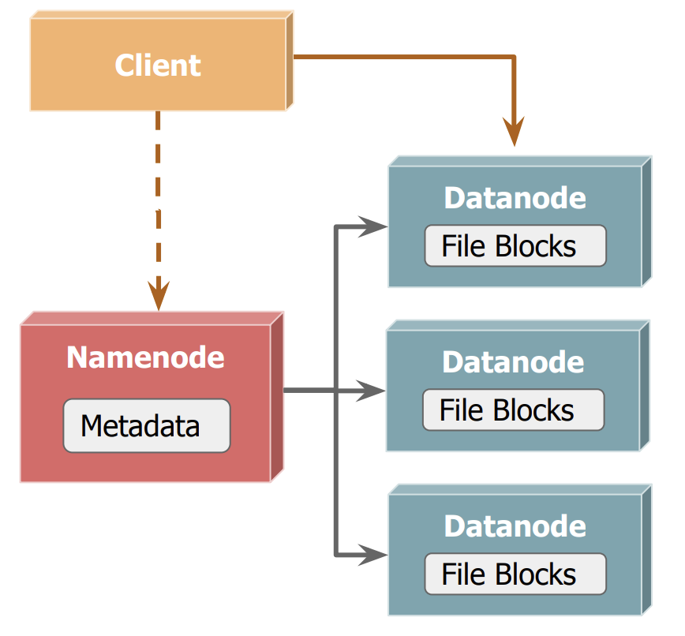
</div>

Si quiero obtener cualquier tipo de metadata de los archivos. como el nombre de todos los archivos, lo puedo hacer comunicandome directamente con el Namenode, no hace falta con cada uno de los Datanodes.

### Almacenamiento de datos

- Los archivos se particionan en bloques de 128MB
- Los bloques son replicados en distintos Datanodes
- El Namenode mantiene el listado de Datanodes para un archivo
- La metadata es mantenida en memoria para optimizar acceso, con un log de transacciones
- El cluster de Datanodes permite re-balanceo de bloques

<div style="text-align: center;">
    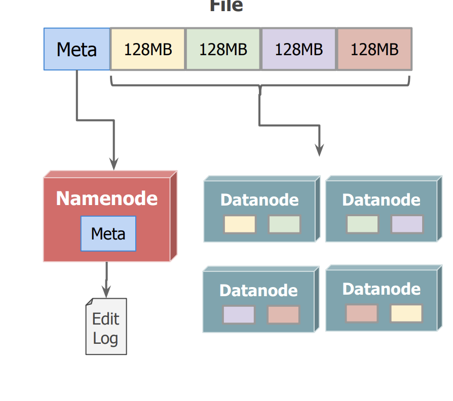
</div>

### Acceso a Datos

- El Namenode favorece el principio de localidad de datos para el cliente
- El cliente recibe listado de Datanodes para cada bloque y sus réplicas
- Se intenta obtener los bloques desde el mismo rack.
- Si no es posible, desde el mismo datacenter

<div style="text-align: center;">
    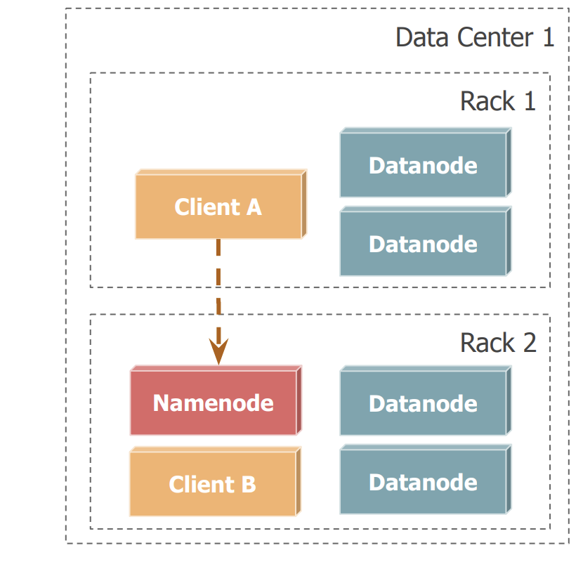
</div>

# Big Table

Es una caso de uso de este tipo de arquitectura aplicada.

- Big table es una plataforma.

## Características

#### Claves, datos y columnas

Clave: es para tener una función de particion previamente definida.
Datos: Pueden tener conjuntos dentro de ellos, que se conocen como columnas o pueden ser simplemente mucho datos para una clave.

- Solo almacenan pares clave-valor
- Los datos en realidad son un conjunto de valores(o columnas).
- Al tratarse de conjunto dispersos(sparse), los valores no se almacenan en un orden definido sino que conocen su "Column Family".

#### Tablets

- Conjunto de filas consecutivas de acuerdo a la clave. Esta el la idea que se usa para hacer la división de los datos
- Unidades de balanceo de BigTable. Permite escalar el sistema.

<div style="text-align: center;">
    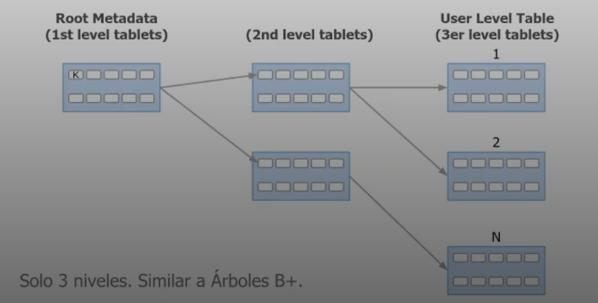
</div>

Un tablet es una partición horizontal de una tabla. Cada tablet maneja un rango contiguo de row keys.
El objetivo es distribuir la carga entre muchos servidores y permitir acceso eficiente a grandes volúmenes de datos.

Tengo 3 niveles de almacenamiento:

- Root Metadata: Decide a que Table de metadata mirar.
- Metadata Tablet: Decide que Tablet de usuario mirar.
- User Tablet: Contiene los datos del usuario. Busca directamente en la fila.

#### Ejemplo

Supongamos que queremos buscar: **"cliente#0042"**.

- Paso 1: Busqueda en root metadata: Se consulta root metadata que suele estar cacheada en memoria, este contiene entradas como:

```python
   ["a".."g") → tablet1
   ["g".."q") → tablet2
   ["q".."z") → tablet3
```

La clave "cliente#0042" entra en el rango ["a".."g"), así que seguimos el puntero a tablet1 del 2° nivel.

**Tiempo constante: Solo una lectura para decidir a donde ir.**

- Paso 2: Busqueda en metadata tablet

  Tablet1 contiene información sobre rangos de tablets de usuario reales:

```python
["cliente#0000".."cliente#0050") → userTablet_A
["cliente#0050".."cliente#0100") → userTablet_B
["cliente#0100".."cliente#0200") → userTablet_C
```

La clave "cliente#0042" cae en el primer rango → vamos al userTablet_A.

**Otra lectura (segunda). También tiempo constante.**

- Paso 3: Lectura de datos reales en User Tablet

Vamos al userTablet_A, que contiene datos reales ordenados por "row key".

La estructura de tablet puede tener entradas como:

```python
("cliente#0040", "info", "nombre", 20250709) → "Ana"
("cliente#0042", "info", "nombre", 20250709) → "Carlos"
("cliente#0042", "info", "email", 20250709) → "carlos@email.com"
```

Bigtable busca directamente en la estructura tipo LSM-tree (memtable + SSTables) y encuentra la fila.

### Cómo escala Bigtable?

Escala agregando tablet servers (nodos) para manejar más tablets. Esto implica:

- Cada tablet (rango de claves) puede moverse a otro servidor si recibe mucha carga.

- Los tablets se dividen automáticamente cuando crecen demasiado (split).

- Las nuevas entradas de metadata se actualizan para reflejar esta división.

Así, Bigtable puede manejar petabytes de datos y millones de operaciones por segundo simplemente agregando más hardware, sin cambiar la estructura de búsqueda.

### Características

Siempre va a tener la misma velocidad de busqueda sin importar la cantidad de datos que tenga. Esto es por la estructura propuesta de los tablets, siempre mantienen los mismos niveles y a medida que se va agregando información se van agregando más tablets de forma horizontal(haciendo el split de forma automática en el caso de ser necesario).

Es importante notar que hay una situación la cual no favorece a BigTable, esto es cuando me llegan varias operaciones de escritura que tiene un estructura similar(las claves son casi la misma) y por lo tanto la función de particion no es buena distribuyendolo(de hecho no hay función de particionado). Entonces la tabla, cuando se particiona, deja de un lado algunos valores y del otro lado que rapidamente recibe los siguientes request, por lo tanto sigue creciendo y da lugar a que se vuelva a particionar.

Para poder resolver este problema lo que hago es elegir otra clave.

Esta optimizado para la escritura de muchos datos.
