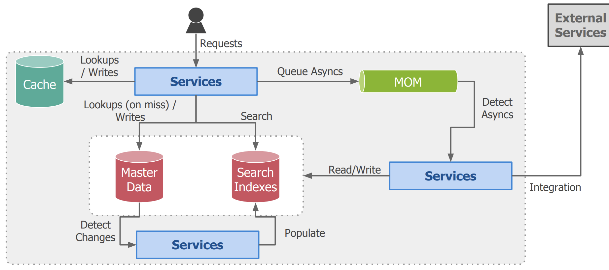

# Aplicaciones Particiones y Replicación. Distributed Shared Memory (DSM).Distributed File Systems (NFS, HDFS). Big Table.

https://campusgrado.fi.uba.ar/pluginfile.php/76972/mod_page/content/43/Distribuidos%20-%20Clase%2014%20-%20Data%20Intensive%20Applications.pdf

## Datos en sistema sistema a gran escala

Buscar explicación

