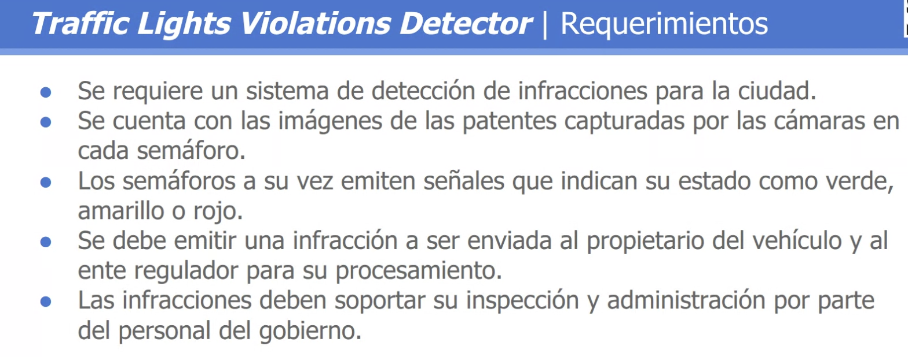
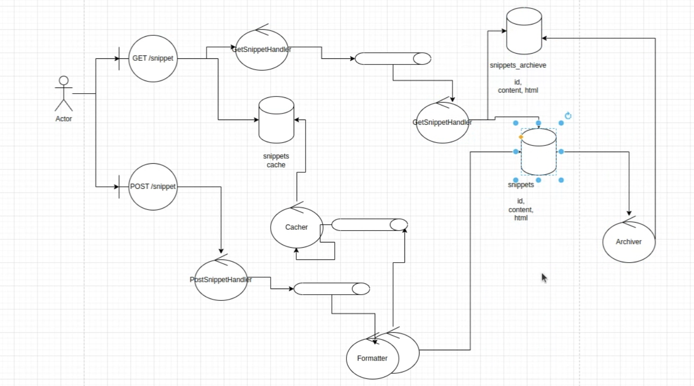

# Diseño de arquitectura de gran escala (Non-Abstract Large-Scale System Design (NALSD))

## Shared Code Snippet

## Traffic Violations Detector

- Se requiere un sistema de detección de infracciones para la ciudad.
- Se cuenta con las imágenes de las patentes capturadas por las cámaras en cada semáforo.
- Los semáforos a su vez emiten señales que indican su estado como verde, amarillo o rojo.
- Se debe emitir una infracción a ser enviada al propietario del vehículo y al ente regulador para su procesamiento.
- Las infracciones deben soportar su inspección y administración por parte del personal del gobierno.

Primero defino los actores, el sistema y algun sistema externo.

- Asumo que:

  - Envio las fotos solo cuando detecto movimiento.

- Actores y data a procesar:

  - Camara: Pasa las imagenes al sistema. (lo envia a una frame rate determinado, con una resolución determinada)
  - Semáforo: Pasa el estado del semáforo al sistema(verde, amarillo, rojo), junto con el timestamp.
  - Storage: Almacena las imágenes y datos de infracciones para su posterior análisis.

- Outbound:
- Tengo la información en una base de datos donde tengo la patente y además el mail del usuario al que le tengo que enviar la infracción.
- Tengo que enviar la infracción al usuario y al ente regulador.

### Endpoints

Es importante definir la cantidad de datos que estoy enviando y cómo se procesarán. Porque en esto es lo que se va a basar mi sistema.

- Entrada

* /camera
  - POST: Recibe la imagen y el estado del semáforo. --> post -- images/ --> Body: camera_uuid, image, timestamp
* /semaforo
  - PUT: Recibe el estado del semáforo. --> put -- semaforo/lightstatus/... --> Body: status(un byte), timestamp

- Salida

* Los datos de respuesta son despreciables respecto a la cantidad de datos que estoy enviando.

### Análisis de volúmenes

photo_bytes = 0,5 MB --> ver como razonar
cantidad de fotos recibidas por minuto en un semaforo(puedo tener distintos tipos de semaforos según el flujo que tenga) -->

- pocas pasadas: 1 x minuto x la cantidad de semaforos
- muchas pasadas: 10(lo importante acá es el orden de magnitud, no en si el múmero) x minuto x la cantidad de semaforos

## Cosas a darle importancia y passos a seguir

- Endpoint (cuánto pesa cada dato que estoy enviando)
- Análisis de volúmenes

# ----------------------------------------------------------------------------------

## Shared Code Snippet

- Detalles del ejercicio: Estos son snppets de código que **no son editables**.
- Esto se puede hacer dentro de github(buscar ejemplo).

## Pasos a seguir

- Endpoint (cuánto pesa cada dato que estoy enviando)
- Análisis de volúmenes -- entender si el sistema escala mucho o no
- Diseño

### Endpoints

- Post del snippet: POST /snippet

  - BODY:
    {
    language: python | golang | ... , -- no es relevante el valor -- asumo que son (20 bytes)
    code: xxx --
    }
  - RESULT: CODE
    {
    data: Public URL: xxxx
    id: xxx
    }

- Get del snippet: GET /snippet/:id
  - RETURN :
    {
    language: python | golang | ... ,
    code: xxx,
    html: 

    }

## Análisis de volúmenes

- Cant de snippets:

  - cant_usuarios \* mean_snippet_by_user_day(tomamos el orden de 10)

  - opciones para ver cantidad de usuarios:

    - población _ ratio : 10.10^9 _ 10^4 = 10^6

    - estudiantes/egresados de instituciones grandes _ cant de instituciones + estudiantes/egresados de instituciones chicas _ cant de instituciones + developors autodidactas(estudiantes \* 0.2)

    - (developers*per_company_large) * cant*company + (developers_per_company_medium) * cant*company + |(developers_per_company_small) * cant*company =  
      10^5 * 100 + 10^3 _ 10^4 + 10^ _ 10^5 =(aprox) 2 \* 10^7

  - 10 snippet / user_per_day

- size_content: (100(filas) \* 80(columnas)) chars = 8kB -- es importante notar en este caso lo que importa es la escala, no el número en si

- size_post: 20B + 8kB

- size_get_snippet 8kB + 8kB \* 10(extensión del div)

- size storage = 2 _ 10^7 users _ 10 snippet/user*day * 10^2 days/year \* 10 year + 10kB/snippet = 4.8 PB

  - size_get_snippet(formateo y lo almaceno formateado, junto con las variables de ingreso-- no lo tengo en cuenta en el número)

### Diseño

