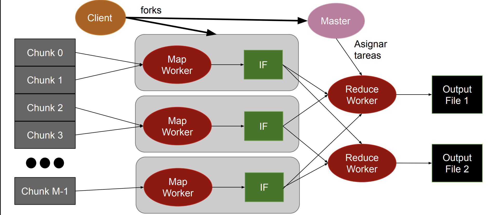

# Map Reduce

Lo importante para destacar en este caso más allá del algortimo en si, lo que buscan es esta matería es analizar la arquitectura de un framework, y como sería el despligue de recursos en uno de estos casos.

## Caso ideal (Master-Worker)

- No existe dependencia entre los datos
- Datos pueden ser partidos en chunks del mismo tamaño
- Cada proceso pueden trabajar con un chunk

- **Master**
  - Encargado de partir la data en # chunks
  - Envía los chunks a los Workers
  - Recibe los resultados de todos los Workers
- **Workers**
  - Recibe chunks del Master
  - Procesa el chunk recibido
  - Envía el resultado del procesamiento al Master

También puede estar la situación en la que no le pasa el resultado para que lo preocese, sino que le pasas la dirección a donde lo tiene que ir a buscar para poder procesarlo(esto puede estar almacenado en una bdd).

## Función Map

### Map: (input shard) → intermediate(key/value pairs)

- Data es particionada automáticamente en K chunks y procesada en M máquinas de un cluster ejecutando la función map
- Librería MapReduce agrupa todos los valores asociados con una misma key intermedia y envía los datos a una función Reduce
- Función Map proporcionada por el usuario es ejecutada en todos los chunks de data
- Usuario decide cómo filtrar la data provista en los chunks

### Función reduce

- Reduce: intermediate(key/value pairs) → result files
  - Recibe una key intermedia y un set de valores
  - Realiza un merge de los datos recibidos para formar un set de datos menor
  - Función Reduce es distribuida particionando las keys intermedias en R workers
  - La cantidad de R workers es especificada por el usuario
  - Función Reduce realiza una agregación de los datos para obtener un resultado final (result file)
  - Función Reduce es llamada por cada Unique Key

- En esta situación podemos ver que el master le pasa a los workers la dirección de donde tiene que ir a buscar la información, y no le pasa el chunk directamente.
- Además el encargado de comunicar el EOF va a ser el master y no cada uno de los workers(mappers).

El caso idel que quiero es:

- Tener cantidad de maps como cantidad de chunks, y asginarle un core a cada uno de los mappers.
- Tener cantidad de reduce igual a la cantidad de keys que vienen del mapper, pero lo que pasa en este caso es que no se de antemano la cantidad de keys que va a haber, porque tengo que procesar la información previamente para saber esto.
