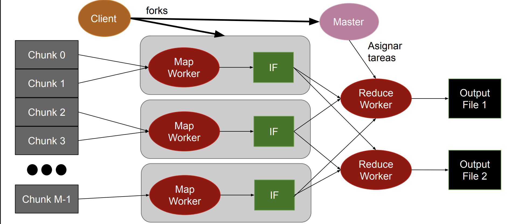
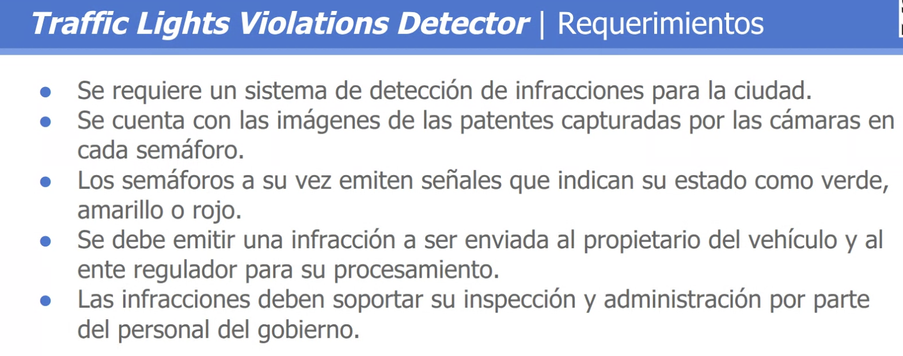
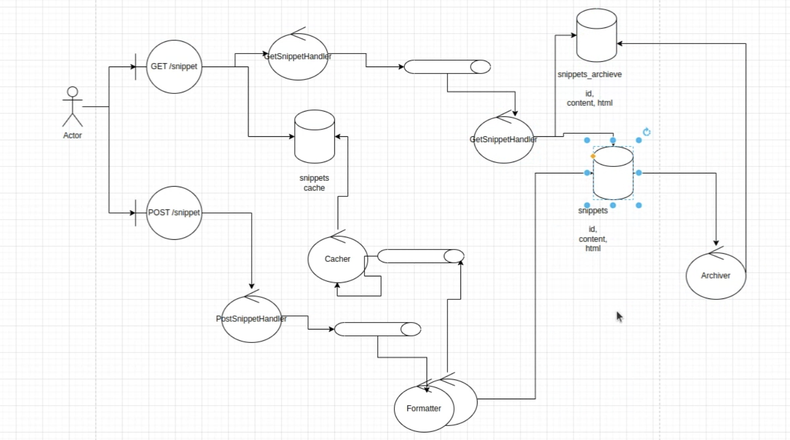

# Map Reduce 

## Caso ideal (Master-Worker)

* No existe dependencia entre los datos
* Datos pueden ser partidos en chunks del mismo tamaño
* Cada proceso pueden trabajar con un chunk
* Master
    * Encargado de partir la data en # chunks
    * Envía los chunks a los Workers
    * Recibe los resultados de todos los Workers
* Workers
    * Recibe chunks del Master
    * Procesa el chunk recibido
    * Envía el resultado del procesamiento al Master

También puede estar la situación en la que no le pasa el resultado para que lo preocese, sino que le pasas la dirección a donde lo tiene que ir a buscar para poder procesarlo(esto puede estar almacenado en una bdd).

## Función Map

### Map: (input shard) → intermediate(key/value pairs)
* Data es particionada automáticamente en K chunks y procesada en M máquinas de un cluster ejecutando la función map
* Librería MapReduce agrupa todos los valores asociados con una misma key intermedia y envía los datos a una función Reduce
* Función Map proporcionada por el usuario es ejecutada en todos los chunks de data
* Usuario decide cómo filtrar la data provista en los chunks

### Función reduce 

* Reduce: intermediate(key/value pairs) → result files
    * Recibe una key intermedia y un set de valores
    * Realiza un merge de los datos recibidos para formar un set de datos menor
    * Función Reduce es distribuida particionando las keys intermedias en R workers
    * La cantidad de R workers es especificada por el usuario
    * Función Reduce realiza una agregación de los datos para obtener un resultado final (result file)
    * Función Reduce es llamada por cada Unique Key

* En esta situación podemos ver que el master le pasa a los workers la dirección de donde tiene que ir a buscar la información, y no le pasa el chunk directamente.
* Además el encargado de comunicar el EOF va a ser el master y no cada uno de los workers(mappers).

El caso idel que quiero es: 
* Tener cantidad de maps como cantidad de chunks
* Tener cantidad de reduce igual a la cantidad de keys que vienen del mapper, pero lo que pasa en este caso es que no se de antemano la cantidad de keys que va a haber, porque tengo que procesar la información previamente para saber esto.

## Link para completar 

https://campusgrado.fi.uba.ar/pluginfile.php/76972/mod_page/content/43/Distribuidos%20-%20Clase%2013%20-%20Modelado%20de%20Computo%20Distribuido.pdf

# Diseño de arquitectura de gran escala (Non-Abstract Large-Scale System Design (NALSD))

## Shared Code Snippet

## Traffic Violations Detector 

*  Se requiere un sistema de detección de infracciones para la ciudad.
*  Se cuenta con las imágenes de las patentes capturadas por las cámaras en cada semáforo.
*  Los semáforos a su vez emiten señales que indican su estado como verde, amarillo o rojo.
*  Se debe emitir una infracción a ser enviada al propietario del vehículo y al ente regulador para su procesamiento.
*  Las infracciones deben soportar su inspección y administración por parte del personal del gobierno. 

Primero defino los actores, el sistema y algun sistema externo.

* Asumo que: 
    * Envio las fotos solo cuando detecto movimiento.

* Actores y data a procesar: 
    * Camara: Pasa las imagenes al sistema. (lo envia a una frame rate determinado, con una resolución determinada)
    * Semáforo: Pasa el estado del semáforo al sistema(verde, amarillo, rojo), junto con el timestamp.
    * Storage: Almacena las imágenes y datos de infracciones para su posterior análisis.

* Outbound: 
* Tengo la información en una base de datos donde tengo la patente y además el mail del usuario al que le tengo que enviar la infracción.
* Tengo que enviar la infracción al usuario y al ente regulador.

### Endpoints 

Es importante definir la cantidad de datos que estoy enviando y cómo se procesarán. Porque en esto es lo que se va a basar mi sistema.

- Entrada 

* /camera
    * POST: Recibe la imagen y el estado del semáforo. --> post -- images/ --> Body: camera_uuid, image, timestamp 
* /semaforo
    * PUT: Recibe el estado del semáforo. --> put -- semaforo/lightstatus/... --> Body: status(un byte), timestamp 

- Salida 

* Los datos de respuesta son despreciables respecto a la cantidad de datos que estoy enviando.

### Análisis de volúmenes

photo_bytes = 0,5 MB --> ver como razonar 
cantidad de fotos recibidas por minuto en un semaforo(puedo tener distintos tipos de semaforos según el flujo que tenga) --> 
* pocas pasadas: 1 x minuto x la cantidad de semaforos 
* muchas pasadas: 10(lo importante acá es el orden de magnitud, no en si el múmero) x minuto x la cantidad de semaforos

## Cosas a darle importancia y passos a seguir 
* Endpoint (cuánto pesa cada dato que estoy enviando)
* Análisis de volúmenes

# ---------------------------------------------------------------------------------- 

## Shared Code Snippet

* Detalles del ejercicio: Estos son snppets de código que **no son editables**.
* Esto se puede hacer dentro de github(buscar ejemplo).

## Pasos a seguir 
* Endpoint (cuánto pesa cada dato que estoy enviando)
* Análisis de volúmenes -- entender si el sistema escala mucho o no
* Diseño 

### Endpoints 

* Post del snippet: POST /snippet  
    * BODY: 
    {
        language: python | golang | ... , -- no es relevante el valor -- asumo que son (20 bytes)
        code: xxx -- 
    }
    * RESULT: CODE 
    {
        data: Public URL: xxxx
        id: xxx
    }
     

* Get del snippet: GET /snippet/:id 
    * RETURN : 
     {
        language: python | golang | ... ,
        code: xxx,
        html: 

     }

## Análisis de volúmenes

* Cant de snippets: 
    * cant_usuarios * mean_snippet_by_user_day(tomamos el orden de 10) 
    
    * opciones para ver cantidad de usuarios: 
        * población * ratio :  10.10^9 * 10^4 = 10^6  
        
        *  estudiantes/egresados de instituciones grandes * cant de instituciones +  estudiantes/egresados de instituciones chicas * cant de instituciones + developors autodidactas(estudiantes * 0.2)

        * (developers_per_company_large) * cant_company + (developers_per_company_medium) * cant_company + |(developers_per_company_small) * cant_company =  
        10^5 * 100 +  10^3 *  10^4 +  10^ *  10^5 =(aprox) 2 * 10^7
        

    
    
    * 10 snippet / user_per_day

* size_content: (100(filas) * 80(columnas)) chars = 8kB -- es importante notar en este caso lo que importa es la escala, no el número en si 

* size_post: 20B + 8kB 

* size_get_snippet 8kB + 8kB * 10(extensión del div)

* size storage = 2 * 10^7 users * 10 snippet/user*day  * 10^2 days/year * 10 year + 10kB/snippet = 4.8 PB

    * size_get_snippet(formateo y lo almaceno formateado, junto con las variables de ingreso-- no lo tengo en cuenta en el número)

### Diseño 

