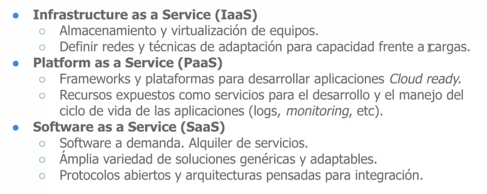
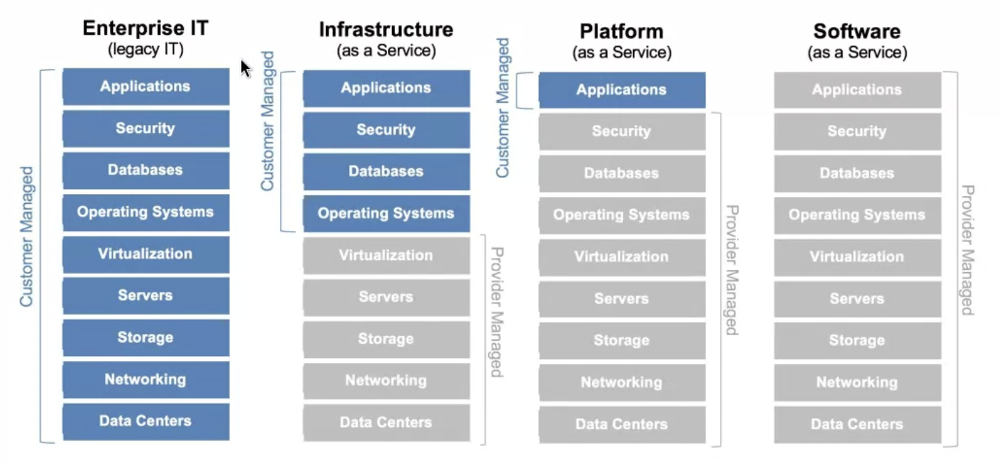

# Clase 13 - Arquitecturas orientadas a servicios y Cloud

## Cloud

### Definición

- Una forma de ofrecer recursos de IT, no necesariamente una nueva tecnología.
- Networking + Infrastructure + Nueva plataformas + Servicios

### Niveles de abstracción

- Saas: Software as a service -- El caso en el que una empresa ofrece un software a través de internet, te resulve el problema como consumidor (en este caso estamos hablando de una empresa). Ej: Google Docs, Salesforce, Hotmail

- Paas: Plataforma como servicio -- El caso en el que una empresa ofrece una plataforma para desarrollar, ejecutar y gestionar aplicaciones sin preocuparse por la infraestructura subyacente. Ej: Google App Engine, Heroku.

- Iaas: Infrastructure as a service -- El caso en el que una empresa ofrece recursos de computación, almacenamiento y red a través de internet. Ej: Amazon EC2, Google Cloud Storage.

## Servicios automnejados

## Principales beneficios

- Accesibilidad: Acceder desde cualquier lado. Movilidad y visibilidad constante de los recursos.
- Time to Market: Disponibilidad instantánea de los recursos.
- Escalabilidad: Capacidad "ilimitada" de los recursos para manejar volúmenes, ancho de banda, computo, memoria, etc.
- Costos:
  - Pago de demanda(Pay as you go): Solo pagas por lo que usas.
  - Control del gasto dependiendo del uso
  - Accesibilidad + escalabilidad + confiabilidad realmente barata

## Cloud Publica vs Cloud Privada

- Pública:

  - Servicios públicos
  - Servidores compartidos con otros usuarios
  - Disponibilidad de recursos garantizados con SLAs(Service Level Agreement)
  - Costos variables. "Pay as you go"
  - Se accede mediante internet

- Privada:

  - Servicios privados
  - Datacenter propio de la empresa
  - Recursos dedicados a la empresa
  - Costos fijos de manetenimiento y expansión
  - Se accede mediante intranet(red que se accede solo desde la red de la empresa)

- Híbrida:

## Algunos factores

- Factores Políticos

  - Lienciamiento, jurisdicción y pérdida de gobernabilidad sobre los datos
  - Incapacidad de influir sobre la toma de decisiones que afecta al hardware

- Factores Técnicos
  - Costos monetarios y de tiempo para migracioens de datos y softwre
  - Alta exposición de datos sensibles
  - Dificultades en la construcción de los sistemas por esta "nueva" arquitectura. Hay que ver si es sencillo adaptar nuestro modelo a la nube.

## Plataforms as a Service(Paas)

