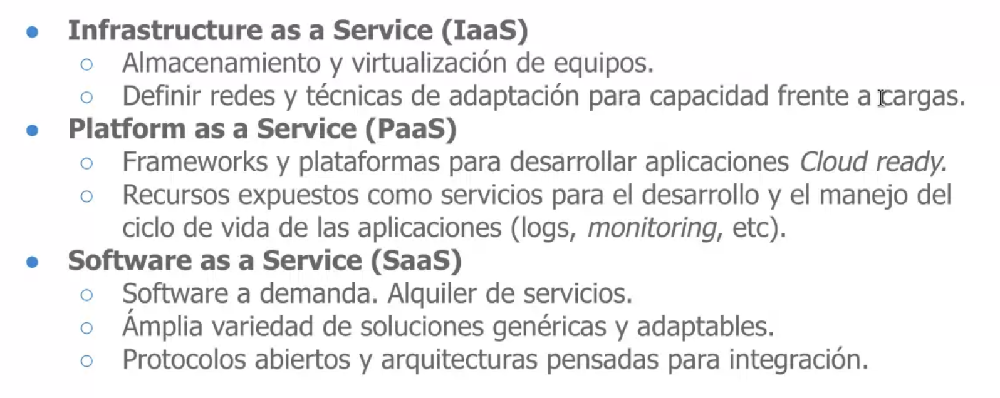
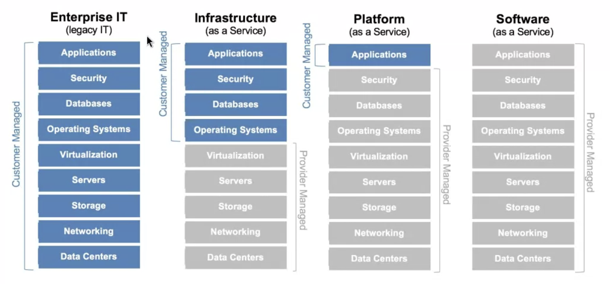
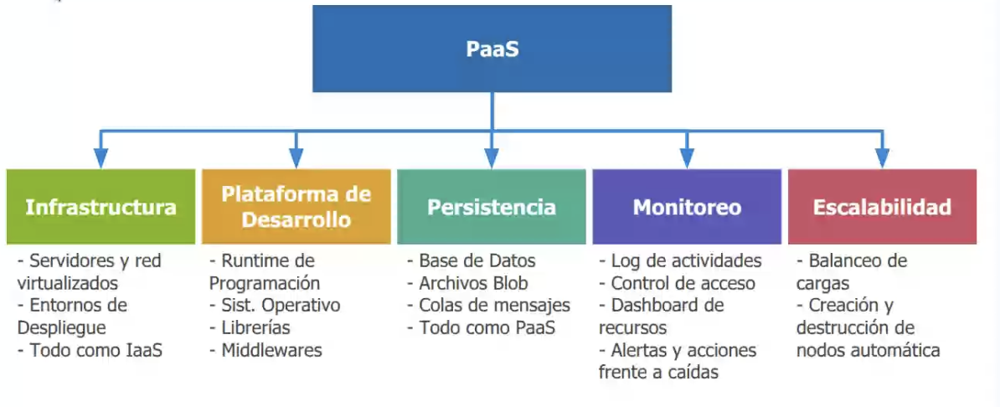

# Clase 13 - Arquitecturas orientadas a servicios y Cloud 

## Cloud

### Definición

* Una forma de ofrecer recursos de IT, no necesariamente una nueva tecnología.
* Networking + Infrastructure + Nueva plataformas + Servicios

### Niveles de abstracción

* Saas: Software as a service -- El caso en el que una empresa ofrece un software a través de internet, te resulve el problema como consumidor (en este caso estamos hablando de una empresa). Ej: Google Docs, Salesforce, Hotmail

* Paas: Plataforma como servicio -- El caso en el que una empresa ofrece una plataforma para desarrollar, ejecutar y gestionar aplicaciones sin preocuparse por la infraestructura subyacente. Ej: Google App Engine, Heroku.

* Iaas: Infrastructure as a service -- El caso en el que una empresa ofrece recursos de computación, almacenamiento y red a través de internet. Ej: Amazon EC2, Google Cloud Storage.

## Servicios automnejados 

## Principales beneficios

* Accesibilidad: Acceder desde cualquier lado. Movilidad y visibilidad constante de los recursos.
* Time to Market: Disponibilidad instantánea de los recursos.
* Escalabilidad: Capacidad "ilimitada" de los recursos para manejar volúmenes, ancho de banda, computo, memoria, etc.
* Costos: 
    * Pago de demanda(Pay as you go): Solo pagas por lo que usas.
    * Control del gasto dependiendo del uso
    * Accesibilidad + escalabilidad + confiabilidad realmente barata

## Cloud Publica vs Cloud Privada 

* Pública: 

    * Servicios públicos 
    * Servidores compartidos con otros usuarios 
    * Disponibilidad de recursos garantizados con SLAs(Service Level Agreement)
    * Costos variables. "Pay as you go"
    * Se accede mediante internet

* Privada: 

    * Servicios privados  
    * Datacenter propio de la empresa 
    * Recursos dedicados a la empresa
    * Costos fijos de manetenimiento y expansión 
    * Se accede mediante intranet(red que se accede solo desde la red de la empresa) 

* Híbrida:

## Algunos factores 

* Factores Políticos 
    * Lienciamiento, jurisdicción y pérdida de gobernabilidad sobre los datos 
    * Incapacidad de influir sobre la toma de decisiones que afecta al hardware

* Factores Técnicos
    * Costos monetarios y de tiempo para migracioens de datos y softwre 
    * Alta exposición de datos sensibles 
    * Dificultades en la construcción de los sistemas por esta "nueva" arquitectura. Hay que ver si es sencillo adaptar nuestro modelo a la nube.

## Plataforms as a Service(Paas)

