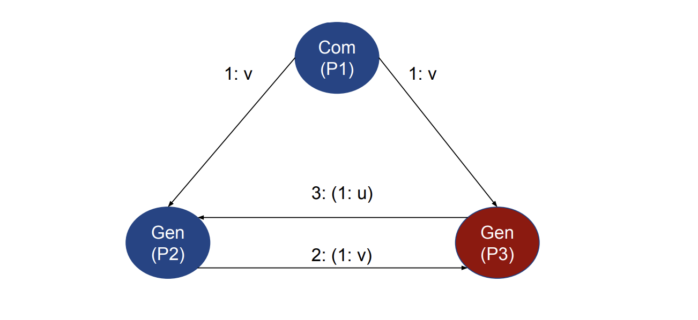

# Tolerancia a fallos

- Estudia las necesidades de sistemas confiables(dependable systems):

  - Garantiza que se ejecuten y se comporten respecto a lo esperado por el usuario en distintas situaciones(de uso y de entorno de ejecución del sistema).

  - Prevenir la aparición de fallas o averías de cara al usuario, tanto normales como excepcionales.

  - Alternativas para prevenir como tolerar cada situación

- Permite definir la inversión y el nivel de tolerancia para cada tipo de sistema.
- Herramientas: recuperación, redundancia (Ej. replicación) y consenso (Ej. algoritmos de coordinación/acuerdo como votación).

## Generación de fallos

- Fallo Parcial:
  - Cuando un componente de un sistema distribuido incurre en un error.
  - Característica distintiva de los sistemas distribuidos.
  - Puede generar una reacción en cadena que afecta el comportamiento del sistema total.

   

## Ejemplos de fallo no Tolerados

**Evento N°1:**

- Fault: Rayo cósmico cambia estado bit en memoria RAM
- Error: Variable en heap apunta a dirección inválida
- Failure: Programa X accede a sección de memoria corrupta y muere

**Evento N°2:**

- Fault: Programa Y no puede comunicarse con programa X
- Error: Programa Y hace polling infinito con un timeout pequeño a programa X
  que no responde dejando conexiones abiertas
- Failure: Programa Y llega al límite de conexiones abiertas y muere

Podemos acompañar todo el proceso hasta el "failure" final y restaurar el sistema lo antes que podamos.

## Definición

**"En presencia de fallos, el sistema distribuido continua operando de forma aceptable"**

Siempre tiene que haber una defición de cual va a ser el siguiente paso a realizar.

## Clasificación de fallos

Los fallos se clasifican en:

- Transientes: Ocurren una vez y luego desaparcen, si se repite la operación el fallo desaparece.

  - Ej: Desconexión de la placa de red de un cable de red, porque alguien paso y desconectó el cable.

- Intermitentes: Ocurre en forma intermitente, dificil de diagnosticar.

  - Ej: Todos los días a las 10:00 pm el CPU se va al 100% y el sistema deja de responder peticiones externas

- Permanentes: Existe hasta que el componente defectuoso se reemplaza.

  - Ej: Problema en el disco rigido, una vez que se activa este error el disco queda inutilizable.

Es importante notar la diferencia entre fallos improbables vs imposibles.

### Más clasificación de fallos

   

En el caso de el error Bizantino, lo que pasa es que en tiempos abitrarios da respuesta incosistentes a distintos procesos, no le responde lo mismo cuando tendría qeu hacerlo.

## Estrategias de tolerancia a fallos

- **Fault Removal:**
  Remover errores antes de que estos sucedan.

  - Ej.: Detección de hardware errores antes que sucedan (ECC Memory)

- **Fault Forecasting:**
  Determinar la probabilidad de que un componente pueda llegar a fallar.

  - Ej.: Reemplazo de piezas en un avión por tiempo de uso 10

- **Fault Prevention/Avoidance:**
  Evitar las condiciones que llevan a la generación de errores. Componentes impidan que haya fallos, prevengo que pasen esos errores que son imposibles de evitar.

  - Ej.: Componentes que impidan que haya fallos (relojes atómicos, military grade)

- **Fault Tolerance:**
  Procesar errores en el sistema y tratar los mismos en vez de evitar que sucedan

## Resiliencia

Mnatener un nivel aceptable del servicio en presencia de fallos y desafios a la operción normal:

- Degradació suave: El comportamiento difiere del comportamiento normal en ausencia de fallos, pero continua siendo aceptable.

## Recuperación

- Recuperarse de un error y llevar el sistema a un estado correcto
  - Almacenamiento estable: almacenamiento seguro de la información
  - Checkpointing : se guarda periódicamente el estado completo del sistema en almacenamiento estable
  - Message logging : se parte de un checkpoint y se repiten todos los mensajes intercambiados desde ese checkpoint
  - Consenso: acordar el estado correcto

## Redundancia

- Se toleran fallos mediante redundancia:
  - física (replicación), de información (valor), de tiempo (reintentos)
  - Ejemplo de la vida real: Rueda de auxilio. a) en la ciudad, b) en ruta, c) en
    el desierto, d) para un camión de carga
- Punto único de fallo => Replicación:
  - Varios tipos: activa, semiactiva (leader-follower), pasiva
  - Algoritmos de consenso permiten elegir componentes activos
  - Particionamiento de la red => muy dificultoso reconciliar estado automáticamente

### Replicación pasiva

Una réplica primaria y varias secundarias o de backup.

   

El maestro replica el estado y una vez que eso esta listo el maestro le va a responder al usuario. Esto se puede ver facil en el caso que tengo que hacer grabado en una bdd que tienen mirroring, la bdd computa todas las tareas que tiene que hacer, dice que esta todo bien, se graba tal cosa en tal archivo, luego se lo pasa al backup. Esto lo hace para el caso en el que se caiga el maestro, las replicas tengan toda la informción necesaria para tomar su lugar y que el sistema siga siendo consistente.

### Replicación activa

Múltiples réplicas de la misma máquina de estado que ejecutan
las mismas operaciones en el mismo orden (por lo tanto: orden total)

   

El procesado del request no ocurre en una sola computadora, sino qeu en todas. Me llega el request, el load balancer le madna el mismo request a las replicas, ellas computan el cambio de estado, deciden si pueden o no pasar al estado siguiente, graban el valor, le envian la respuesta al load balancer, el cual valida que todo este en orden y le responde al usuario.

Todas las replicas saben que hacer, ambas replicas tienen que responder de la misma manera.

En el caso de que se caiga el balanceador la idea es reemplazarlo por otro con las mismas caracteristicas, la idea es que no tengan estado para que sea intercambiable de forma sencilla y rapida.

### Replicación semiactiva

Múltiples réplicas de la misma máquina de estado que ejecutan
las mismas operaciones en el mismo orden (por lo tanto:
orden total)

   

Todas las replicas van a ejecutar todos los comandos, pero va a haber una que va a tomar el rol de lider.

Esto se hace de esta forma porque hay situacione las cuales no son deterministicas en caso de dejar a las copias que se ejecuten de manera independiente. Entonces cuando hay una de estas instrucciones, las replicas esperan para que el lider les diga que hacer.

# Confiabilidad

- Dependability(confianza): medidad de la confianza del sistema.
  - Availability: la probabilidad de que el sistem este operando correctamente.
  - Reliability: Capacidad del sistema para dar servicio en forma continua.
  - Durability: probabilidad de que un dato persistido se pueda recuperar.
  - Safety: En presencia de fallos, no ocurre nada catastrofico.
  - Maintainability: Cantidad de tiempo que se requiere para recuperar el sistema(repararlo o actualizarlo).

## Resiliencia | Safety

El sistema debe poder ser recuperado automáticamente o manualmente ante cualquier tipo de falla.

## Consenso

Procedimiento que para que un conjunto de procesos distribuidos acuerden en el mismo valor dado un punto de decisión compartido.

Implica la coordinación y un algoritmo de acuerdo.

Hay que tomar algunas condiciones para que el consenso sea posible:

Un ejemplo puede ser:

- Tengo que ver si los canales de comunicación son fiables o no.
- Todos los procesos pueden comunicarse entre sí
- Única falla a considerar es la caída de un proceso.
- Caída de un proceso no puede ocasionar la caída de otro proceso.

## Coordinación y acuerdo

### Objetivo

- Lograr que un conjunto de procesos pueda realizar ciertas tareas siguiendo una secuencia.
- Permintir la replicación de la información
- Evitar puntos únicos de fallo

### Ej:

   

El valor que sabía P1 se ha comunicado a P2 y P3, y el valor que sabía P2 se ha comunicado a P1 y P3, y el valor que sabía P3 se ha comunicado a P1 y P2.

Luego de ciertos pasos todos van a tener una tupla que va a tener los valores de los otros procesos. Y lo que podemos hacer en este caso es que me de la mayoría de los valores. Y así se llega a un consenso.

## Exclusión mutua distribuida

### Objetivo

- Crear un algoritmo que permita pedir y obtener acceso exclusivo a un recurso que se encuentra disponible en la red.

- Utilizar pasaje de mensajes para lograr nuestro objetivo.

### Propiedades requeridas

- Safety: Solo un proceso puede obtener el recurso en todo momento.
- Liveness: Procesos no deben esperar eternamnete por mensajes que nunca van a llegar. La "Starvation" debe ser evitada.
- Fairmess: Cada proceso posee la misma prioridad para obtener el recurso. Una vez de obtener el recurso, el mismo debe liberar el recurso luego de un tiempo conocido.

### Servidor central

   

Un servidor central es un proceso que se encarga de coordinar el acceso a un recurso compartido entre varios procesos. Este servidor central es responsable de recibir las solicitudes de acceso al recurso, otorgar permisos y garantizar que solo un proceso tenga acceso al recurso en un momento dado.

   

Esta implementación tiene las siguientes ventajas y desventajas:

- Ventajas:

  - Sencillo de entedner y de implementar.
  - Request procesadas en orden.
  - Cantidad de mensajes y conexiones minima.
  - Los procesos solo necesitan conocer al server.

- Desventajas:
  - El server es un punto único de fallo.
  - Los procesos no pueden diferenciar si esta caido o no responsivo. Esto es así porque no reciben ningun tipo de mensaje desde el server cuando solicitan el recurso, entonces no saben el estado del mismo.
  - Hay un cuello de botella. Si tengo mucho tráfico de solicitudes, el server puede no responder a tiempo y generar un timeout en los procesos que solicitan el recurso.

## Token Ring

- Anillo es construído ordenando a los procesos involucrados por algún atributo (MAC, IP, PID)
- Inicialización
  - Proceso 0 crea un token
- Token circula alrededor del anillo
  - De Pi a P(i+1) mod N
- Cuando un proceso recibe el token

  - Proceso chequea si requiere sección crítica
  - En caso negativo, pasa el token a su vecino
  - En caso afirmativo, accede al recurso reteniendo el token

Algunas características del algoritmo:

- Ventajas
  - Fácil de implementar y entender
  - No es necesario elegir un coordinador
  - Exclusión mutua garantizada (token)
- Desventajas
  - Creación del anillo de forma dinámica
  - Requiere un protocolo en sí mismo
  - Caída de un proceso implica regeneración
    del anillo
  - Token puede ser perdido

## Ricart & Agrawala

- Algoritmo distribuido que utiliza reliable multicast y relojes lógicos
- Cuando un proceso intenta acceder a la sección crítica

  - Crea un request con un timestamp asociado al proceso, un ID y el nombre del recurso (<T, Pi , R>)
  - Envía el request a todos los procesos en el grupo
  - Espera hasta que todos los procesos le den permiso
    de ingresar a la sección crítica (OK response)
  - Entra a la sección crítica

- Cuando un proceso recibe un request
  - Si el receiver no está interesado, envía un OK al Sender
  - Si el receiver posee la sección crítica, no responde
    al proceso Sender y encola el mensaje
  - Si el receiver envió también un request para acceder a la sección crítica
    - Se deben comparar los timestamp del mensaje enviado y recibido
    - Aquel que tenga un timestamp menor gana
    - Si el receiver es el perdedor, envía un OK al Sender
    - Si el receiver es el ganador, encola request
- Si el receiver poseía la sección crítica
  - Envía un OK a todos los requests encolados

   

Características del algoritmo:

- Ventajas:

  - N puntos de falla, pero todos son un punto de falla para el total, todos esperan a que les responda el proceso que falla.
  - No hay necesidad de un coordinador

- Desventajas:
  - Todos los procesos deben conocer a todos los demás
  - Todos los preocesos pueden comunicarse entre sí
  - Cantidad de mensajes para obtener el permiso para entrar a la sección crítica es [2(N-1)]
  - Imposible detectar entre nodos caidos y nodos que estan en la sección crítica

# Algotirmos de consenso

## Elección de lider

- Objetivo
  - Elegir a un proceso en un grupo para que desempeñe un rol particular
  - Permitir reelecciones en caso de que proceso líder decida darse de
    baja
  - Permitir reelecciones en caso de que proceso líder se encuentre caído
- Características
  - Cualquier proceso puede comenzar una nueva elección de líder
  - En ningún momento puede haber más de un líder
  - El resultado de la elección de un nuevo líder debe ser única y
    repetible

### Propiedades

- Cada proceso debe tener un identificador único
- Todos los procesos poseen un array que indica el estado del algoritmo de elección de Líder
- Estados posibles: Identificador (P), indefinido (@)
  - Indefinido (@) es el estado inicial que posee un proceso Pi al comenzar a participar del algoritmo de elección de líder
- Safety
  - Un proceso participante Pi posee el estado electedi = P o electedi = @
- Liveness
  - Todos los procesos participan de la elección de líder y bien terminan con un estado electedi != @ o comienzan una nueva elección de líder

### Paso

- Inicio de la elección
  - Algún proceso Pi se marca como participando y envía un mensaje en sentido horario indicando que él es el líder.
- Proceso Pj recibe mensaje de elección de líder y...

  - Si se encuentra en estado no participando:
    - Cambia su estado a participando.
    - Compara el identificador del líder con el suyo, lo reemplaza en caso de ser mayor y reenvía el mensaje al nodo siguiente.
  - Si se encuentra en estado participando:
    - Si el ID recibido es menor al suyo, no reenvía el mensaje.
    - Si el ID recibido es mayor al suyo, reenvía el mensaje.
    - Si el ID recibido es igual al suyo, entonces es el líder!!

- Proceso Pj reconoce que es el líder y…
  - Se setea como no participando.
  - Envía un mensaje de líder elegido.
- Proceso P j recibe un mensaje de líder elegido y…
  - Cambia su estado a no participando.
  - Setea la variable elegido con el identificador del mensaje recibido.
  - Si el identificador recibido es distinto al suyo, retransmite el mensaje.

## Bully

- Hipótesis

  - Canales de comunicación reliables
  - Cualquier proceso puede morir de forma inesperada
    - Uso de timeouts para detectar que un proceso no está
      respondiendo
  - Todos los procesos pueden comunicarse entre sí
  - Cada proceso conoce el ID asociado a todos los procesos
  - Cada proceso conoce qué procesos poseen un ID superior al suyo

- Tipos de Mensajes
  - Election Message: Mensaje enviado para iniciar una elección de líder
  - Answer Message: ACK de Election Messages
  - Coordinator Message: Contiene información sobre quién fue el proceso líder elegido
- Sincronismo

  - Tmax: Tiempo máximo de transmisión
  - Tprocess: Tiempo máximo de cualquier proceso para resolver un mensaje
  - T = 2 \* Tmax + Tprocess: timeout para detectar procesos caídos.

- Algoritmo (Parte I)

  - Proceso con mayor ID puede identificarse como leader y mandar un Coordinator Message a todos los procesos del sistema
  - Si un proceso detecta que el líder está caído, envía Election Messages a procesos que tengan un ID mayor al suyo
  - Si un proceso recibe un Election Message, responde con un Answer Message y comienza una nueva elección
  - Si un proceso recibe un Coordinator Message, elige al proceso que envió el mensaje como líder
  - Si un proceso que comenzó una elección no recibe Answer Messages después de transcurrido tiempo T, el proceso se autoproclama líder

- Algoritmo (Parte II)
  - Si un proceso caído vuelve a la vida, comienza una nueva elección de líder
    - Si este proceso es el que posee mayor ID, será elegido como el nuevo líder
    - Por esta razón este algoritmo es llamado Bully Algorithm

## Consenso

- Dado un conjunto de procesos distribuidos y un punto de decisión, todos los procesos deben acordar en el mismo valor
- Problema complejo, require acotar variables:
  - Canales de comunicación son reliables
  - Todos los procesos pueden comunicarse entre sí
  - Única falla a considerar es la caída de un proceso
  - Caída de un proceso no puede ocasionar la caída de otro
- Propiedades necesarias de los algoritmos de consenso:

  - Agreement
  - Integrity
  - Termination

- Definición

  - Conjuntos de Pi(i= 1...N) procesos desean llegar a un acuerdo
  - Cada proceso comienza en el estado undecided
  - Cada proceso posee una decision variable di (i = 1...N)
  - Cada proceso propone un valor vi
  - Procesos se comunican entre sí a través de mensajes
  - Luego de haber recibido mensajes de otros procesos, proceso Pi setea su decision variable di y cambia su estado a decided

- Requerimientos
  - Agreement
    - El valor de la variable es el mismo en todos los procesos correctos
    - Si Pi y Pj son procesos correctos entonces di = dj cuando su estado es decided
  - Integrity
    - Si los procesos correctos propusieron el mismo valor vi , entonces el valor de su decision variable es la misma
  - Termination
    - Eventualmente todos los procesos activos setean su decision variable
- Fórmula de Quorum
  - Depende de la fórmula de agregación. Ej. si requiere mayoría: N >= 2f + 1. Siendo f cuantos procesos pueden caerse para que el sistema siga funcionando.

   

   

En este diagrama tiene que quedar en claro qu el algoritmo de consenso no necesariamente es centralizado, sino que se muestra de esta forma para que se entienda mejor el concepto.

Se quiere que los 3 procesos lleguen a un acuerdo, que sería si "proceden" o "abortan". En este caso se toma la condición para llegar aun consenso el de mayoria. Entonces para este caso el sistema va a proceder

Ahora si pasa la siguiente situación en la que se cae el proceso 3, el sistema se sigue comportando de la forma eseperada porque el algoritmo de consenso sigue funcionando, porque el proceso 1 y 2 siguen vivos y pueden llegar a un acuerdo.

   

### Ejemplo de comunicación entre los procesos

En este caso se puede visualiar una posible situación, en la que el proceso 2 llega a comunicarle al nodo 3 de su estado, pero no al nodo 1, por lo tanto nos va a quedar una situación en donde el nodo 3 tiene toda la información necesaria para llegar al consenso y lo va a ser de forma correcta, pero en el caso del nodo 1 no va a poder llegar al consenso porque no tiene la información necesaria para hacerlo.

   

   

   

### Algoritmo sincronico

- Tenemos n procesos
- Cada proceso propone un valor "v"
- Tenemos rondas que van a estar entre 1 y f+1(siendo f el número de fallos que puede haber), entonces vamos a tener tantas rondas como fallos posibles + 1.
- El primer indice es la ronda, el segundo es el valor del proceso

   

**Pasos**

- Cuando hago el broadcast, lo que hago es enviar el mensaje de todos los valores que adquirio en la ultima instancia.
- Asumo que la ronda r+1 es igual a la anterior
- Tengo un ciclo que me dice que mientras la ronda este abierta, recibo los valores que me envin los demás procesos y guardo esta información.

- Una vez que pasan todas las rondas aplico la función de agregación de los ultimos valores. Entonces con esto todos los procesos van a llegar al mismo valor.

## Generales bizantinos

Situación en la que tengo que todos los procesos estan funcinoando, pero no de la forma esperada. No podes confiar en la información que te envian los demás procesos.

Cuando decimos que tenemos un traicionero queremos emular que un proceso no esta funcinoando correctamente y no esta enviando la información correcta.

**Definición**

- Tres o más generales deben decidir si atacan o se retiran
- Un comandante envía la orden de ataque/retirada
- Generales pueden ser traicioneros
  - Le indica a los otros generales que deben atacar si el comandante le
    indicó que se retiren y viceversa
- Comandante puede ser traicionero
  - Envía diferentes órdenes a diferentes generales
- Comandante / General traicionero viene a emular a un proceso que
  posee fallas

**Requerimientos**

- Agreement
  - El valor de la variable decided es el mismo en todos los procesos activos
  - Si Pi y Pj son procesos activos entonces di
    = dj cuando su estado es decided
- Integrity
  - Si el comandante no es traicionero, todos los procesos deben setear su decision variable al valor enviado por el comandante
- Termination

  - Eventualmente todos los procesos activos setean su decision variable

- Fórmula de Quorum
  - N >= 3f + 1

### Situaciones

#### Imposibilidad N <= 3f

Esto no puede suceder ya que en nuestro caso que tenemos N(nodos) = 3 y f(fallos) = 1, entonces no podemos llegar a un acuerdo porque no tenemos la cantidad de nodos necesarios para llegar a un consenso.

   

#### Solución N >= 3f + 1

**CASO 1**

En este caso lo que estamos diciendo es que si o si tengo que tener 3 veces la cantidad de fallos + 1 nodo para que el sistema pueda llegar a un consenso.

En esta primera situación, los dos generales van a tener un array en el que tiene dos elementos iguales y uno distinto, en donde el distinto fue enviado por el traidor. Entonces, el general leal puede ignorar el valor del traidor y llegar a un consenso con el otro general leal, ya que tiene la mayoría de los votos. En palabras de un sistema, quiere decir que pueden tomar una decisión y seguir adelante con el siguiente paso de una forma correcta.

   

**CASO 2**

En esta segunda situación, donde el Comandante es el traidor, envia un mensaje distinto a cada uno de los generales. Entonces, cada uno de los generales va a tener 3 valores distintos, con esta información puede deducir que los demás comandantes no son los traidores y que el comandante lo es.

En este caso, los generales no van a poder tomar una decisión correcta del siguiente paso a seguir, porque no saben cual es el valor correcto a tomar. Pero van a poder tomar la decisión de reemplazar al comandante por uno nuevo, que no sea traidor, y volver a iniciar el proceso de consenso.

   

**CASO 3**

En este ultimo caso, el comandante envia dos valores iguales y uno diferente, entonces los generales no van a saber quien fue el traidor(van a asumir que fue el general que envio el valor distinto, lo cual no sería correcto). Pero van a poder tomar la decisión correcta de seguir adelante con el siguiente paso, ya que tienen la mayoría de los votos y pueden llegar a un consenso.

   

## Paxos

Video1: https://www.youtube.com/watch?v=SRsK-ZXTeZ0

Video2: https://www.youtube.com/watch?v=d7nAGI_NZPk

- Objetivo
  - Consensuar un valor aunque múltiples procesos realicen diferentes propuestas
- Características
  - Tolerante a Fallos
    - Algoritmo progresa siempre que haya una mayoría de procesos vivos
    - N >= 2f + 1 (Fórmula de Quorum) --> Siempre tiene que haber uno más de la mitad de los procesos para seguir adelante.
  - Posible Rechazar Propuestas
    - Pedido de un cliente puede ser rechazado -- es una situación normal del flujo del sistema. Esto es así porque el sistema puede estar ejecutando otras peticiones.
    - Cliente puede reintentar una propuesta las veces que desee

### Introducción

   

- Cliente intenta setear/modificar un valor R (key/value)
  - Si puede hacerlo, recibe un OK
  - En caso contrario, debe volver a intentar
- Paxos asegura orden consistente en un cluster
  - Eventos realizados por clientes son almacenados de forma incremental por ID. --> Tenemos orden total.

### Arquitectura

#### Objetivo

Lograr que todos los Acceptors consensuen un valor v asociado a una propuesta realizada por un Proposer y que despues se lo comunique a los Learners, para que aplique la función asociada a ese valor y que le comunique al cliente el resultado de la operación.

Hay 5 acceptors, como hay 3 vivos, hay quorum y se puede llegar a un consenso, el algoritmo puede continuar.

   

### Actores

- Proposer
  - Reciben requests de clientes y comienzan el protocolo
  - Leader debe ser elegido para evitar starvation
- Acceptor
  - Reciben prepare/propose de los Proposers
  - Mantienen el estado del protocolo en almacenamiento estable
  - Quorum: Existe cuando la mayoría de Acceptors se encuentran vivos
- Learner
  - Cuando el protocolo llega a un acuerdo, Learner ejecuta el request y
    envía respuesta al cliente

### Fases

#### Fase 0:

Cliente realiza una request.

   

#### Fase 1a - Prepare

- Proposer: Crea una propuesta #N donde N es mayor a cualquier propuesta realizada previamente por el Proposer(acá es en donde se establece un ID incremental para cada propuesta, por lo tanto tenemos un orden total de las propuestas)
- Enviar propuesta a Acceptors esperando obtener Quorum (mensaje llegue a la mayoría de Acceptors). No le manda el valor v, sino solo el mensaje de prepare con el ID N.

   

#### Fase 1b - Promise

- Si ID recibido del Proposer es mayor al último recibido, Acceptors prometen rechazar cualquier Requests con ID < N
- Envío de Promesa a Proposer.
- Acceptors no contestan si llega una propuesta que no cumpla que N > N’

   

#### Fase 2a - Propose

- Proposer: Si recibe Promesas de la mayoría:

  - Rechaza todos los requests con un ID < N
  - Envía Propose con el N recibido por los acceptors y un valor v: Propose(N,v)

  

#### Fase 2b - Accept

- Acceptor: Si la promesa aún es mantenida, anunciar el nuevo valor v
  - Enviar accepts a todos los Learners y al Proposer que envió el request inicial
  - No enviar accepts si un ID superior a N fue recibido

  

#### Fase 2c - Accept

Learner: Responde al cliente y se toman acciones respecto del valor acordado

  

## RAFT (Replicated State Machine)

pagina: https://raft.github.io/

Explicación gráfica : https://thesecretlivesofdata.com/raft/

Diapositivas: https://courses.grainger.illinois.edu/cs425/fa2021/assets/slides/lect11-raft-early.pdf

Expliacción practica: https://www.youtube.com/watch?v=NVMZBBQ9hsM
