# Tiempos

## Relojes físicos

Cada computadora tiene su reloj local(este no esta sincronizado con el de las demás computadoras, a menos que una referencia lo sincronice), pero además hay un reloj universal que es el mismo para todas las computadoras. Este reloj universal se llama UTC (Tiempo Universal Coordinado) y es el tiempo estándar que se utiliza en todo el mundo.

El reloj global a ser un aparato conectado a internet que va a estar sincronizado con el reloj universal. Este reloj global va a ser el que se va a utilizar para sincronizar todos los relojes locales de las computadoras.

   

Drift: Error del reloj, descalibre del reloj por distintas situaciones de temperatura, humedad, etc. Por lo que los relojes no son confiables para su comparación.

## Referencias globales

- UTC (Tiempo Universal Coordinado) --> Basado en medición por relojes atómicos, este recibe ajutes atomicos)
- GPS Time (Tiempo GPS)
- TAI (Tiempo Atómico Internacional) -- no recibe ajustes astronomicos.

### Drift

**Drift:** Cambios de temperatura, presión y humedad descalibran relojes.

- Los relojes físicos no son confiables para su comparación por efecto del dirft.

- Hay que sincronizar periodicamente:

  - Medir el desvío medinte el valor de referencia(UTC o GPS).
  - Aplicar la correción o compensación lineal cambiando la frecuencia del reloj local.
  - Nunca atrazar el reloj, hay que avanzar el reloj más lento.

- Hay que sincronizar al despertar la computadora.

   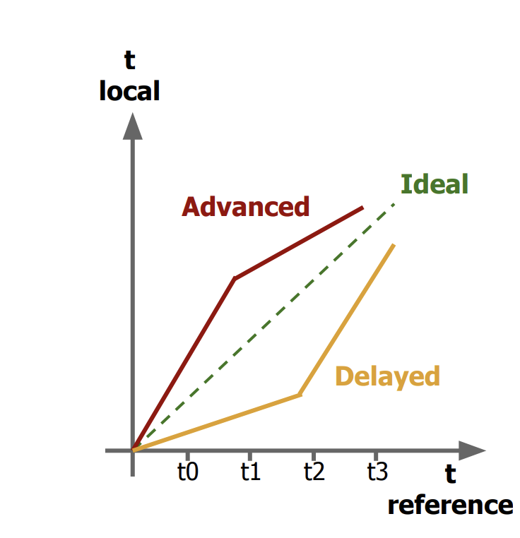

### Algoritmo de Cristian

Realiza una compensación del delay existente al obtener la medida de tiempo. Este algoritmo esta tomando en cuenta el delay de la red para la comunicación entre el cliente y el servidor para poder obtener el tiempo correcto.

- T0: El client envia request
- T1: El cliente recibe respuesta.
- Hipotesis: Delays en la red son constantes.

Entonces el nuevo tiempo de la computadora que se sincrnizo es igual al tiempo del servidor en el momento que recibió la solicitud más la mitad del tiempo que tardó en recibir la respuesta, que sería el tiempo que tardo en volver el mensaje.

   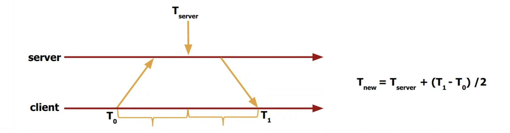

## NTP (Network Time Protocol)

### Objetivos

- Sincronización:
  - Clientes(UTC) sincronizados aunque existan delays en la red.
  - Analisis estadistico para filtrar data y obtener resultados de calidad.
- Alta disponibilidad:

  - Sobrevivir a largas caídas de conectividad
  - Rutas redundantes
  - Servidores redundantes

- Escalabilidad:
  - Gran número de clientes sincronizados de forma frecuente
  - Debe tener en cuenta efectos de drift

### Estructura de NTP

   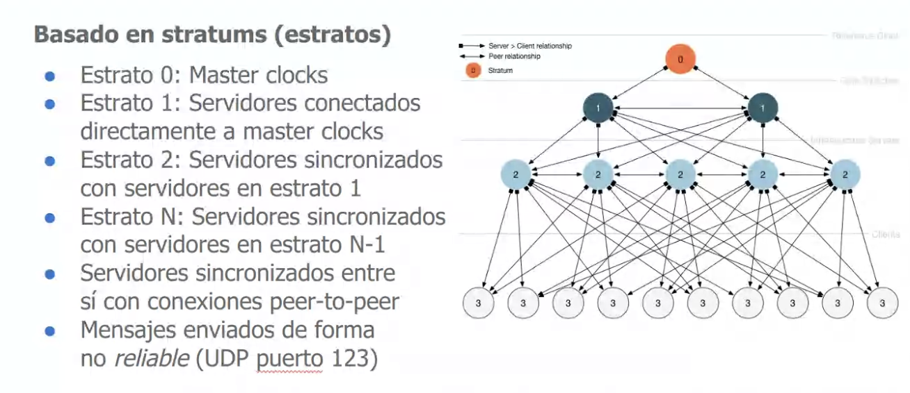

- Estrato 0: Master clocks
- Estrato 1: Servidores conectados directamente a master clocks
- Estrato 2: Servidores sincronizados con servidores en estrato 1
- Estrato N: Servidores sincronizados con servidores en estrato N-1
- Servidores sincronizados entre sí con conexiones peer-to-peer. Esto se hace de esta manera ya que puede existir la posibilidad de que los servidores del estrato superior no respondan. Este servidor puede elegir repspoderlo o no, si lo hace es porque se condidera que el servidor es confiable.
- Mensajes enviados de forma no reliable (UDP puerto 123). Esto se hace para evitar el overhead de TCP. Como se transporta poca información y se envía de forma periódica, no es necesario que se garantice la entrega de los mensajes.

### Modos de sincronización

- Modo multicast/broadcast --> Baja precisión
  - Usado en LANs de alta velocidad
  - Eficiente pero de baja precisión --> No se puede hacer ninguna consideración del RTT.
- Modo Cliente-Servidor (RPC)
  - Grupos de aplicaciones se conectan formando un grupo
  - Aplicaciones entre sí no pueden sincronizarse
- Modo Simétrico (Peer Mode)
  - Peers sincronizados entre sí para proveer backup mutuo
  - Utilizado en estratos 1 y 2

## Relojes lógicos

**Evento**

- Suceso relativo al proceso Pi que modifica su estado

**Estado**

- Valores de todas las variables del proceso Pi en un momento dado
  Relación 'ocurre antes' (happened before):
- Relación de causalidad entre eventos o estados tales que:

  - a b, si a,b pertenecen al mismo proceso Pi y a ocurre antes de b
  - a b, si a es un evento de Pi, b es un evento de Pj, a es el envío del mensaje 'm' a Pj y b es la recepción del mensaje 'm' desde Pi
  - a c, si a b y b c (transitividad)

Si un evento paso antes que otro garantiza que el segundo evento no puede ser antes que el primero. Pero esto no funciona de la forma inversa.

Los procesos son los puntos, los números que ponemos arriba son lo que queremos medir.

Dado S, el conjunto de todos los estados locales posibles del sistema y "-->" la relación temporal de implicancia "happened before", un reloj lógico es una función C monotónica creciente que mapea estados con un número natural y garantiza que:

para todo evento s,t pertenciente a S, s es anterior a t si y solo si, los relojes lógicos cumplen la siguiente relación: C(s) < C(t)

   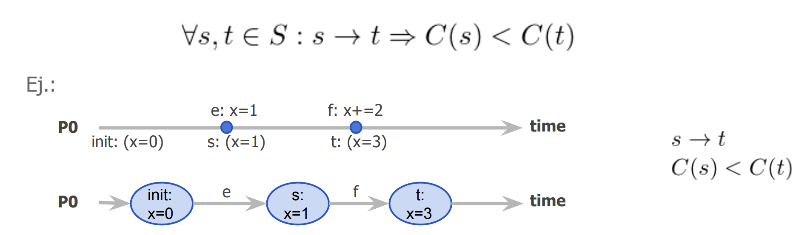

### Algoritmo de Lamport

Los valores de arriba son los valores de los relojes lógicos. Los números de abajo representan el estado de los procesos.

Cuando un proceso le envia un mensaje a otro, el proceso que envía incluye dentro del sistema su reloj lógico. El proceso que recibe, lo que va a hacer es tomar el valor del reloj lógico del mensaje y compararlo con su propio reloj lógico. Si el valor del reloj lógico del mensaje es mayor que el suyo, entonces va a actualizar su reloj lógico al valor del mensaje más uno.

Este algoritmo lo queremos usar para

   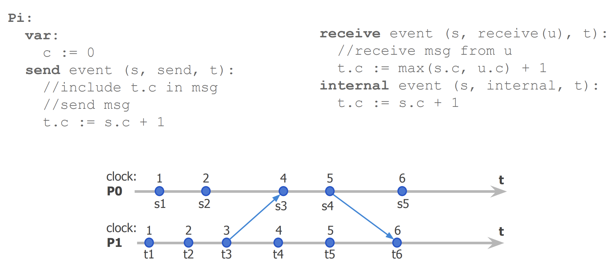

### Inconvenientes

Lo que quiero hacer en este caso, es que si tengo el reloj lógico de s y de t poder determinar cual fue el evento que ocurrió primero, para saber si dos estado cualquiera son concurrentes o no concurrentes(siendo concurrentes aquellos estados que no cumplen con la condición "Happened before").Pero no puedo determinarlo con un único escalar. Esto se ve en el siguiente ejemplo:

   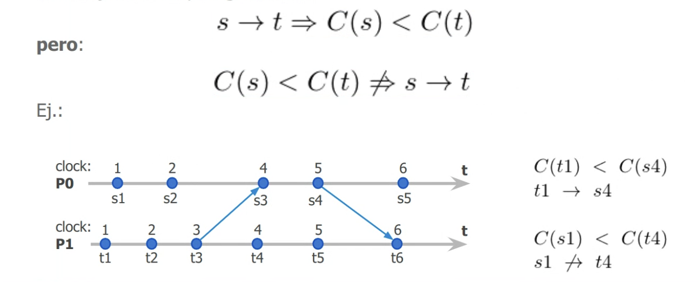

El reloj de Lamport captura muy poca información sobre dos eventos:

1. progreso dentro de un proceso
2. progreso durante envíos de mensajes entre procesos
   pero se pierde la información de qué evento ha ocurrido se pierde al
   almacenar un único escalar.

   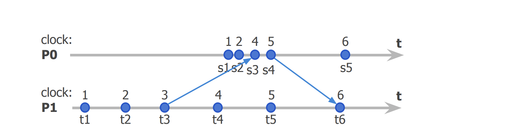

No se puede determnar si el evento s1 ocurrio antes del evento t4 ya que no hubo un intercambio de mensajes entre los procesos. Esto sucede porque no tengo la información necesaria de ambos procesos para tomar esta decisión. Como se ve en las imagenes puede suceder cualquiera de las dos situaciones.

### Corolario

Cuando sucede esta situación estamos hablando de eventos **PARALELOS**

   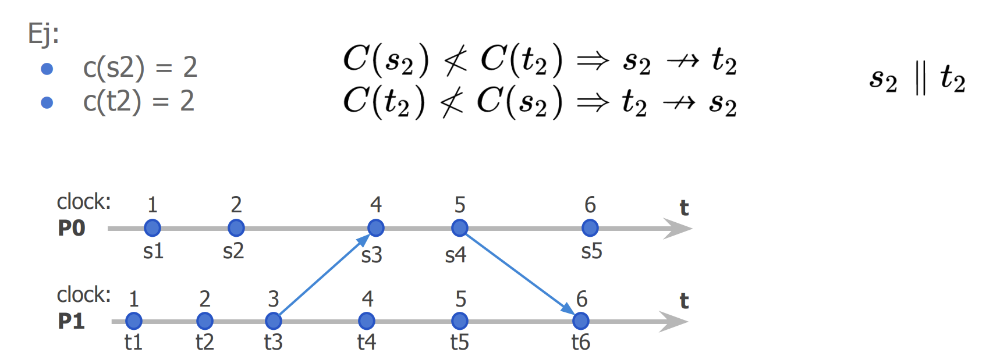

## Vectores de relojes

Un vector de relojes es el mapeo de todo estado del sistema compuesto por k
procesos, con un vector de k números Naturales y garantiza:

   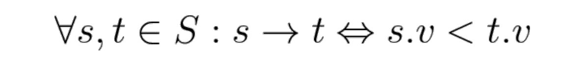

donde s.v y t.v son los vectores de k componentes para los estados s y t
respectivamente y

   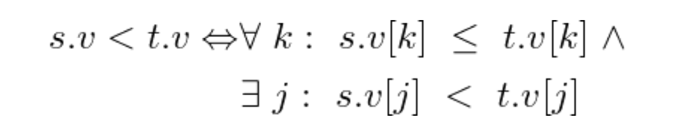

En pocas palabras, para determinar que un evento s ocurre antes que un evento t, tenemos que comparar los vectores de ambos eventos. Si el vector de s es menor al vector de t, entonces s ocurre antes que t.

Hay dos situaciones en la que esto no se puede determinar:

- Los vectores son iguales, entonces no se puede determinar si s ocurre antes que t o viceversa.
- Los vectores son paralelos, entonces no se puede determinar si s ocurre antes que t o viceversa. Esto es cuando los vectores son diferentes pero ninguno es mayor que el otro. En el caso de dos procesos, si un elemento del vector de s es mayor que el elemento del vector de t, pero otro elemento del vector de t es mayor que el elemento del vector de s, entonces no se puede determinar si s ocurre antes que t o viceversa.

   

   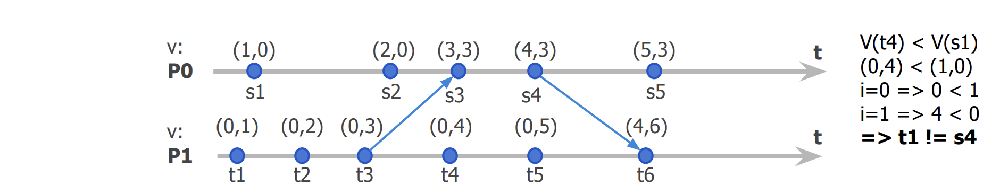

# Sincronismo

Los términos sincrónico / asincrónico dependen del contexto:

- Ejecución de Eventos
  - Sincrónico = bloqueante
  - Asincrónico = no bloqueante
- Comunicación entre grupos
  - Sincrónico = Entidades interactúan entre sí
  - Asincrónico = Entidades son independientes, se pueden comunicar entre si pero no depende uno del otro para poder avanzar a una siguiente etapa.
- Sistemas Digitales

  - Sincrónico = Entidades coordinadas por el mismo reloj
  - Asincrónico = Entidades coordinadas por diferentes relojes

**Sistemas Distribuidos**

- Un algoritmo/protocolo es sincrónico si sus acciones pueden ser delimitadas en el tiempo.
  - Sincrónico: Entrega de un mensaje posee un timeout conocido.
  - Parcialmnente sincrónico: Entrega de un mensaje no posee un timeout timeout conocido, o bien es variable.
  - Asincrónico: Entrega de un mensaje no posee un timeout asociado.

## Algunas propiedades

Depende del contexto:

- Sistemas distribuidos: Queremos medir los eventos en el tiempo
  - Steadiness: No queremos que los eventos se desincronicen
  - Tightness: Queremos que los eventos se sincronicen

Nos vas a interesar medir las propiedades para determinar que el sistema es estable.

- Tiempo delivery: Es el tiempo que tarda un mensaje **m** en ser recibido luego de haber sido enviado hacia **P**.
- Timeout de delivery: Todo mensaje enviado va a ser recibido antes de un tiempo **Tmax** conocido.Es el tiempo máximo que se espera para recibir un mensaje antes de considerar que ha fallado.

- Steadiness: Maxima diferencia entre el mínimo y el máximo tiempo de delivery de cualquier mensaje recibido por un proceso.

  - Define la varianza con la cual un proceso observa que recibe los mensajes
  - Define que tan constante (steady) es la Recepción de mensajes

   

      
   

- Tightness: Maxima diferencia entre los tiempos de delivery para cualquier mensaje m. Nos reflaja la varianza que tenemos en los mensajes recibidos en distinttos procesos. Nos va a reflejar la simultaneidad con la que llegan los mensajes a los procesos.

   

      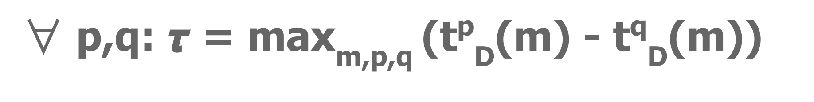
   

   

      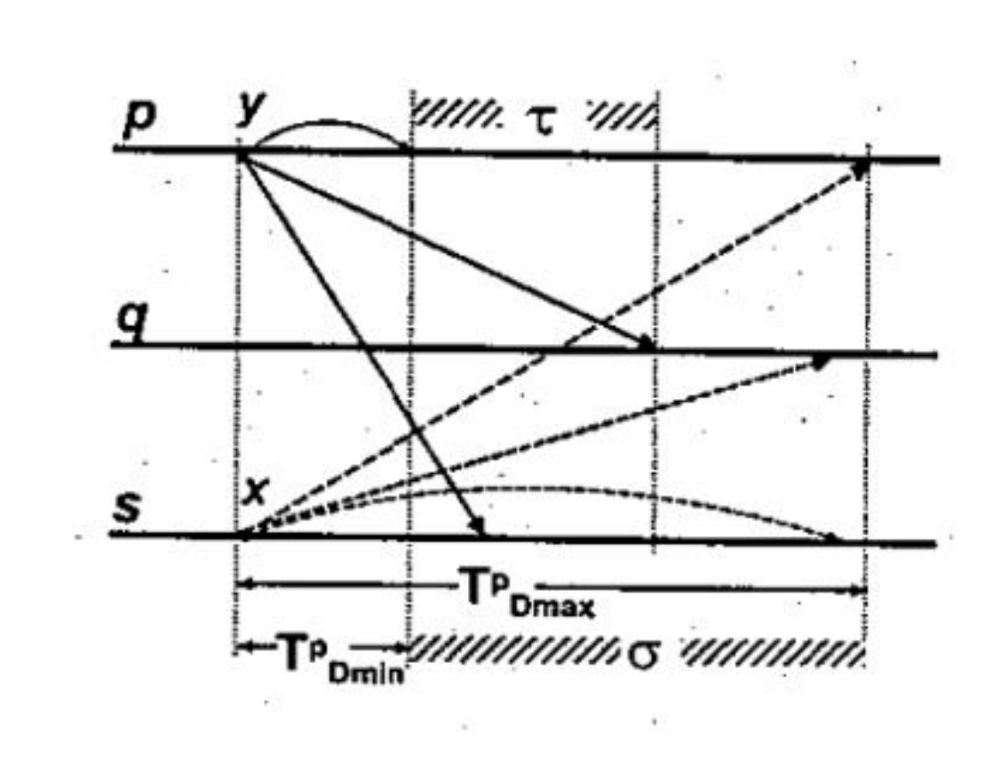
   

## Protocolos Time-driven

- Es sincrónico ya que tenemos un timeout conocido.
- Establecemos una tecnica de retries.

Teniendo en cuenta estos dos puntos, podría pensar que el protocolo puede llegar a ser asincronico por esta tecnica de retries. Pero esto no es así porque se que mi timeout maximo va a ser "N\*Ttout", esto es así porque voy a conocer la maxima cantidad de reintentos que voy a hacer para enviar el mensaje. Por lo tanto, el protocolo es sincrónico.

   

      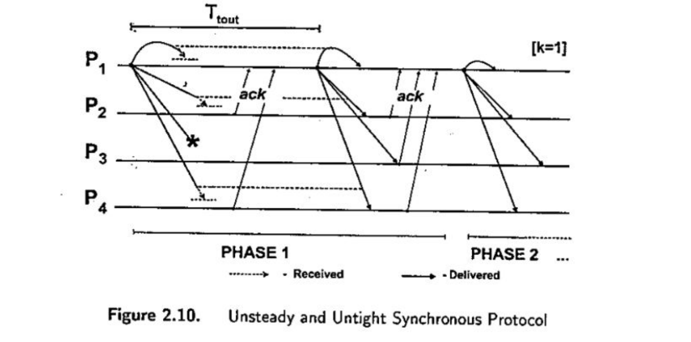
   

## Protocolos Clock-driven

Los relojes necesariamente tienen que estar sincronizados

### Steady and Tight Protocol

   

      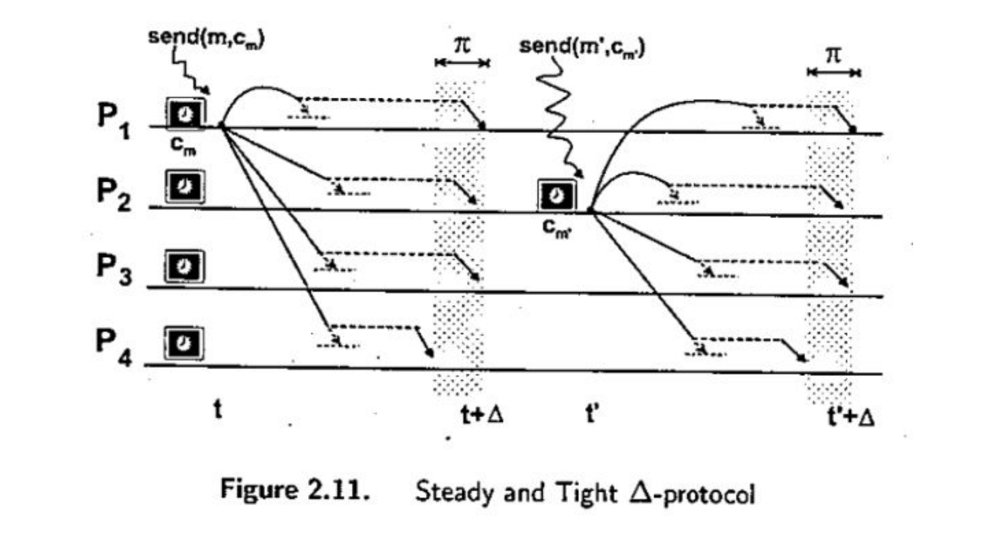
   

Nos garantiza que el tiempo de delivery no va a ser mayor a un tiempo máximo. Pero no nos garantiza que el mensaje llegue. Por lo tanto no podemos garantizar que el mensaje llegue en un tiempo determinado.

### Steady and Tight TDMA Protocol

   

      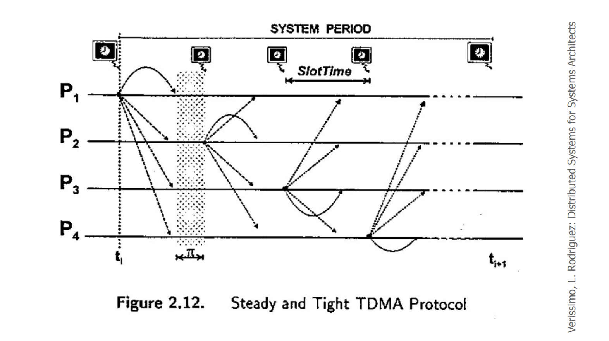
   

Medio compartido de comunicación. Si estamos todos hablando al mismo tiempo no nos entendemos, tenemos que ir tomando turnos.

Nos podemos asignar periodos de tiempo donde cada uno puede hablar.

Lo importante de estos protocolos es que hay una demora. Hay un envio del mensaje y un procesamiento del mesaje.

En cada uno de los eventos que pasan, uno de los procesos va a poder enviar mensajes a los demás, en el caso de que no quiera enviar nada, simplemente no lo envía. Esto no nos asegura que los mensajes lleguen, pero si nos asegura que los mensajes van a llegar en un tiempo determinado, y se va a handlear ese caso en ese tiempo.

# Orden de mensajes

## Delivery de Mensajes | Hold-back queue

- Envio del mensaje no es lo msimo que procesarlo(delivery de los mensajes).

- El delivery consiste en procesar el mensaje provocando, eventualmente, cambio en el estado del proceso.

- Los mensajes se mantienen en una cola que permite controlar el momento en que se lo libera, permitiendo demorar el delivery.

- Es posible reordenar mensajes en esta cola.

## Orden sincronico

Todo mensaje posee el mismo timestamp que el mensaje que lo origina. La transmisión del mensaje es de tiempo nulo. (despreciable)

   

      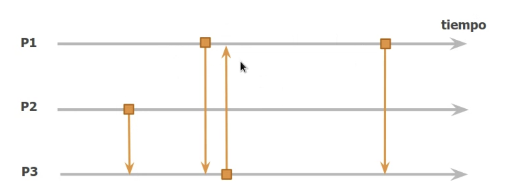
   

## Orden FIFO

Para un emisor y un receptor, si el eminsor envia dos mensajes m1 y m2, y el receptor recibe primero m1 y luego m2, entonces el receptor no puede recibir m2 antes que m1.

   

      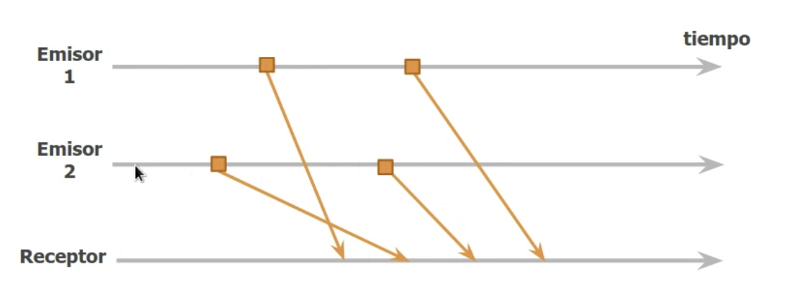
   

## Orden causal

Todo mensaje que implique la generación de un nuevo mensaje, es entregado manteniendo esta secuencia de causalidad sin importar el receptor.

Si un mensaje genera otro mensaje, para todo el resto de procesos que reciban mensajes, esa causalidad, que el mensaje 1 genera al mensaje 2, tiene que verse relejada en la recepción de todos los procesos.

- M1 se envia a P2 y P3.
- Cuando llega d1. P2 vemos que modifica el estado de P2 y genera un mensaje d2. Lo que quiero decir es que **d1** causa **M2**.

- Luego para que se genere el evento **M3** tiene que llegarme **d1** y **d2**.
- Cuando se envia el mensaje d3, es importante notar que tiene que llegar despues de los mensajes d1 y d2, ya que d3 es consecuencia de d1 y d2, para cumplir con la causalidad. NO PUEDO RECIBIR d3 ANTES QUE d1 y d2, porque fueron quien lo causaron.

   

      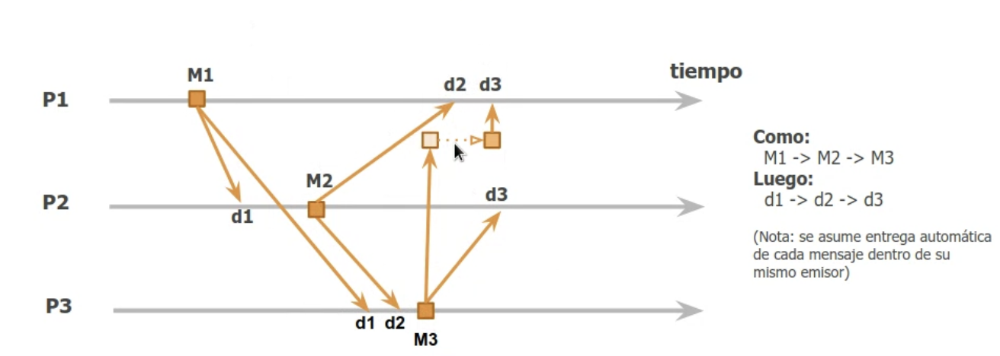
   

Si llega a pasar la situación que hablamos arriba en el P1, lo que se hace es un holdback queue, hasta que llegue el mensaje d2. Una vez que llega el mensaje d2, se procesa el mensaje d3.

## Orden total

Todo par de mensajes entregados a los mismos receptores es recibido en el mismo orden por esos receptores. Le importa que reciban primero el mismo mensaje.

No implica orden causal. Son dos cosas distintas.

   

      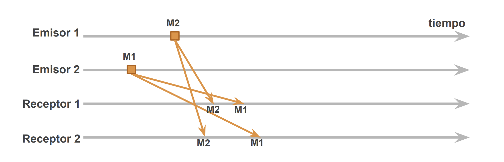
   

Todos van a ver lo mismo. Si en un proceso llega primero un mensaje, los demás procesos van a tener que ver ese mensaje antes que el otro.

# Estado

- Local: tengo un proceso y un momento, el estado es la unión de todas las variables de ese proceso.

- Global: La unión de los estados locales es el estado global.

## Analogía

Tengo un contador y cuando le hago click suma 1. Si miro para el otro lado y me cambian el contador. Que es lo que ese contador tendría que tener para que no me de cuenta que me lo cambiaron ?

Tendría que tener el mismo número que tenía en el contador.

En el caso de que se me rompa, para poder terminar la operación tengo que arrancar del último estado que tuve.

EJ 2:

Tengo una aplicación que es el contador, y me doy vuelta y me roban el celu. Saco otro, entonces voy a tener que tener el mismo estado de contador anterior y además neccesito la misma aplicación instalada en el nuevo celu.

La aplicación en este caso sería el código.

La entrada es el estado, pero también el código que estoy ejecutando(en este caso es la aplicación).

Ej 3

Tengo una computadora, el código lo damos por sentado porque esta en el disco. Si la aplicación me estaba mostrando una imagen, me la tendría que estar guardando una y otra vez ?

No me la tengo que estar guardando todo el tiempo, porque la imagen y el código son constantes, no son variables. Lo que esta cambiando en este caso el el número en si. Esta operación va a ser determinística.

Lo que pertenece al estado tiene que ser independiente de los demás elementos del sistema.

Ej 4

Emuldaores: Esta lo que se llama el safe state.

## Sistema como maquina de estados

- Consiste en modelar el sistema como una serie de estados
- Un estado evoluciona al siguiente estado por la ocurrencia de un evento
- El estado en el que estoy se refleja en mis variables.

- Asumiendo instrucciones determinísticas, el procesamiento de cualquier evento bajo el estado actual se puede reproducir

### Que pasa si tengo más procesos

Pasar de estado ocurre con el envio del mensaje.

   

      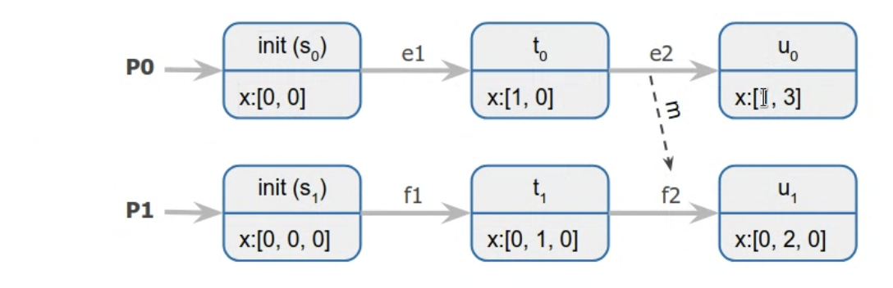
   

### Historia y cortes de un sistema

No soy una maquina de estados. Sino que tengo un historial de lo que esta pasando.

- Historia(corrida): Toda la serie de eventos que ocurren en un sistema desde su inicio hasta su finalización.
- Corte: Unión del subconjunto de historias de todos los procesos del sistema hasta cierto punto.

### Consistencia

Un corte consistente es cuando por cada evento que este contenido en ese corte, cada evento anterior a ese evento en el mismo proceso, también esta contenido en el corte.

Para todo evento e perteneciente a un corte, si f genera a e, entonces f también pertenece al corte.

   

      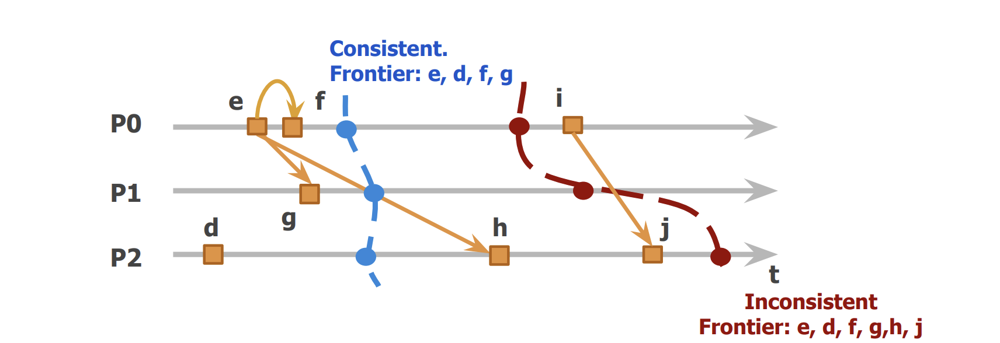
   

#### Ejemplos

Si hago un corte que es consistente, tengo para cada procesos un historial de enventos. Si se me corta la luz lo que puede restaurar el estado sin tener que volver a empezar y comunicame nuevamente con el resto de los procesos.

Un ejemplo puede ser con el caso de una transacción. Si tomo el corte(saco la foto en donde es correcto) y lo guardo, puedo volver a ese estado. Si no tengo el corte, tengo que volver a empezar la transacción.

## Algoritmo de Chandy & Lamport

- Algoritmo que permite obtener snapshots de estados globales en sistemas distribuidos
- El objetivo del algoritmo es almacenar estados de un conjunto de procesos y estados de canales (snapshots) de forma que, aunque los estados no hayan ocurrido al mismo tiempo, el estado global almacenado sea consistente.

Cuando vemos la imagen anterior podemos ver que lo que vamos a estar almacenando en canales van a ser aquellos mensajes que se hayan enviado pero que no se hayan recibido, que no esten dentro del corte.

- Hipótesis

  - Los procesos y los canales de comunicación no fallan
  - Canales son unidireccionales y poseen orden FIFO
  - Grafo fuertemente conexo (caminos de ida y vuelta definidos), todos los procesos se pueden comunicar entre sí.
  - Cada proceso puede iniciar un snapshot en cualquier momento

   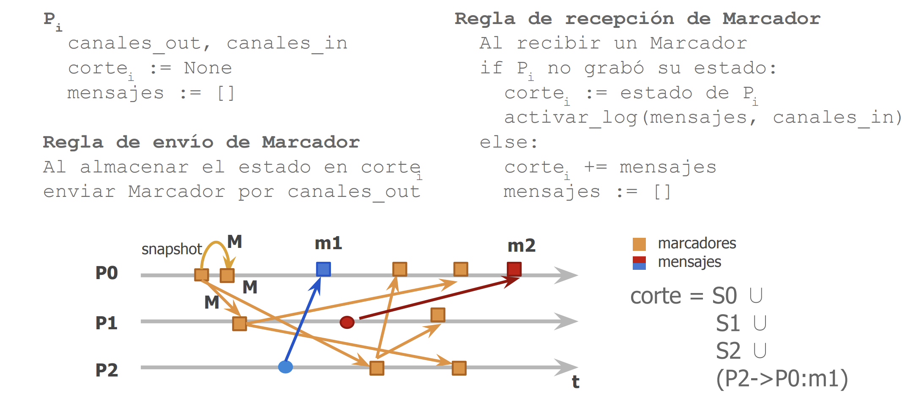

- Inicialización
  - Cada proceso tiene un canal de in y otro de out.
  - Corte: Corte del proceso que arranca en null.
  - Mensajes: Los mensajes que estan en el curso.

Un proceso cualquiera puede iniciar un snapshot en cualquier momento. Cuando un proceso inicia un snapshot, lo que hace es enviar un mensaje a todos los demás procesos del sistema, notificando que va a iniciar un snapshot. Este mensaje se llama "marker". Este mensaje es el que va a iniciar el corte.

Cuando recibimos un marcados tenemos dos posibilidades:

- El proceso no grabo el estado todavía:
  - Graba el estado en la variable corte
  - Logea el mensaje que recibe en el canal de entrada, y todos los mensajes que reciba después de este mensaje los va a logear en el canal de entrada.

Paso a paso:

- P0 inicia snapshot, envía un marcador a el mismo y a los demás procesos.
- Cada proceso que recibe el marcador, graba su estado y logea el mensaje que recibe en su canal de entrada.
- La condición de corte de este algortimo es que me tienen que llegar un marcador de todos los demás procesos.
- En el caso del mensaje M1, es importante tenerlo cuenta ya que se esta enviando antes que el marcador, y como garantizamos que tenemos orden FIFO(entre sender y receiver), entonces va a llegar antes que el marcador.
- En el caso de M2, no es parte del estado consistente. Esto es así porque el mensaje en P1 se genero despues de haber recibido el primero marcador, por lo tanto es una acción nueva que se genera despues de querer guardar el estado. El mensaje se va a processar, pero no se va a tomar en cuenta en el corte establecido.

La inforamación se esta guardando de forma local en cada proceso.

## Comunicación Reliable

- Que garantice la integridad de los datos.
- Validez
- Axtomicidad de los datos.

- Uno a Uno

  - Trivial si contamos con protocolos sobre TCP/IP y una red segura

- Uno a Muchos
  - El grupo debe proveer
