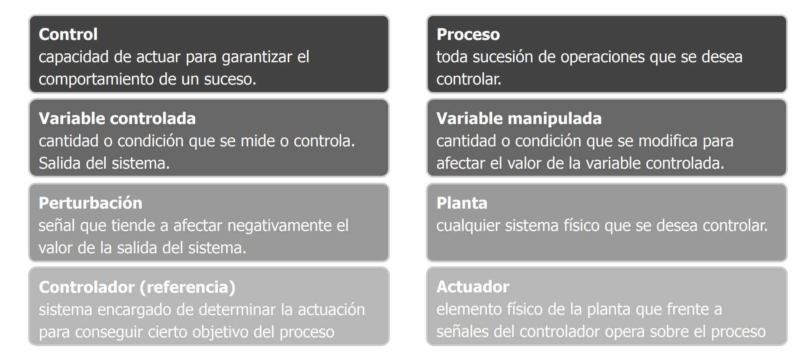

# Sistemas en Tiempo Real

- Son aquellos sistemas cuya evolución se especifica en términos de
  requerimientos temporales requeridos por el entorno. Son aquellos sistemas que lo importante es que se indica el paso a paso cual es el tiempo definido para relaizar cada una de las acciones.
- La correctitud del sistema depende de que entregue respuestas correctas y en tiempo correcto.
- Un sistema es RT si tiene al menos un servicio RT
- Ejemplos de sistemas RT:
  - Electrodomésticos digitales, medidores de señales (presión,
    pulsaciones, ritmo cardíaco, etc.) mediciones por sensores, control de automóviles, control en aeronaves, marcapasos, etc.

## Tipos de RT

- Hard RT(Ocurre realmente en real-time):

  - se debe evitar todo fallo relacionado con el tiempo de delivery

  - perder un deadline o plazo de respuesta es un fallo total

Un caso puede que este haciendo un sistema de controla para la detección de errores en un avión.

- Soft RT:

  - fallos relacionados con el tiempo de delivery pueden ser admitidos ocasionalmente\*.

  - la utilidad de un resultado disminuye
    tras el deadline

- cierta frecuencia documentada

## Presivilidad

- RT implica previsibilidad, no performance(). Es un sistema que se exactamente que va a hacer en cada momento y que va a tardar en hacerlo.

  - Sistemas veloces pero sin previsibilidad
    - No son RT
  - Sistemas previsibles con tiempos característicos lentos
    - Son RT

- Se trata de hacer un correcto scheduling para que se cumplan los
  deadlines previstos por diseño

## Comunicación en RT

RT require comunicación fiable y sincrónica (con deadlines bien definidos)

- TCP/IP: no permite asegurar estos atributos.
- Comunicación Serial: permite control sobre estos aspectos
  - Ej. producto comercial: Profibus
- Ethernet: puede ser utilizado en capa física:
  - Evitar no-determinismos en protocolos capas superiores
  - Switching determinístico: necesario en colisiones en transmisión
  - Ej. producto comercial: Profinet

## Tolerancia a fallos

- Los sistemas ahora deben ser tolerantes a fallos de tiempo
- Distintos tipos de estrategias:
  - Soft RT:
    - Ej.: Sistemas web de gran escala
    - El 99% de los requests deben reponderse en 2 seg. El 1% restante se deben responder en 10 seg. Se admite 1 outliers cada 1M reqs.
  - Hard RT:
    - Ej.: Misión crítica
    - El 100% de los requests debe resolverse en 1 seg. Frente a errores, se asume un fallo catastrófico y se recomienda hard reset.
    - Muy importante revisar el factor de Maintainability.

## Paradigma de trabajo

Distintas formas de ver los protocolos para emitir señales o pedidos y obtener respuestas de los mismos:

   

# Sistemas de Control

Escenarios donde un sistema intenta controlar de forma manual o automática alguna realidad del medio físico.

## Motivación

- Distintos escenarios cotidianos plantean un sistema a controlar de forma
  manual o automática

- En la Industria

  - Esquemas de irrigación
  - Procesos de transferencia térmica
  - Procesos químicos
  - Líneas de producción

- En la Vida Cotidiana
  - Termostatos, ascensores, expendedores de líquidos, control de luminosidad, electrodomésticos en general, etc

## Nociones

   

- Un ejemplo puede ser el aire acondicionado. En este caso la **variable controlado** sería la temperatura del ambiente, la **variable manipulada**, podría llegar a ser la velocidad del ventilador. **Perturbación** sería la ventana abierta o hay un horno encendido.

## Lazo abierto

- Sistema de control manual. Tomando el caso de la temperatura del aire acondicionado, hay que ir pasando distintas referencias para llegar a la temperatura deseada(botonera caliente, frio, super frio etc). En este caso, si ponemos el aire en frio y lleva la temperatura a 20 grados, pero abren la ventana, y la temperatura sube a 25 grados, el aire acondicionado no va a hacer nada porque no tiene un sensor que le indique que la temperatura ha cambiado.

- La salida de la acción no afecta el controlador.

   

## Lazo cerrado

- Se puede llamar también retroalimentado.
- Se utiliza información sobre el estado del sistema para actuar sobre el sistema y llevar la salida del mismo a los valores deseados.

En el caso del aire acondicionado, si la temperatura sube a 25 grados, el aire acondicionado va a detectar que la temperatura ha cambiado y va a volver a bajar la temperatura a 20 grados.

   

## Programación y tiempo real

- Arquitecturas dirigidas por eventos (event-triggered) o por el tiempo (time-triggered)
- Scheduling es importante:
  - Apropiativo (non-preemptive)
  - Esquema de prioridades para poder cumplir deadlines
- Protocolos de comunicación específicos:
  - Determinismo en todas las capas
  - Evitar algoritmos de backoff => imprevisibilidad

## Casos de estudio

### Mars Pathfinder

- Mars Pathfinder fue la primer misión a marte usando rovers. A los pocos
  días de aterrizar, se detectan continuos reinicios al intentar enviar datos.
- Motivos detectados:

  - Watchdog(si había una tarea que no se recibia desde la tierra había que hacer un reinicio) que reiniciaba el sistema al perderse el deadline de una tarea crítica.
  - Inversión de prioridades: una tarea de alta prioridad es interrumpida por una tarea de prioridad media.

    

     
  

### Therac-25

### Ariane 5

### (Non RT): Mt. Gox
