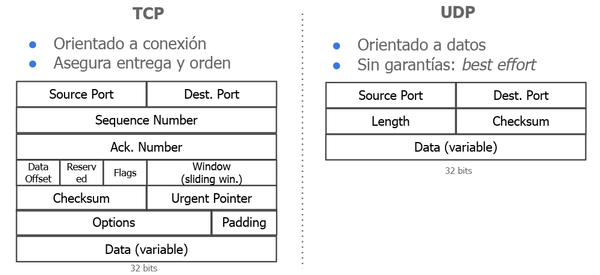

# Conceptos

## Conceptos básicos de memoria de un proceso

```
+----------------------+
|     Code Segment     |  ← Instrucciones del programa (solo lectura)
+----------------------+
|    Data Segment      |  ← Variables globales / estáticas inicializadas
+----------------------+
|  BSS Segment         |  ← Variables globales no inicializadas
+----------------------+
|     Heap             |  ← Memoria dinámica (malloc, new, etc.)
+----------------------+
|     Stack            |  ← Variables locales, llamadas a funciones
+----------------------+
```

## Modelos de multiprogramación


### Multithreading

- Recursos compartidos

  - Heap
  - Data segment(variables gloabales)
  - File descriptors(archivo, socket. etc.)
  - Code segment (donde esta el código fuente): Si tengo distintos procesos con el mismo code segment se esta corriendo el mismo programa.

  La estructura de la que estamos hablando es la siguiente:

* Sincronización

  - Soporte de threading del SO
  - IPC (Inter Process Communication): Comunicación entre procesos
  - Soporte threading del runtime (threads Java, .Net, etc)

* Caracteristicas clave
  - Sencillo compartir información entre threads.
  - Alto acoplamiento entre componentes del sistema.
  - Escasa estabilidad => 1 thread defectuoso afecta todo el sistema.
  - Escalabilidad muy limitada.

### Multiprocessing

Como lo dice el nombre, no corre todo dentro de un mismo procesos, sino que cada proceso tiene su propio espacio de memoria y corre de forma independiente. El ejemplo que se puede ver es el de los navegadores, donde cada pestaña es un proceso distinto. Esto antes no sucedía con Firefox, que era un solo proceso y si se caía, se caía todo.

- Recursos compartidos

  - Code segment (read only)

- Sincronización

- InterProcess Communication (IPCs):

  - Signals ○ Shared Memory
  - Sockets Sincronización
  - Pipes / Fifos ○ Semáforos

- Características clave
  - No es trivial compartir información entre procesos.
  - Componentes separados, en general simples.
  - Más escalable y más estable que multi-threading.
  - Sin tolerancia a fallos de hardware, sistema operativo, etc.

### Multicomputing

- Recursos compartidos

  - Nada

- Sincornización

  - Mensajes Ad-Hoc entre Computadoras => necesidad de implementar mecanismos de sincronización.

- Caracteristicas clave
  - Comunicación de red => problemas por limitaciones de ancho de banda, latencia y pérdida de mensajes.
  - Comunicación entre procesos: compleja y central al diseño del sistema.
  - Alta escalabilidad y tolerantes a fallos.

## Propiedades de progemas concurrentes

- Safety properties(siempre verdadero-invariante)
  - Ausencia de deadlocks
  - Exclusión mutua
- Liveliness properties (eventualmente verdadero)
  - Ausencia de starvation
  - Fairness

# Mecanismos de sincronización

- Semaphores
- Monitors
- Condition Variables: A bajo nivel el sistema operativo lo que hace es hacer un System call para que el proceso se duerma y luego se despierte.
- Barreras
- Rendezvous: Es cuando un proceso le tiene que pasar un mensaje a otro, solo se puede avanzar en el caso de que se pase el mensaje de forma exitosa.

**Nota**

- Cola bloqueante, es una cola que se bloquea cuando esta vacía o llena, no es necesario hacer un busy wait.

# IPCs

Permiten la comunicación entre dos o más procesos

- Provistos por el SO
- Creación y destrucción exceden la vida del proceso
  - Usuario es responsable de la vida de los mismos
  - Proceso Launcher y Terminator para administrar la vida de los mismos
- Usualmente identificados por nombre
- En Linux todos los IPCs son vistos como diferentes tipos de archivos

## Comparación


### Signals

- Existen 31 tipos distintos (kill -l)
- Cada proceso decide cuales handlear (Ej. libcURL y SIGALRM)
- SIGSTOP y SIGKILL son la excepción
- Ejemplos de signals estándar
  - SIGINT y SIGTERM: Graceful Quit
  - SIGSEGV: Problemas en la memoria
  - SIGABRT: Code assertions
- Propagación de signals en threads. (Masks setting)

### Shared memory

- Mecanismo provisto por el SO (Linux) para compartir recursos
- Abstracción inexistente en threads: heap entre dos threads de un mismo proceso es compartido
- Su tamaño se define al ser creada ● Mutex es necesario solo si dos procesos no pueden acceder a la memoria al mismo tiempo (e.g. shared counter)


### Pipes y FIFOs

- Pasaje de información directa entre 2 procesos
- Linux: API de un archivo para la escritura/lectura
- Unnamed Pipes (Pipes)
  - Comunicación entre procesos padre e hijo
  - Dejan de existir al finalizar el proceso
- Named Pipes (FIFO)
  - Comunicación entre dos procesos cualesquiera
  - Viven en el SO por lo cual excede la vida del proceso

### Message Queues

- Procesos escriben / reciben bloques de bytes
- Campo mtype
  - Identifica el tipo de mensaje
  - Sender debe enviar mensajes con mtype > 0
  - Receptor con mtype = 0 recibe mensajes sin importar el mtype
  - Caso esotérico: Receptor con mtype < 0
- Mensajes leídos son removidos de la cola
- Buffer size definido durante la creación

### Sockets

- Permite comunicar dos procesos a través de un canal de comunicación (endpoint)
  int socket(int domain, int type, 0);
- Domain
  - AF_UNIX - Unix socket
  - AF_INET / AF_INET6 - Network Socket
- Type (Protocolos de comunicación)
  - SOCK_DGRAM => UDP
  - SOCK_STREAM => TCP
  - SOCK_RAW => ??

## Comunicaciones

### Modelo TCP-IP


### Modelo OSI


### Estructura de Paquetes

- **IP**:


- **TCP y UDP**:



```

```
