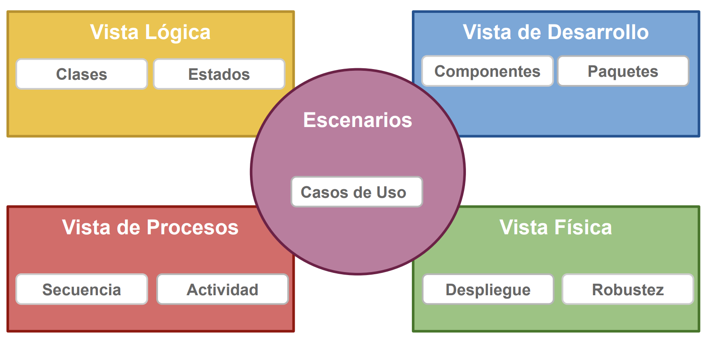
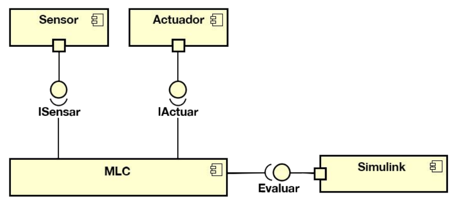
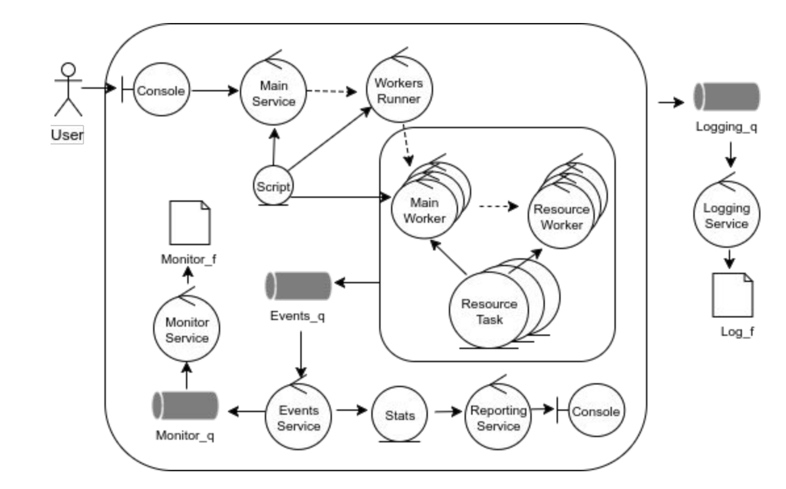
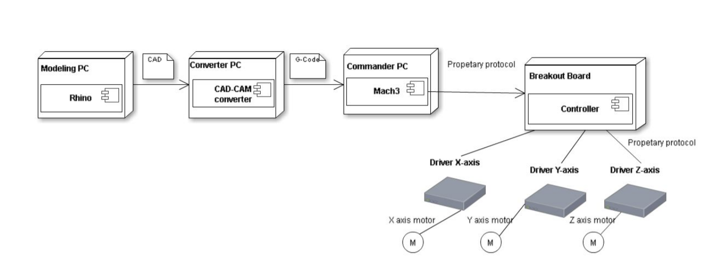
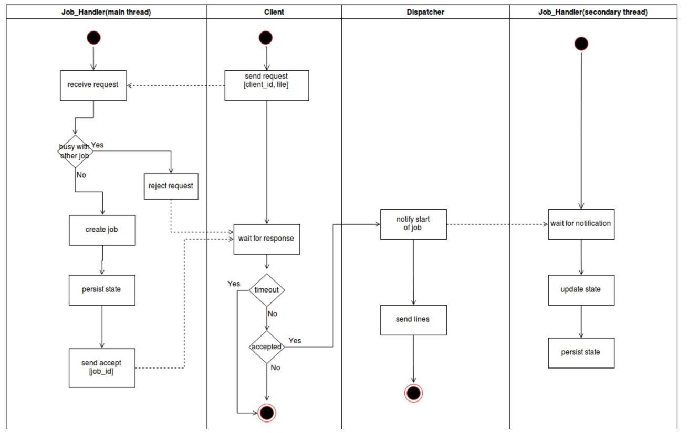

# Documentación Técnica y Diagramas

## Documentación

La arquitectura representa aquellas decisiones de importancia, medidas de acuerdo al costo de modificarlas.

Diseño y documentación:

- Evolutivo:

  - Adaptarse rapido, tomar feedback y aportar alor iterativamente.
  - No buscar el entendimiento del todo y ni domorar la arquitectura.

- Necesario para la coodinación, coherncia y cohesión.
  - Sin un diseño preliminar, probablemente jamás haya diseño.

Framework de documentación:

- Vista de Arquitectura 4+1

    

## Vista Lógica

- Estructura y funcionalidad del sistema (Clases, Estados) Vista de Física (o Despliegue)
- Topología y Conexiones entre componentes físicos (Despliegue)
- Expone la arquitectura delsistema (Robustez)Vista de Desarrollo (o de Implementación)
- Artefactos que componen al sistema (Paquetes, Componentes) Vista de Procesos (o Dinámica)
- Descripción de escenarios concurrentes (Actividades)
- Flujo de mensajes en el sistema (Colaboración)
- Flujo temporal de mensajes en el sistema (Secuencia)

## Diagramas

### Vista de desarrollo

#### Diagrama de Componentes

#### Diagrama de paquetes

### Vista fisica

#### Diagrama de Robustez

Comunicación entre los diferentes componentes de nuestro sistema.

#### Diagrama de Despliegue

En este caso se quiere mostrar las diferentes formas en las que se va a desplegar nuestro sistema. Queremos ver como distribuidos nuestro servicios en todos los nodos de nuestro sistema.

### Vista de procesos

Nos muestean como es el pasaje de mensajes entre diferentes servicios de nuestro sistema.

### Diagrmas de Secuencia

Muestra el flujo de mensajes entre los diferentes servicios de nuestro sistema.

### Diagrama de Actividades

Queremos ver más en profundidad cuales son los procesos que terminan creando más procesos, y cuando cada uno de ellos terminan de realizar alguna tarea

### Diagrama de Topología de red

