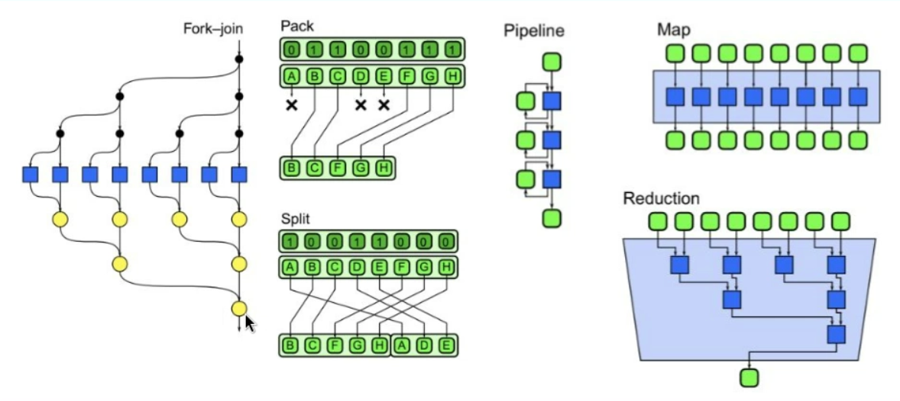

# Clase 3 - Paralelización, Multiprocessors, Multicomputing

Copiar la primera diapo

* Camino critico: 

## Paralelización de tareas: Ley de Amdahl

Tengo tareas, una parte es paralelizable y la otra es serial(esto si o si va a estar).

La idea es que si yo tengo un solo procesador, lo que hago es hacer primero la parte serial y despues la parte paralelizable, en cambio, en el caso de tener más de un procesador lo que se hace es dejar la parte serial en un procesador y despues el paralelizable lo separo en los demas procesadores.

* Peor caso: Lo maximo que puedo tardar es si tengo un solo procesador.
* Mejor caso: Que pasa si tenog infinita paralelización, lo mejor que puedo lograr sería ... (ver en la clase).

Lo que nos dice amdahl es que todo trabajo que hagas que sea serial ...

## Ley de Gustafson 

El speedup no lo debes medirlo con una unica tarea sino que deberias medirlo escalando el problema.

## Modelo work-span

* Paralelismo imperfecto
* Greddy schedudling: Proceso 
* 

Estrategia de paralelización 

Descomposición funcional: Tengo una fución con tres dentro funciones dentro de la misma. Lo que hago es poder paralelizar la funciones que tengo dentro de la misma 

Particionamiento de datos: Los datos se deben poder separar, la función se pueda separar. La idea es separar los datos para poder paralelizar, se va a hacer un fork y un join en algun momento.

 ## Patrones de procesamiento

* Basados en algoritmos
    * No tan abstractos como patrones de diseño
    * No incluyen detalles de implementación
    * Agnósticos a lenguajes de programación
* Patrones deben poder incluir otros patrones (nesting)
* Herramientas básicas de trabajo también en multi-computing

# Multhreadig vs multiprocessing vd Multi-computing

* Multithreading: 
    * Un solo proceso
    * Comparten memoria -- Se pueden comunicar muy facilmente, pero esto también puede ser un problema
    * Comunicación entre threads
    * Sincronización
    * No se puede escalar a multiples computadoras

* Multiprocessing:
    * Multiples procesos
    * No comparten memoria
    * Comunicación entre procesos
    * Sincronización
    * Se puede escalar a multiples computadoras

* Multi-computing:
    * Multiples computadoras
    * No comparten memoria
    * Comunicación entre computadoras
    * Sincronización
    * Se puede escalar a multiples computadoras

# Muchos procesadores(taxonomia de Flynn)

* SISD: Single Instruction Single Data: Un solo procesador, un solo dato. No hay parallelismo.
* SIMD: Single Instruction Multiple Data: Un solo procesador, muchos datos.
* MISD: Multiple Instruction Single Data: Multiples procesadores, un solo dato. No son usuales. Se suele usar por ejemplo en sistemas de redundancia y datapipelines.
* MIMD: Multiple Instruction Multiple Data: Multiples procesadores, muchos datos. Es el caso más natural.

    * Multiprocessorrs: Con memeoira y/p clock compartidos
    * Multicomputers: sin memoria ni clock compartidos

## Multiprocessors(Memoria comppartida)

 ### MIMD - Multiprocessors - NUMA 

* Non-Uniform Memory Access
    * Cada CPU controla un bloque de memeoraia local como su home agent 
    * Mayor ancho de banda si se respeta el acceso a memoria local.
    * Ideado en SGI, presente en Linux kernel y MS Servers.
    * Luego de años en desuso, nuevamente se ofrece en Cloud (ver Ej.)

### MIMD - Multiprocessors - UMA

* Uniform Memory Access (UMA == non-NUMA)
    * Tiempo de acceso a la memoria es idéntico para todos los procesadores.
    * Ancho de banda compartido por todos.
    * Performance balanceada para aplicaciones de uso general

## Multicomputing - sin memoria compartida 

*  Cada computadora tiene su propia memoria local
*  Cada computadora puede fallar de forma independiente
*  No poseen un reloj central de ejecución de instrucciones
*  Requieren comunicación entre computadoras:
    *  Networking: LAN, MAN, WAN

# Documentación Técnica y Diagramas

## Documentación 

La arquitectura representa aquellas decisiones de importancia, medidas de acuerdo al costo de modificarlas.

Diseño y documentación: 

* Evolutivo:
    * Adaptarse rapido, tomar feedback y aportar alor iterativamente.
    * No buscar el entendimiento del todo y ni domorar la arquitectura.

* Necesario para la coodinación, coherncia y cohesión.
    * Sin un diseño preliminar, probablemente jamás haya diseño.

Framework de documentación:

* Vista de Arquitectura 4+1

    

## Vista Lógica
* Estructura y funcionalidad del sistema (Clases, Estados) Vista de Física (o Despliegue)
* Topología y Conexiones entre componentes físicos (Despliegue)
* Expone la arquitectura delsistema (Robustez)Vista de Desarrollo (o de Implementación)
* Artefactos que componen al sistema (Paquetes, Componentes) Vista de Procesos (o Dinámica)
* Descripción de escenarios concurrentes (Actividades)
* Flujo de mensajes en el sistema (Colaboración)
* Flujo temporal de mensajes en el sistema (Secuencia)

## Diagramas 

### Diagrama de Componentes 

### Diagrmas  de Secuencia 

### Diagrama de Robustez

### Diagrama de Topología de red

### Diagrama de Despliegue

### Diagrama de Actividades 

# Nobmbres y direcciones 

* Nombres
    * Permiten identificar unívocamente a una entidad dentro de un sistema
    * Deben describir a la entidad
    * Abstraen al recurso de las propiedades que atan al mismo con el sistema (lugar geográfico, direcciones de red)
* Direccionamiento (Addressing)
    * Mapeo entre un nombre y una dirección
    * Dirección de una entidad puede cambiar, nombre no (*)
    * Dirección puede ser reutilizada

## Ejemplos 

* Domain Name (name) -> IP Address (address)
    * Mapeo de un servicio/nodo/otra entidad a una dirección IP
    * Traducción a través de protocolo DNS

Probar el comando dig y analzar la respuesta.

* IP Address (name) -> Ethernet Address (address)
    * IP address identifica a un nodo en un red (sea local o no)
    * Ethernet address identifica a NIC (network interface card) de un nodo
en una red local 
    * Resolución se realiza a través de protocolo ARP en IPv4 o ND
(Neighbor Discovery) en IPv6
* Service (name) -> Instances (address)
    * Mapeo del nombre de un servicio a alguna instancia
    * Resolución a través de Service Discovery
    * Diferentes implementaciones existentes: Zookeeper, Istio, Linkerd

El cliente solo envía la solicitud a un proxy o balanceador de carga, y este se encarga de encontrar el servicio adecuado.

1. El cliente envía una solicitud a un endpoint fijo (como un balanceador de carga o proxy).

2. El balanceador consulta el registro de servicios y elige la mejor instancia disponible.

3. El balanceador reenvía la solicitud a la instancia correcta.

### Ejemplos: 
### Escenario 1: Failover Automático entre Servicios Internos

#### Caso de Uso

Una empresa tiene un sistema interno de autenticación (auth-service) que permite a los empleados iniciar sesión en sus aplicaciones. Hay dos instancias de este servicio corriendo en distintas regiones:

* auth-service-us
* auth-service-eu

Si auth-service-us falla, el tráfico debe redirigirse automáticamente a auth-service-eu sin intervención manual.

Solución con Service Discovery (Ejemplo con Consul)
Con Consul (u otra herramienta de Service Discovery como Kubernetes o AWS Cloud Map), los servicios pueden registrarse dinámicamente y hacer failover sin depender de DNS.

### Escenario 2: Redirección de Tráfico según Condiciones (A/B Testing o Canaries)
#### Caso de Uso

Una empresa está lanzando una nueva versión de su servicio de facturación (billing-service). Quieren que solo el 20% de los usuarios sean redirigidos a la nueva versión (billing-service-v2), mientras que el resto siga usando la versión estable (billing-service-v1).

### Razones para usar Server-Side Discovery en lugar de DNS
1. DNS NO SE ACTUALIZA EN TIEMPO REAL (TTL)

    **Problema**:

    Cuando un servicio cambia de dirección IP (por ejemplo, si un contenedor se reinicia en Kubernetes), los cambios en DNS tardan en propagarse debido al TTL (Time To Live) configurado en los registros DNS.

    **Ejemplo**:

    1. service-a llama a service-b en service-b.mycompany.com (con DNS).

    2. service-b se mueve a otra IP.

    * DNS tarda varios minutos en actualizarse -- service-a sigue llamando a la IP vieja y falla la comunicación.

    * Con Service Discovery en el lado del servidor (ejemplo con Kubernetes):

        * Kubernetes maneja automáticamente los cambios de IP sin depender de DNS.

        * service-a sigue llamando a service-b y el tráfico siempre llega a una instancia válida.

2.  DNS NO BALANCEA EL TRÁFICO DE FORMA INTELIGENTE
    **Problema**:
    DNS puede balancear tráfico con Round-Robin DNS, pero no tiene en cuenta el estado real de los servidores.

    **Ejemplo**:

    Tienes dos servidores para payment-service:

    * server-1 (IP: 10.0.1.1)
    * server-2 (IP: 10.0.1.2)

    
    DNS responde con ambas IPs de forma aleatoria. --- Si server-1 se cae, DNS no lo sabe y los clientes pueden seguir intentando conectarse a él.

    Con Server-Side Discovery un balanceador de carga o proxy detecta automáticamente qué instancias están vivas y solo envía tráfico a las saludables.
    Se pueden aplicar reglas avanzadas, como:

    * Enviar tráfico a instancias con menos carga.

    * Evitar servidores con alta latencia.

    * Hacer "circuit breaking" si un servicio falla muchas veces seguidas.