# Interfaces y Protocolos

## Modelos de Capas: Layers y Tiers

### Arquitecturas de capas

Permiten dividir el problema en sub-problemas

- Fomentan el uso de interfaces
- Permiten intercambiar componentes reutilizando conectores y protocolos ya definidos
- Existen dos tipos de separación por capas:
  - Layers, o capas lógicas
  - Tiers, o capas físicas

### Layers

Agrupación lógica de componentes y funcionalidades de un sistema.

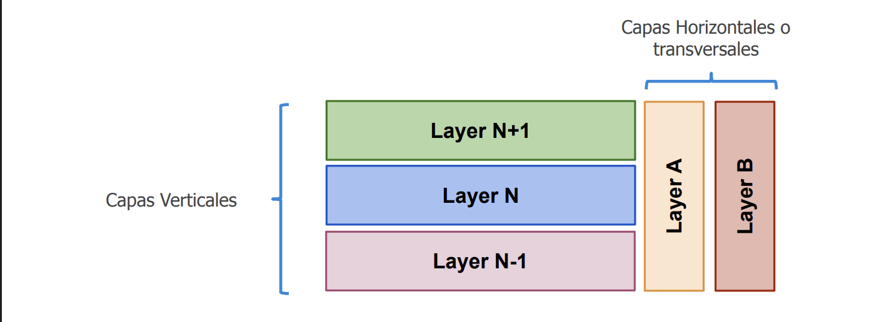

El caso de las capas horizontales, puede llegar a ser:

- Logs
- Librerias de manejo de errores
- Librerias de matematicas
- Seguridad

### Comunicación

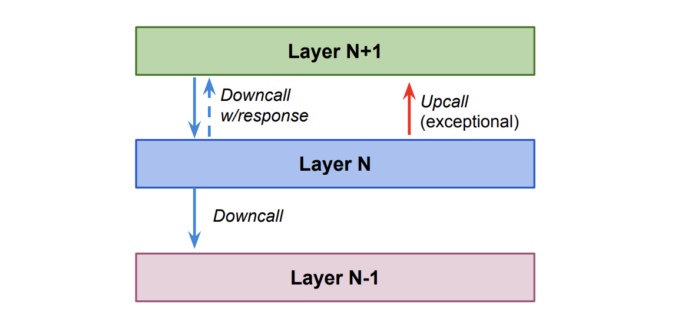

### Responsabilidades

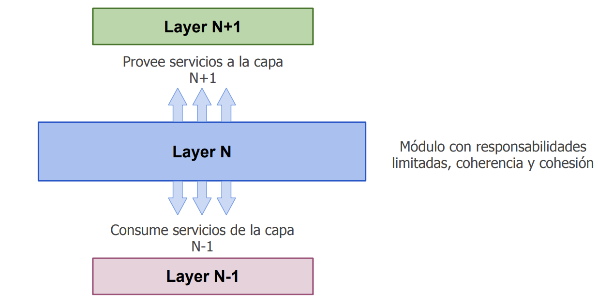

### Ejemplo

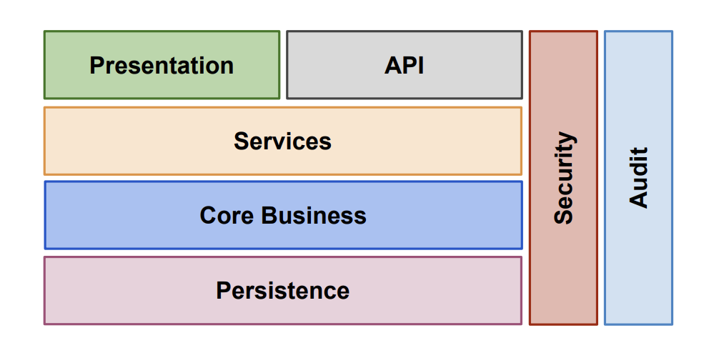

- Services: Aplicar alguna de las lógicas transversales que tenemos en la aplicación.
- Core Business: Lógica de negocio.
- Persistence: Forma de persistir los datos, estos pueden ser en una base de datos, en un archivo, etc.

### Tiers

Describen la distribución física de componentes y funcionalidad de un
sistema.

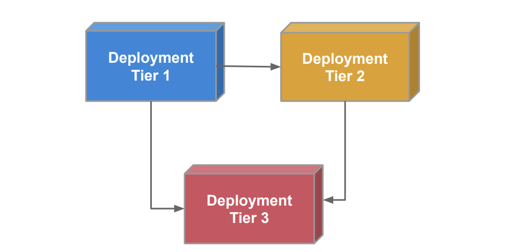

Una forma de separar en distintos tiers es la siguiente:

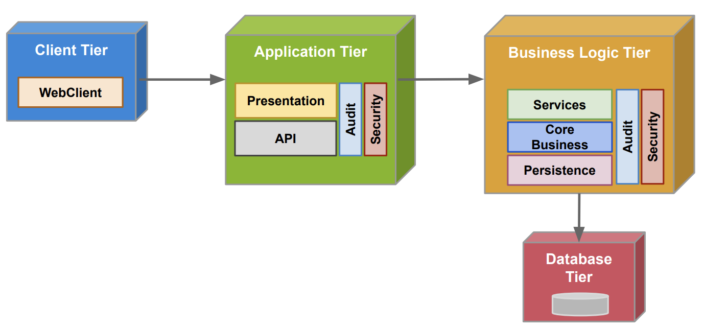
Las comunicaciones entre cada uno de los servicios lo pueden hacer de distintas cosas, en el caso Client Tier puede hablar con Application Tier a través de un protocolo HTTP, y Application Tier puede hablar con Data Tier a través de un protocolo JDBC.

JDBC: Java Database Connectivity

## Interfaces

Permiten la comunicación entre dos o más componentes/servicios sistemas

- Diferentes contratos permiten diferentes clientes
- Sólo se expone una parte del sistema

- Esconden implementación
  - Implementación puede ser modificada sin cambiar contrato
  - Cambio de contrato implica un nueva versión

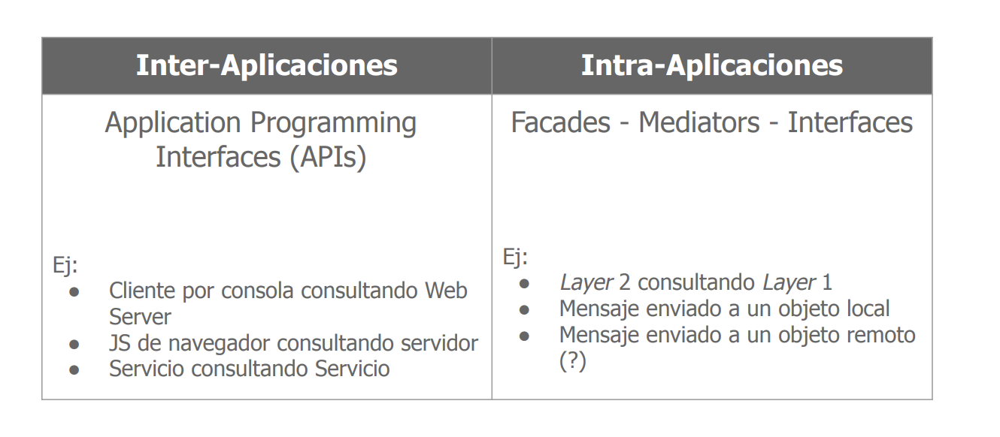

- Intra-aplicaciones: Interfaces entre componentes de una misma aplicación. Relacionado paradigma de programación orientada a objetos.
- Inter-aplicaciones: Interfaces entre aplicaciones distintas.

### Problemas a resolver

- Software es difícil de integrar
  - No todas las capas van a proveer iterfaces utiles. Entonces hay algunas veces que no queremos tener capas tan chicas, sino un poco más grande.
- Software es difícil de cambiar
  - Generamos capas que sean una independiente de la otra

Hay entra una cohersión, que es la medida en la que los componentes de un módulo están relacionados entre sí. Y el acoplamiento, que es la medida en la que un componente depende de otro.

### Orientación del contrato

- Orientación a entidades

- Desacoplamiento entre sistemas.
- Flexibilidad como objetivo.
- Admite extensiones a una funcionalidad no definida en su totalidad.

- Orientación a procesos

- Componentes altamente acoplados.
- Alta performance como objetivo.
- Funcionalidad conocida y diversa.

Nos interesa más el proceso que se va a realizar, que la entidad en sí. Por ejemplo validar si un usuario es válido o no, en vez de validar si un usuario tiene un nombre y un apellido.

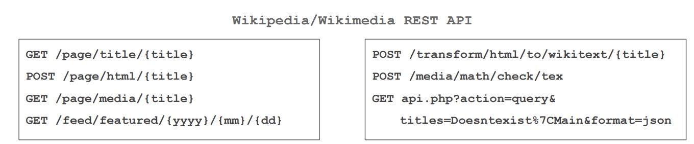

### Clasificación

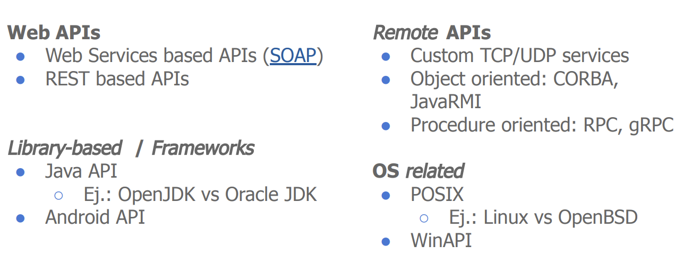

## Protocolos

### Modelo HTTP

Es el como nos comunicamos.

Características:

- Modelo Cliente-Servidor
- Modelo Request-Reply
- Sin estado. Esto quiere decir que no guarda información de la sesión. Pero en realidad ya desde Http 1.1 se puede guardar información de la sesión(cookies).

### Responsabilidad por capa

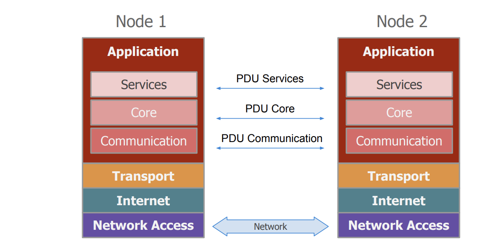

### Protocol Data Unit(PDUs)

Encapsulación de PDUs entre capas:

1. Encapsulación exacta
2. Segmentación de paquetes
3. Blocking de paquetes

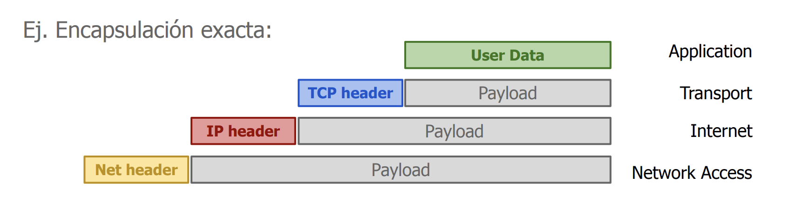

No siempre se puede enviar toda la data de una, sino que hay que particionar la información en distintos paquetes.

## Mensajes

### Formato de mensajes

#### Binario

- Alta performance

  - Tamaño de mensajes eficientes
  - Compresión puede no ser necesaria

- Serialización

  - Autogeneración de código (Google ProroBuf)
  - No siempre existe soporte para todos los lenguajes

- Interacción

#### Texto plano

En este caso tenemos información que es legible por humanos, pero no es tan eficiente en cuanto a tamaño. Entonces tenemos mayor overhead, por lo tanto el throughput es menor.

- Baja performance
  - Throughput bajo
  - Compresión agrega overhead
- Serialización
  - Formatos human-readable (JSON, XML)
  - Serialización básica (e.g. HTTP, SMTP)
- Interacción
  - Cliente único si se conoce el protocolo (e.g. cURL + REST API)
  - Fácil de debuggear

### Longitud de mensajes

- Bloques fijos
  - Cada dato a enviar posee una longitud fija
  - Fácil de serializar
  - Subóptimo con tipos de longitud variable (e.g. strings)
- Bloques dinámicos
  - Separador para delimitar comienzo y terminación de un campo
  - Longitud del tipo para delimitar longitud del campo
  - Pequeño overhead al agregar bytes extra
- Esquema mixto
  - Parámetro fijos (e.g. integers) no llevan delimitadores / longitud
  - Parámetros variables llevan delimitadores / longitud

#### Ejemplo - TLV

Todos los parámetros siguen el formato Type - Length - Value

- Type: Indica el tipo de dato / entidad. Tamaño fijo
- Length: Longitud del value sin contar el tipo y el length. Tamaño fijo
- Value: Dato a enviar. Tamaño variable. Admite subtipos

En este caso lo que hacemos es encodear una dirección

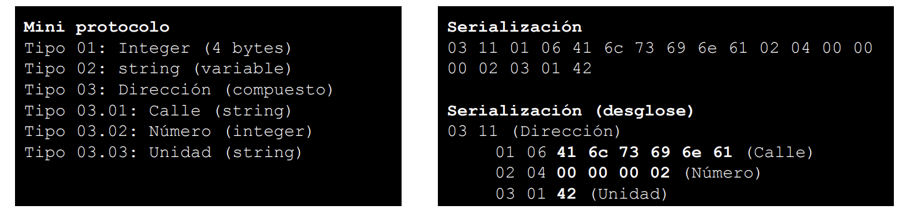

#### Ejemplo - TFTP

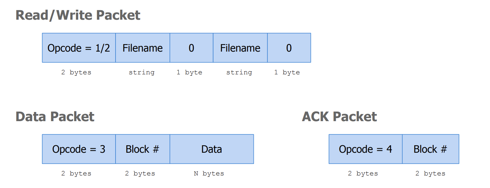

Cuando el cliente recibe un paquete que es menor al tamaño maximo, que es de 512 bytes, entonces sabe que es el último paquete.

### Multiples canales

La idea en este caso es tener distintos canales en los que te vas a comnunicar de forma más rapida, este es el caso de UPD. La idea es tener redundancia en la comunicación para que si un paquete no me llega por un canal, me llegue por otro. Y le saco el mayor provecho a la red, pero en el caso de que los dos fallen, lo que hago es utilizar el otro cananl que es TCP. El cual es más lento pero lo que hace es asegurarme que la información llegue. Una vez que la informacion que no había llegado por los canales de UPD, lo que hago es volver a usar los canales UDP nuevamente hasta que vuelvan a fallar.

Entonces la idea es usar los protocolos que son más rapido aunque no sean seguros(no te asegura que llega toda la información), pero tener un protocolo que sea seguro para asegurarme que la información llegue como backup.

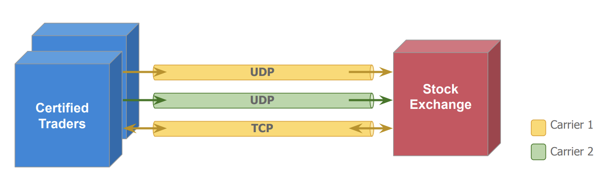

- Canales UDP para garantizar throughput (aún con repetidos)
- Canal TCP para pedir retransmisión

### RESTful

#### Representational State Transfer

- Basado en entidades (Web Resources)
- Cada Web resource es representado por una URI
- HTTP/HTTPS utilizado como protocolo de comunicación
- JSON/XML utilizado como protocolo de serialización
- Cambio de estados a través de operaciones CRUD

Objetivos:

- Alta performance, escalabilidad, confiabilidad, etc.
  Principios de Arquitectura:
- Arquitectura cliente/servidor
- Cacheability
- Interface Uniforme: Hypermedia As The Engine Of Application State (HATEOAS)
- Statelessness
- Layered system

- Statefull: Puede ser el caso de las cookies, en el que el servidor guarda la información de la sesión.

- Stateless: El caso en el que usemos el jwt, esto es así porque el cliente es el que se tiene que encargar de guardar la información de la sesión. Y el servdor no tiene que guardar nada, lo unico que hace es validar que el token sea correcto, y de esta forma el cliente puede acceder a la información que necesita.

#### Identidad

Identificar unívocamente una entidad entre diferentes sistemas es una prioridad

- Identificador debería tener información sobre la identidad que referencia

Identidad != Nombre

- Nombre puede cambiar, identidad no (Ej. https://tracker.com/pet?name=Lassie)
- URL define la identidad de la entidad, no el identificador (Ej. https://tracker.com/pet/12345)

#### Relaciones

- Identificar correctamente una entidad ayuda a la integración de sistemas
- Integración con otros sistemas
  - Siempre usar URIs para identificar entidades
  - URIs pueden ser relativas si la entidad es del mismo sistema

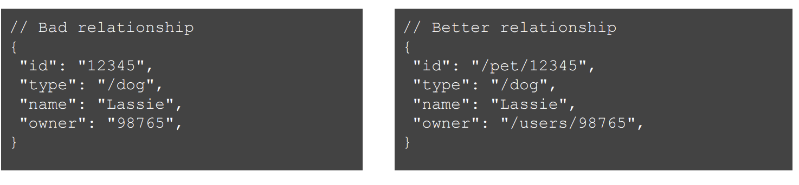

## Bibliografía

- M. Van Steen, A. Tanenbaum: Distributed Systems. 3rd Edition. Pearson Education, 2017.
  - Capítulo 2.1 - Architectures, Architectural Styles
  - Capítulo 4 - Communication
- Microsoft Application Architecture Guide, 2nd Edition. 2009.
  - Capítulo 5: Layered application guidelines
  - Capítulo 19: Physical tiers and deployment
- Martin Nally. Designing Quality APIs. 2018. **VER ESTE VIDEO**
  - https://www.youtube.com/watch?v=P0a7PwRNLVU
