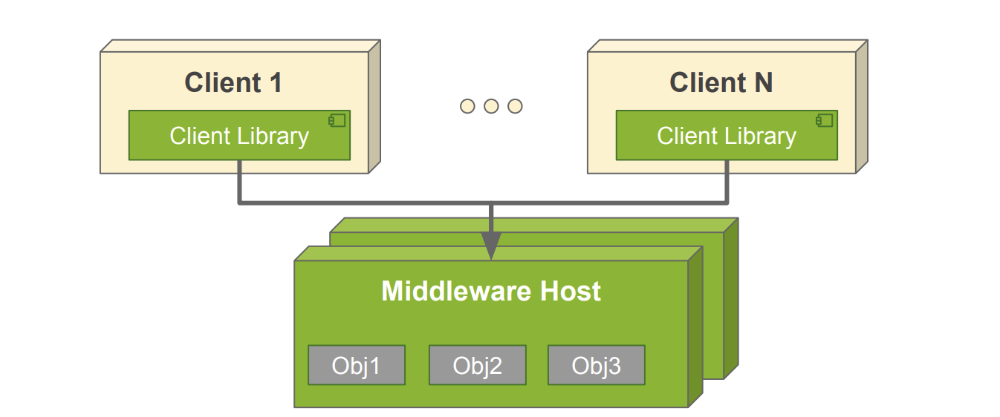

## Grupos

- Poder permitir que los procesos armen colecciones entre ellos, que puedan mandar mensajes en este grupo y que apliquen algunas entidaddes del grupo.
- Siempre el objetivo es la comunicación.
- Los procesos se deben poder suscribir a un grupo, y desuscribirse. Deben haber primitivas para que esto suceda.
- Difusión de mensajes: recibir y entregar hacia alguien más cierto elemento. Puede tener distintos casos:
  - Uni-cast: un proceso envía un mensaje a otro proceso.
  - Multi-cast: un proceso envía un mensaje a un grupo de procesos.
  - Broad-cast: un proceso envía un mensaje a todos los procesos.
  - Anycast: un proceso envía un mensaje a uno de los procesos de un grupo(no necesariamente a todos).

En el caso de anycast y unicast puedo tener un protocolo que sería el envio al nodo más cercano. (ECMP).

### Ej

- Colecciones de grupos dinamicas, puede haber un grupo de 10 procesos, y que se vayan agregando y sacando procesos.

## Topologóia

Puedo hacer el mismo envio de mensajes en distintas topologías. Pero la implementación en la misma va a ser distinta.

- Topología de anillo: el mensaje va a ir de nodo en nodo hasta llegar al destino.
- Topología de árbol: el mensaje va a ir de nodo en nodo hasta llegar al destino.
- Topología uno a uno: el mensaje va a ir de nodo en nodo hasta llegar al destino. ???

Difusión de los mensajes: Ver quien es el que coordina el envio de los mensajes. En el caso de que estemos en la **topología del arbol** pueden pasar dos situaciones:

- El nodo raíz es el que coordina el envío de los mensajes. Control centralizado en el nodo padre, habla con cada uno de los nodos hijos.
- En este caso la responsabilidad de seguir comunicado con los nodos hijos es de los nodos hijos. Control descentralizado, cada nodo se encarga de hablar con sus hijos. "**Este es el caso más correcto**"

La decisión tomando en cuenta la topología es importante, ya que si tengo una topología de anillo, no puedo tener un control centralizado, ya que no tengo un nodo padre.

## Atomicidad de los mensajes

- Los mensajes deben enviarse a todos los procesos o a ninguno. No puede haber un caso intermedio.
- Necesidad de realizar ACK de los mensajes. Esto tiene que ver con la capa de aplicación que justamsente lo que buscamos es confirmar a los demás que recibií, comprendí y estoy listo para seguir adelante.
- Necesidad de demorar el delivery de los mensajes.
- Reintentos frente a:
  - Caida de receptores
  - Caida de coordinadores
  - No recepción de mensajes
  - No recepción de ACKs

## Midleware

### Distintas definiciones

- Sofware de conectividad que ofrece un conjunto de servicios que hacen prosible el funcionamiento de aplicaciones distribuidas sobre plataformas homogeneas. Tiene que ser distinto sofware, IOT, sistemas envevidos.
- módulo intermedio que actúa como conductor entre sistemas permitiendo a cualquier usuario de sistemas de información comunicarse con varias fuentes de información que se encuentran conectadas por una red.

    

La imagen muestra un middleware como una capa de software que se encuentra entre el sistema operativo (SO) y las aplicaciones en un entorno distribuido. Su función principal es permitir la comunicación y coordinación entre múltiples computadoras, ofreciendo una vista unificada del sistema.

### Análisis por Capas

1. Capa de Aplicaciones (Apps)

- Representa los programas que ejecutan los usuarios en cada computadora.
- Las aplicaciones no se comunican directamente con los sistemas operativos, sino a través del middleware.

2. Capa de Middleware: Es la capa intermedia que proporciona servicios como:

- Comunicación entre aplicaciones en diferentes sistemas.
- Sincronización y gestión de recursos compartidos.
- Abstracción de las diferencias entre sistemas operativos.

Su objetivo es que las aplicaciones puedan interactuar sin preocuparse por la infraestructura subyacente.

3. Capa de Sistema Operativo (SO)

- Cada computadora tiene su propio sistema operativo.
- El middleware se encarga de traducir las solicitudes de las aplicaciones para que puedan ejecutarse en diferentes SO sin modificaciones.

4. Capa de Red (Networking)

- Permite la conectividad entre múltiples computadoras.
- El middleware utiliza esta capa para transmitir datos entre sistemas.

### Objetivo

- Transparencia (vista unificada del sistema)

  - No es necesario saber que el sistema esta distribuido. Para mi accedo a cierto recurso y no me importa si esta en un lugar o en otro.
  - Transparencia respecto a la capa de acceso, ubicación, migración y relicación, concurrencia fallos y persistencia.

- Tolerancia a fallos

  - Sistemas confiable(no es que no falla nunca, pero puede tener la posibilidad de recuperarse) que se ejecuten y comporten de manera predecible incluso en presencia de fallos.

- Acceso a recursos compartidos
- Interfaces. Como soy independiente de las maquinas tengo que saber como comuncarse con todas las capas.
- Comunicación de grupos.
  - Permiten un broadcasting y multicasting de mensajes.
  - Facilitar localización de elementos y coordinación de tareas.

## Vista Fisica

### Centralizado

Tenemos una unica maquina a la cual nos tenemos que comunicar con ella.

- Tiene un solo punto de falla
- Miniza la cantidad de mensajes a la red
- Si hay un problema esta en un solo lugar posible.
- No puede escalar. En la imagan son las instancias de computo que tiene mi monolito. LO VAN A HABLAR EN OTRA CLASE.

### Distribuido

Servicio que se provee en un espacio fisico.

- Si falla una operación, en un principio no sabes donde esta el problema.
- Puede escalar. Tiene que estar bien balanceado para que pueda escalar.

  

## Clasificación

### Transacciones de procesos

- Permiten garantizar transaccionabilidad de operaciones respecto de datos.
- Conectar muchas fuentes de datos y permite un acceso transparente al grupo.
- Poseen politicas de reinitentos y retención de datos frente a caidas internas.

### Orientado a objetos

Un middleware orientado a objetos permite que los sistemas distribuidos intercambien objetos completos en lugar de solo datos primitivos como en un enfoque basado en mensajes o RPC tradicional.

- Mensajes hacia sistemas distribuidos.
- Los objetos viven dentro del middleware.
- Esquema de 'marshalling' para transmitir la información --> Es el proceso de serializar un objeto en un formato que pueda ser transmitido a través de una red o almacenado, y posteriormente deserializarlo en el otro extremo.

#### Características clave:

- Las aplicaciones trabajan con objetos remotos como si fueran locales.
- Los objetos pueden invocar métodos en otros objetos ubicados en diferentes máquinas.
- El middleware se encarga de la comunicación y del manejo de memoria.

### Orientados a procesos

- El midleware trabaja como un servidor de funciones que se pueden invocar remotamente.
- Los servicios se pueden explorar y ejecutar pero no presentan estado para futuras invocaciones.
