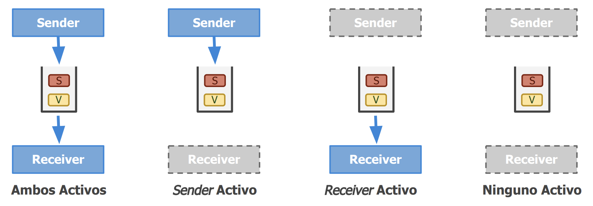

# Comunicación orientada a mensajes

## The message-Pasing interface

En la busqueda de escribir aplicaciones de alta eficiencia se busco operaciones orientadas a mensajes que lo permitieran.

Los sockets para este caso son insuficientes por dos razones:

- Nivel equivocado de abstracción ya que solo soportan operaciones basicas de envio y recepción de mensajes
- Los sockets fueron diseñados para comunicarse a traves de la red con el protocolo de proposito general TCP/IP. Lo cual no es suficiente para los protocolos desarrolados para las redes de interconección de alta velocidad.

Como resultado fue que las redes de interconección de alta velocidad desarrollaron sus propias interfaces de paso de mensajes, que son más eficientes que los sockets. Pero dio lugar a un problema de compatibilidad. Por lo tanto aparecio la interfaz de paso de mensajes (MPI), que es un estándar para la comunicación entre procesos en sistemas distribuidos.

Tiene las siguientes características:

- Esta diseñaada para aplicaciones paralelas y distribuidas.
- Tiene un uso directo de la red subyacente.
- Asume que los errores como crash de procesos o particiones de red son fatales y por lo tanto no tiene mecanismos de recuperación asociado.

Cuando hablamos de la transferencia de mensajes con MPI, podemos encontrar tanto operaciones sincronicas como asincronicas. En ambos casos, no tenemos una queue de mensajes en donde se van encolando cada uno de los mensajes, sino que lo que se hace al enviar un mensaje es hacer una copia en el buffer local en el MPI runtime system, y luego el runtime de MPI se hace cargo de remover el mensajes del buffer y transmitirlo a través de la red.

## Message-oriented persistent communication(MoM)

- Funcionan como un sistema de messajeria entre las aplcaciones que usen el midleware.
- Pueden enviarse mensajes bajo cierto "tópico" para que aquellos intereados los reciban(inforamtion Bus). INVESTINGAR
- Pueden enviarse mensajes con un destinatario definido (modo queue).

Provee un extenso soporte de comunicación asincrónica y persistente entre aplicaciones distribuidas. Permite que las aplicaciones se comuniquen a través de mensajes, sin necesidad de que estén activas al mismo tiempo.

La esencia de MoM es que los mensajes se almacenan en un sistema de mensajería, lo que permite que los procesos envíen y reciban mensajes en diferentes momentos. Esto es especialmente útil en sistemas distribuidos donde los procesos pueden estar en diferentes máquinas o incluso en diferentes redes. No es necesario que ambas entidades(sender y receiver) estén activas al mismo tiempo, lo que permite una mayor flexibilidad y escalabilidad en la comunicación.

Una diferencia importante con los sockets y con MPI es que MoM esta orientado a soportar transferencia de mensajes que pueden llegar a tomar minutos en lugar de segundos o milisegundos.

La idea basica de este modelo es que en sender inserta el mensaje en la queue de mensajes del receiver con el cual se quiere comunicar, es importante destacar que se da la garantia al emisor que el mensajes se va a insertar en la queue pero no que el receiver vaya a procesar este mensaje. Luego el receiver puede leer el mensaje de la queue en cualquier momento, incluso si el sender ya no esta activo. Esto permite que los mensajes se almacenen de manera persistente y se procesen en un momento posterior.

En una primera implementación cada uno de las identidades tiene una queue asociada, pero puede suceder la situación en la que varias entidades compartan una misma queue.

- Implementan la comunicación de grupo de forma transparente a las aplicaciones que la requieren.
- Basan su funcionamiento en el simple concepto de comunicar mensajes entre aplicaciones.
- Resuelve problemas de transparencia respecto de ubicación, fallos, performance y escalabilidad.

   

## Centralizado vs Distribuido

   

## Bus de Información vs Colas de Mensajes

Tengo dos aplicaciones, en la primera le interesan los dos tipos de paquetes, a la otra aplicación le interesa solo un tipo de paquete, pero emite los dos.

Tengo que hay una aplicación que solo escuchan, y que no producen. Puede pasar la situación en la que hay un productor pero no hay un consumidor, por lo cual esto puede ser un problema(pierde los paquetes producidos). En el bus no se retienen los mensajes.

En cambio en el segundo caso, lo que se hace es el modelo de colas es que el que tiene que pushear a las colas correspodientes para que las demás entidades lo puedan popear de su propia cola. Es importante notar en este caso que cada una de las entidades(puede ser más de una maquina)tiene su propia cola para poder consumir.

   

## MOM Sincrocnico

   

**Pros**

- Se modela como una conexión punto a punto
- Permite obtener respuestas instantáneas a pedidos concretos

**Contras**

- No permite implementar transparencia frente a errores. Puede intentar de reconectarse varias veces, y no lo puede resolver. Es bloqueante.

## MOM Asincronico

**Pros**

- Se modela naturalmente con colas
- La arquitectura soporta períodos de discontinuidad del transporte

   

Es necesario tener un storage para poder guardar las cosas que tengo en el aire, esto puede pasar en el caso de que el cliente que estaba conectado se desconecto, porque si esta conectado no va haber casi nada en el aire.

**Contras**

- Es complejo recibir respuesta a pedidos realizados (mínimamente es necesario contar con colas para el retorno de info).

   

No esta diseñado para que el cliente espere la respuesta, sino que el cliente hace un pedido y se va.

### Operaciones de un MOM

- put: publicación de un cierto mensaje
- get: esperar hasta que un mensaje sea detectado. Luego, eliminarlo de la cola y retornarlo
- poll: revisar mensajes pendientes, sin bloquear
- notify: asociar un callback utilizado por el MOM para ser ejecutado frente a publicación de ciertos mensajes

## Colas de mensajes y Brokers

- Pueden existir varias definidas dentro del MOM
- Tienen nombre y longitud definidas
- Los clientes suelen contar con colas privadas intermedias
- Garantía al Emisor de que el mensaje será insertado

   

### Broker(intermediario)

- Proveen transparencia de localización tanto al Emisor como al Receptor.
- Soportan lógica en el middleware para filtrar y modificar mensajes.
- Brindan un punto de control y monitoreo.

   

Intercepta los paquetes, los filtra y los modifica. No siempre es FIFO.

- Proveen transparencia de localización tanto al Emisor como al Receptor.
- Soportan lógica en el middleware para filtrar y modificar mensajes.
- Brindan un punto de control y monitoreo

Una de las aplicaciones más importantes de los sistemas de colas de mensajes es la integración de aplicaciones nuevas y existentes dentro de un sistema distribuido coherente. Para que esto funcione, las aplicaciones deben entender los mensajes que reciben, lo cual implica compartir no solo el formato sino también la semántica de los mensajes: deben hablar el mismo “lenguaje” o protocolo.

El problema surge cuando una nueva aplicación con su propio protocolo se une al sistema. Para comunicarse con las demás aplicaciones, habría que desarrollar convertidores de mensajes entre cada par, lo que escalaría a N × N convertidores en un sistema con N aplicaciones.

La solución práctica es aceptar las diferencias y facilitar la conversión de mensajes mediante componentes especializados llamados **brokers de mensajes**. Estos brokers funcionan como puentes entre aplicaciones, transformando los mensajes al formato que la aplicación destino puede entender. A veces solo cambian el formato (por ejemplo, delimitadores de registros o longitudes de campos), pero en casos más complejos pueden incluir plugins que manejan múltiples protocolos.

En contextos empresariales avanzados, los brokers también gestionan la integración de aplicaciones mediante un modelo publicador-suscriptor: las aplicaciones publican mensa sobre ciertos temas, y los brokers los distribuyen a las aplicaciones que se hayan suscrito a esos temas.

Finalmente, la lógica del broker se basa en reglas de transformación, almacenadas en un repositorio. Aunque muchos productos comerciales ofrecen herramientas sofisticadas para construir estas reglas, la “inteligencia” real proviene de los expertos que las definen y configuran.
