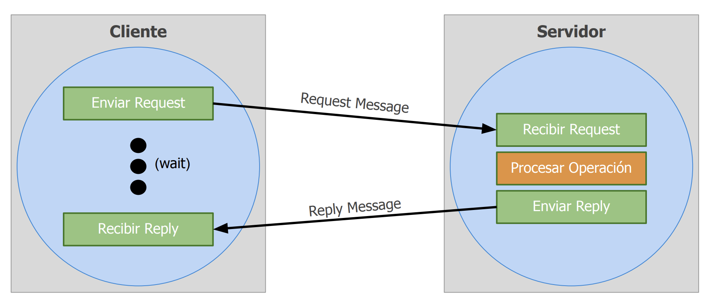
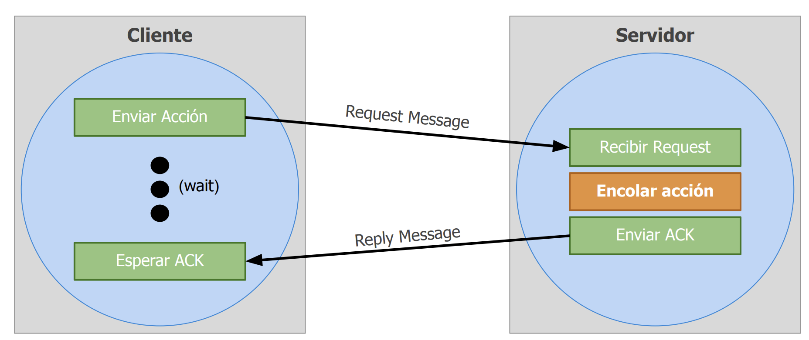
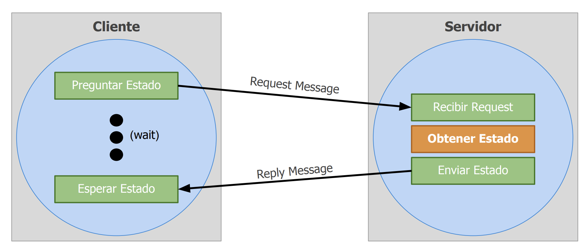
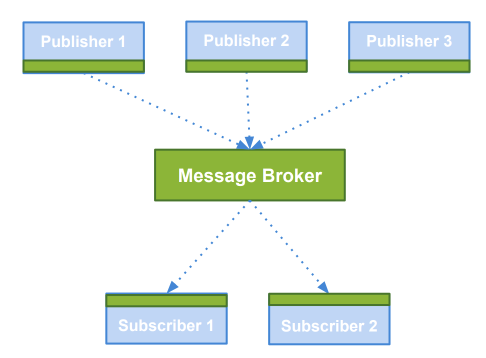
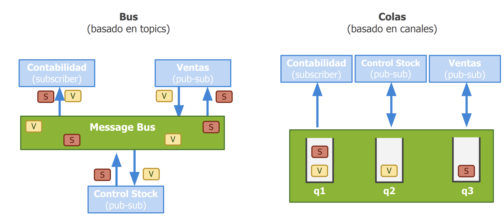
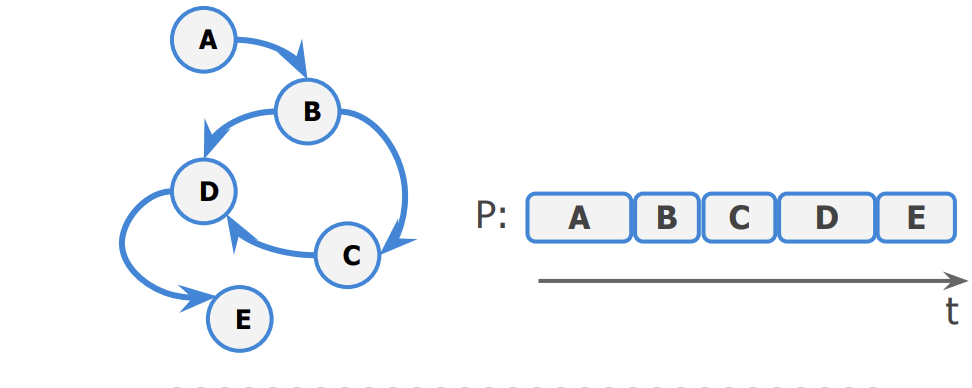
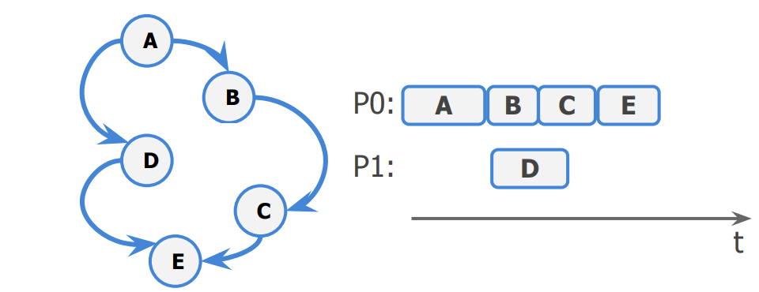
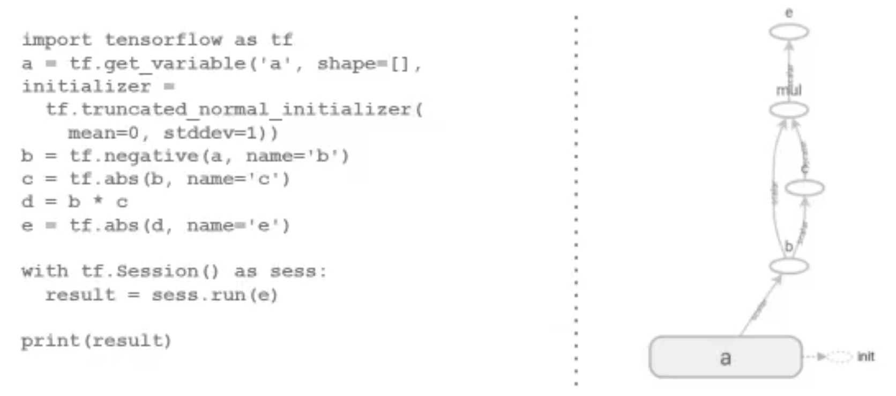
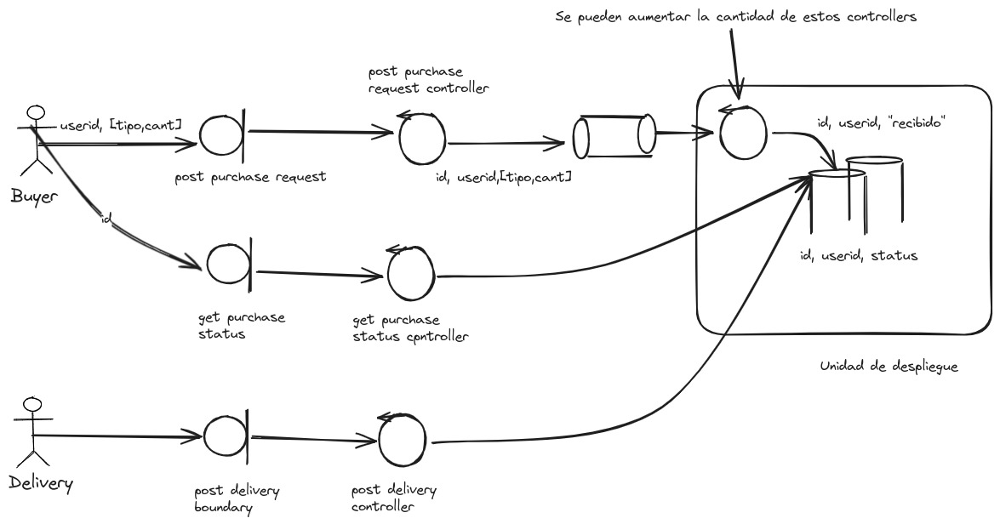

# Patrones de comunicación

## Request-Reply

Se hace un consulta y se recibe una respuesta, esa respusta es inmediata. El cliente en el medio quedo bloqueado, no puede hacer nada, pero tenes la garantia de que el servidor proceso la información.

El momento de las dos consutlas si es bloqueante.

- Protocolo utilizado en modelo Cliente-Servidor
- Es sincrónico (bloqueante) por defecto
  - Cliente envía Request Message
  - Servidor recibe Request, procesa mensaje y envía Reply
  - Cliente queda bloqueado hasta recibir Reply Message
- ACK triviales (el Reply message es un ACK)
- Cómo implementamos una operación asincrónica?
  - 2 Request-Reply sincrónicos son necesarios
  - Primero se envía operación a realizar
  - Luego se obtiene resultado de la operación

## Estructuras de mensajes

- Los siguientes campos suelen ser obligatorios
  - messageID: 0 = Request; 1 = Reply (esto lo necesito en el caso de que tenga dos entidadades identicas que se comunican, no aplica al caso del tp del cliente servidor que hicimos en el tp)
  - requestID: Identifica unívocamente al mensaje enviado
    - Autoincremental
    - UUID
  - operationID: Identifica acción / operación a realizar
  - Argumentos: Atributos asociados a la acción / operación

## Request-Reply

- Cuánto se debe esperar por Reply?
  - Timeouts con Retries
  - Algoritmos de Backoff + [Jitter](https://aws.amazon.com/es/blogs/architecture/exponential-backoff-and-jitter/), espero distinto tiempo para cada uno de los casos.
  - Ejemplo Amazon API
- ¿Que pasa si un request o un reply se pierde?

    <div style="text-align: center;">
     
  </div>

## Sincronico

<div style="text-align: center;">

  </div>

### Asincronico

<div style="text-align: center;">

  </div>

<div style="text-align: center;">

  </div>

## Producer-Consumer y Publish-Subscribe

### Producer-Consumer

Modelo basado en comunicación por tareas entre productores y consumidores

- Producers: son los emisores. Componentes que generan cierta información que se considera la materia prima para cierto procesamiento posterior.
- Consumers: son los receptores. Esperan la aparición de cierta información para efectuar un procesamiento particular.

Si o si hay alguien que esta producinedo cierta información que otros van a consumir si o si. Se estan generando elementos que tienene que ser generados y conumidos 1x1. Esto encaja mejor con un MoM con colas de mensajes, en lugar de un Bus de información.

## Publisher-Subscriber

Modelo basado en comunicación por eventos entre productores y consumidores

- Publishers: también llamados producers, son los emisores. Componentes que tienen la posibilidad de generar algún elemento de interés.
- Subscribers: también llamados consumers, son los receptores. Esperan la aparición de algún evento de su propio interés sobre el cual efectuarán alguna acción

### Arquitectura

Dos posibles arquitecturas

- Basada en tópicos: publicación y subscripción indicando el tipo de evento, tópico o tag.
- Basada en Canales: publicaciones y suscripciones orientadas a canales específicos.

<div style="text-align: center;">
   
</div>

### Implementaciones con MoMs

<div style="text-align: center;">
   
</div>

# Pipelines

- En arquitecturas de software se lo conoce como 'Pipelines and Filters'
- Los datos de entrada forman un flujo donde distintos filters (o processors) se conectan entre sí para procesarlos de manera secuencial
- Inspirado en patrones de procesamiento de señales, es muy utilizado en entornos Unix:

```bash
 cat in | grep pattern | sort | uniq > out
```

## Modelo de procesamiento

Admite dos modelos de procesamiento:

- Worker por filter: Se asgina una unidad de procesamiento a cada etapa del pipeline. Los items son recibidos por el worker, procesados y enviados a la siguiente etapa.
- Worker por item: Se asigna una unidad de procesamiento por cada item. Un worker toma el item ingresado y lo acompaña hasta el final del pipeline, aplicandole los filters paso a paso.

## Etapas secuenciales y paralelas

Cada uno de los procesos funciona como una etapa, pudiendo ser del tipo:

- Paralela: cada item a procesar es independiente del antereriores y posteriores, por lo que acepta paralelismo.
- Secuencial: No puede procesar más de un item a la vez. Ya procesados, los puede retornar:
  - Ordenados
  - Desordenados

### Ventajas

- Algoritmos online: Perminte comenzar el procesamiento antes de que esten todos los datos disponibles.
- Información infinita:
  - Permite trabajar con flujos ilimitados de información con cantidades constantes de memoria.
  - El procesamietno esta encadenado, con un buffer minimo para la configuración del pipeline.

# Direct Acyclic Graph(DAGs)

- Se modelan las intrucciones mediante un grafo de flujo de datos.
- Los nodos indican tareas y las aristas el flujo de información
- Acíclicos: oara todo nodo, no hay un camino que inicie y termine en él.
- Permite calcular trabajo total para cierta secuencia de tareas, camino crítico.

## Ventajas

- Representación natural para dataflows
- La carga de procesamiento se puede paralelizar
- Admite Lazy Loading dfe las operaciones: Solo procesa nodos requeridos por dependencias.

<div style="text-align: center;">
    
</div>

<div style="text-align: center;">
    
</div>

## Dependencias y non-DAGs

- También se pueden utilizar DAGs para modelar dependencias entre procesos
- Dependencias implican posibilidad de bloqueo frente al pedido del recurso de un proceso a otro.
- Si el grafo es cíclico, existe posibilidad de deadlock
- Nos sirve para detectar y recuperar sistemas frente a deadlocks

## Ejemplo de DAG

En este ejemplo se puede ver que tengo operaciones que se ejecutan de manera secuencial y que dependen de otras operaciones.

<div style="text-align: center;">
   
</div>

# Practica de Diseño Multicompunting

<div style="text-align: center;">
   
</div>
