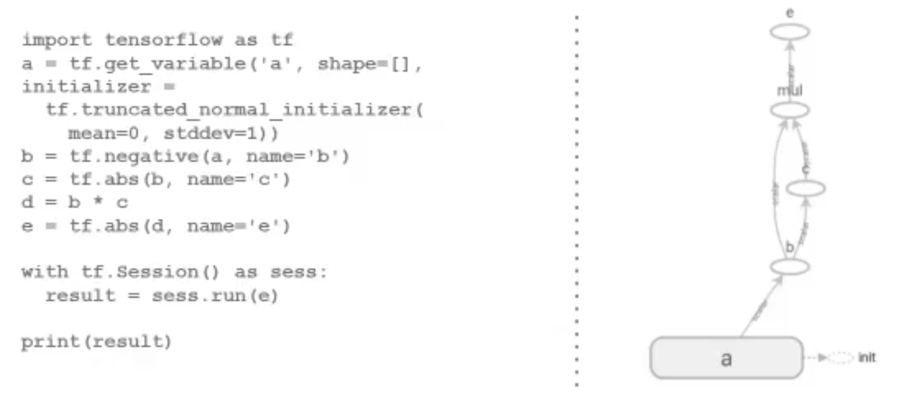

# MoM

* Implementan la comunicación de grupo de forma transparente a las aplicaciones que la requieren.
* Basan su funcionamiento en el simple concepto de comunicar mensajes entre aplicaciones.
* Resuelve problemas de transparencia respecto de ubicación, fallos, performance y escalabilidad.

## Centralizado vs Distribuido

## Bus de Información vs Colas de Mensajes

Tengo dos aplicaciones, en la primera le interesan los dos tipos de paquetes, a la otra aplicación le interesa solo un tipo de paquete, pero emite los dos.

Tengo que hay una aplicación que solo escuchan, y que no producen. Puede pasar la situación en la que hay un productor pero no hay un consumidor, por lo cual esto puede ser un problema(pierde los paquetes producidos). En el bus no se retienen los mensajes.

En cambio en el segundo caso, lo que se hace es el modelo de colas es que  el que tiene que pushear a las colas correspodientes para que las demás entidades lo puedan popear de su propia cola. Es importante notar en este caso que cada una de las entidades(puede ser más de una maquina)tiene su propia cola para poder consumir.

## MOM Sincrocnico 

**Pros**
* Se modela como una conexión punto a punto
* Permite obtener respuestas instantáneas a pedidos concretos 

**Contras**
* No permite implementar transparencia frente a errores. Puede intentar de reconectarse varias veces, y no lo puede resolver. Es bloqueante.

## MOM Asincronico

**Pros**
* Se modela naturalmente con colas
* La arquitectura soporta períodos de discontinuidad del transporte

Es necesario tener un storage para poder guardar las cosas que tengo en el aire, esto puede pasar en el caso de que el cliente que estaba conectado se desconecto, porque si esta conectado no va haber casi nada en el aire.

**Contras**
* Es complejo recibir respuesta a pedidos realizados (mínimamente es necesario contar con colas para el retorno de info). 

No esta diseñado para que el cliente espere la respuesta, sino que el cliente hace un pedido y se va.

### Operaciones de un MOM

* put: publicación de un cierto mensaje
* get: esperar hasta que un mensaje sea detectado. Luego, eliminarlo de la cola y retornarlo
* poll: revisar mensajes pendientes, sin bloquear
* notify: asociar un callback utilizado por el MOM para ser ejecutado frente a publicación de ciertos mensajes

## Colas de mensajes y Brokers

* Pueden existir varias definidas dentro del MOM
* Tienen nombre y longitud definidas
* Los clientes suelen contar con colas privadas intermedias
* Garantía al Emisor de que el mensaje será insertado

### Broker(intermediario)

* Proveen transparencia de localización tanto al Emisor como al Receptor.
* Soportan lógica en el middleware para filtrar y modificar mensajes.
* Brindan un punto de control y monitoreo.

Intercepta los paquetes, los filtra y los modifica. No siempre es FIFO.
En este caso, hay un 

Busco expandir el mensaje para otros lados

# Patrones de comunicación

## Request-Reply

Se hace un consulta y se recibe una respuesta, esa respusta es inmediata. El cliente en el medio quedo bloqueado, no puede hacer nada, pero tenes la garantia de que el servidor proceso la información.

El momento de las dos consutlas si es bloqueante.

* Protocolo utilizado en modelo Cliente-Servidor
* Es sincrónico (bloqueante) por defecto
    * Cliente envía Request Message
    * Servidor recibe Request, procesa mensaje y envía Reply
    * Cliente queda bloqueado hasta recibir Reply Message
* ACK triviales (el Reply message es un ACK)
* Cómo implementamos una operación asincrónica?
    * 2 Request-Reply sincrónicos son necesarios
    * Primero se envía operación a realizar
    * Luego se obtiene resultado de la operación

## Estructuras de mensajes 

* Los siguientes campos suelen ser obligatorios
    * messageID: 0 = Request; 1 = Reply (esto lo necesito en el caso de que tenga dos entidadades identicas que se comunican, no aplica al caso del tp del cliente servidor que hicimos en el tp) 
    * requestID: Identifica unívocamente al mensaje enviado
        * Autoincremental
        * UUID
    * operationID: Identifica acción / operación a realizar
    * Argumentos: Atributos asociados a la acción / operación

## Request-Reply

* Cuánto se debe esperar por Reply?
    * Timeouts con Retries
    * Algoritmos de Backoff + [Jitter](https://aws.amazon.com/es/blogs/architecture/exponential-backoff-and-jitter/), espero distinto tiempo para cada uno de los casos.
    * Ejemplo Amazon API
* ¿Que pasa si un request o un reply se pierde?

    

## Producer-Consumer y Publish-Subscribe

Si o si hay alguien que esta producinedo cierta información que otros van a consumir si o si. Se estan generando elementos que tienene que ser generados y conumidos 1x1. Esto encaja mejor con un MoM con colas de mensajes, en lugar de un Bus de información.

## Publisher-Subscriber 

Modelo basado en comunicación por eventos entre productores y consumidores
* Publishers: también llamados producers, son los emisores. Componentes que tienen la posibilidad de generar algún elemento de interés.
* Subscribers: también llamados consumers, son los receptores. Esperan la aparición de algún evento de su propio interés sobre el cual efectuarán alguna acción

### Arquitectura 

Dos posibles arquitecturas
* Basada en tópicos: publicación y subscripción indicando el tipo de evento, tópico o tag.
* Basada en Canales: publicaciones y suscripciones orientadas a canales específicos.

# Direct Acyclic Graph(DAGs)

* Se modelan las intrucciones mediante un grafo de flujo de datos.
* Los nodos indican tareas y las aristas el flujo de información
* Acíclicos: oara todo nodo, no hay un camino que inicie y termine en él.
* Permite calcular trabajo total para cierta secuencia de tareas, camino crítico.

## Ventajas 

* Representación natural para dataflows
* La carga de procesamiento se puede paralelizar
* Admite Lazy Loading dfe las operaciones: Solo procesa nodos requeridos por dependencias.

## Dependencias y non-DAGs 

* También se pueden utilizar DAGs para modelar dependencias entre procesos 
* Dependencias implican posibilidad de bloqueo frente al pedido del recurso de un proceso a otro.
* Si el grafo es cíclico, existe posibilidad de deadlock
* Nos sirve para detectar y recuperar sistemas frente a deadlocks

## Ejemplo de DAG

En este ejemplo se puede ver que tengo operaciones que se ejecutan de manera secuencial y que dependen de otras operaciones.

# Practica de Diseño Multicompunting

