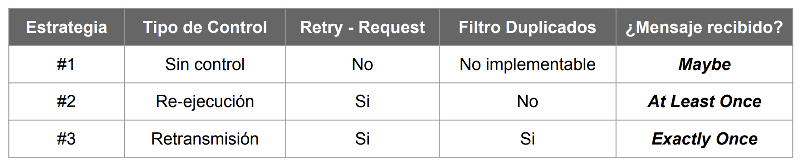
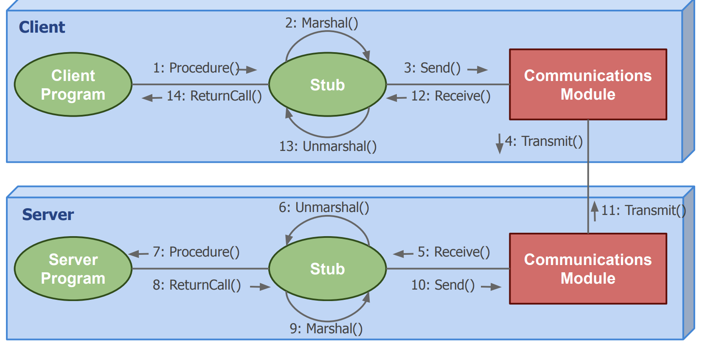
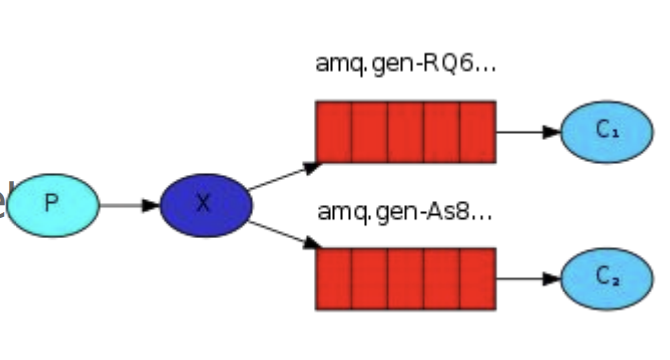
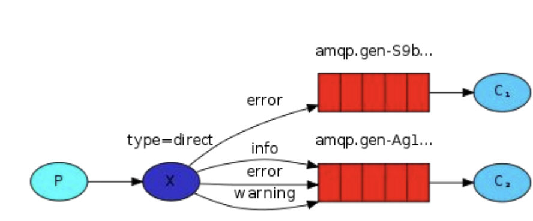
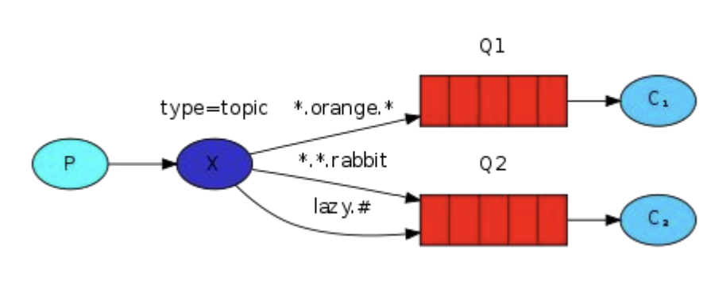
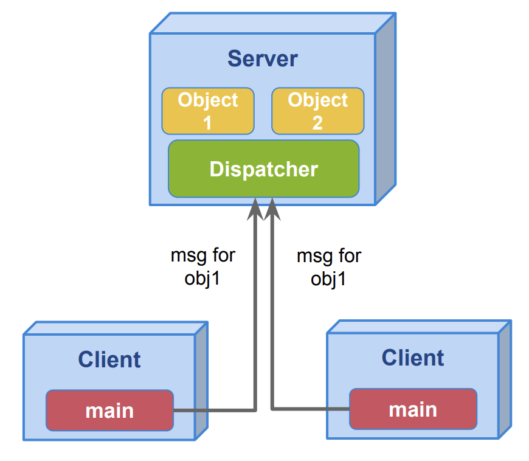

# Arquitecturas distribuidas simples

El servidor se ve como elemento pasivo y provee servicios

## Flujos de comunicación

- Long poling: Pregunto hasta que me respondas, voy a preguntar cada tanto tiempo.
- Push notification: No sabemos cuales son los elementos que se van a disparar, pero sabemos que alguno se va a dispara en algun momento, por lo tanto dejamos abierto un canal para recibir notificaciones.

# Peer to peer

- Se establece una red de nodos que se consideran pares entre sí
- Asume capacidades de recursos similares entre los pares
- Muy útil cuando existen objetivos de colaboración por parte del negocio
  - Protocolo acordado entre partes
  - La lógica distribuida requiere coherencia entre los nodos
- Auge en internet a partir de la invención de Napster, BitTorrent, etc

## Flujo de comunicación

- Muy difícil de establecer la comunicación entre pares:
  - Esquema mixto como cliente-servidor para proveer un servicio de nombres
  - Grupo de comunicación donde se comparten dirección de miembros
- Requieren mayores permisos de networking (reglas de firewall de entrada, rangos de puertos, etc)

# RPC (Remote Procedure Call)

Concepto: Encapsular una funcionalidad en una SDK, y el cliente no va tener conocimiento de la comunicación, reintento, implementación, etc.

- Ejecución remota de procedimientos
- Modelo Cliente-Servidor
  - Cliente realiza una llamada a un Procedimiento
  - Servidor responde con el resultado de la operación
- Comunicación remota transparente para el usuario
- Portabilidad a través de implementación de interfaces bien definidas

Ejemplo: Tenemos una función suma, en la que tenemos dos parametros ---

```python

func suma(a,b){
    return a + b -- Esto va a estar en otra máquina

}

A = 1
B = 2

suma(A,B)

```

## Tolerancia a fallos

Pueden fallar por cuestiones de red

- A diferencia de Local Procedure Calls (LPCs), un procedimiento puede o no ser ejecutado
- Diferentes estrategias para garantizar Delivery de mensajes:
  - Request-Retry con Timeout
  - Filtrado de operaciones duplicadas
  - Retransmisión / Re-ejecución de operación si se pierde retry

Según las estrategias adoptadas para asegurar el delivery de mensajes, los mensajes pueden llegar a ser recibidos 0, 1 o muchas veces:



## Implementación

- Cliente
  - Se encuentra conectado a un stub
  - Realiza llamadas de forma transparente al servidor (o no tanto)
- Servidor
  - Se encuentra conectado a un stub del cual recibe parámetros
  - Posee lógica particular del remote procedure
- Stubs
  - Administra el marshalling de la información -- Es el que se encarga de la abstracción de la comunicación.s
  - Envía información de llamadas (calls) al módulo de comunicación y al cliente / servidor
- Módulo de comunicación
  - Abstrae al stub de la comunicación con el servidor



## gRPC

 : Mecanismo para serializar datos agnostico al lenguaje de programación.

# RabbitMQ

- Queues
  - Nombradas(la idea es que los consumidores que saben el nombre de la queue pueden consumir elementos de la misma) vs TaskQueues(orientadas a distribuir tareas de ejecución pesada) vs Anónimas(no tienen un nombre especifico, las genera rabbitMQ)
  - Acknowledge: automática por defecto
  - Durabilidad: debe ser definida en la cola y en cada mensaje.
- Exchanges
  - Implementan diferentes estrategias para transmitir mensajes
  - Tipos: fanout, direct, topic, headers

Reciben componebtes de productores y los enrutan a una cola determinada.
Routing key: dato que viaja con el mensaje que sirve para tomar la decisión de a que cola se va a enviar el mensaje. Hay algunas configuraciones en la que no se toma en cuenta la routing key.

## Patrones

### Publish-Subscribe

- Productor
  - envía mensajes a un exchange de tipo fanout
- Consumidores
  - crean colas anónimas para recibir mensajes del productor
  - colas anonimas son bindeadas a exchange del productor para comenzar a recibir mensajes (las colas que se generan son independientes entre sí, hay una por cada consumidor).
- Exchange Fanout: Realiza un broadcast de de todos los mensajes recibidos a todas las colas conocidas



### Routing

Pide un match exacto de la routing key para enrutar el mensaje a la cola correspondiente. Siendo consumidor me deja escuchar un mensaje en particular con la routing key que yo quiera.

- Productor
  - Envía mensajes a un exchange de tipo direct
  - Adosa al mensaje un identificador de routeo (routing_key)
- Consumidor
  - Realiza binding a exchange direct con los routing_keys que desea recibir
- Exchange Direct: Redirige mensajes con una routing_key especifica a aquellas colas que se encuentran bindeadas a la misma



### Topic

- Productor
  - Envía mensajes a un exchange de tipo topic
  - Adosa al mensaje un identificador de routeo (routing_key)
- Consumidor
  - Realiza binding a exchange topic con los patrones que desea recibir
- Exchange Topic: Soporta patrones de búsqueda basados en palabras. routing_key es un conjunto palabras separadas por punto
  - \*: Permite sustituir una palabra
  - #: Permite sustituir una o más palabra



# Objetos distribuidos

- Los servidores ya no proveen servicios sino objetos
- Existe un middleware que oculta lacomplejidad de:
  - Referencias a Obj. remotos
  - Invocación de acciones
  - Errores (excepciones)
  - Recolección de basura

El usuario piensa que pasa en un su maquina pero en realiadad no es así. Los objetos están distribuidos en diferentes máquinas. El dispacher es el que se encarga de hacer la comunicación entre los objetos. El cliente no tiene que preocuparse por la comunicación, el cliente solo tiene que preocuparse por la lógica de negocio.



## RPC vs Objetos Distribuidos

RPC: Al hablar de funciones dentro de una computadora, tenemos la ventaja de que tenemos un sistema stateless, no tenemos que preocuparnos por el estado de la función(puedo comunicarme con cualquier maquina sin ningun problema). En el caso de los objetos distribuidos, tenemos que preocuparnos por el estado del objeto, y eso implica que tenemos que tener un sistema stateful. Los servidore van a tener una parte de la verdad, y estos objetos hay que ubicarlos, hay que saber a que servidor hablar para que me de acceso a ese objeto. Entonces si yo me equicovo de servidor no voy a poder hacer nada.

En el segundo caso, lo que se puede hacer es migrar el objeto a la maquina que lo necesita(el trafico que estaba recibiendo cuando hago esto se detiene hasta que termino la transición y tengo que comunicar que ya no tengo más a ese objeto).
