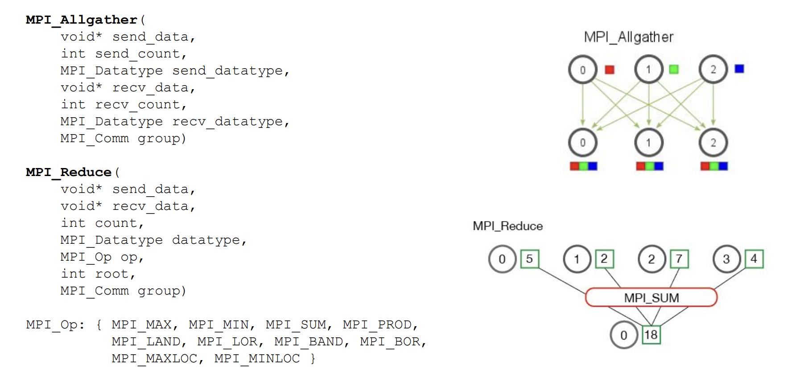
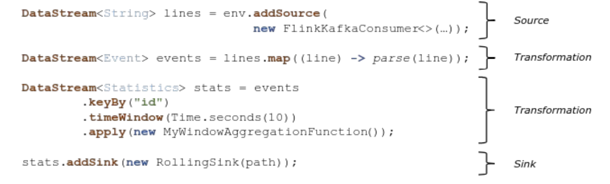

# Distribución y Coordinación de Procesos

## Coordinación de actividades

- Coordinación: Envio la mismas información a varios nodos y cada nodo realiza una transformación diferente.
- Replicación: Envio la misma información y la misma transformación a verios nodos. Puede servir para cuando tengo canales poco confiables, esta bueno por ejemplo tener 3 conexiones UDP que uno solo.

   

Mensajes que llegan en paralelo, le podemos dar un orden determinado para que sea deterministico.

   

## Open MPI | Introducción

Es un framework que usa un concepto de middleware orientado a mensajes en HPC, es de alta eficiencia.
Es muy complicado una vez que usas MPI cambiarlo a otra cosa.

- Basado en transmisión y recepción de mensajes.
- Ejecución transparente de 1 a N nodos.
- Se utiliza como una librería con abstracciones de uso general con foco en el cómputo distribuido
- Implementa un middleware de comunicación de grupos:
  - MPI_Recv, MPI_Send, MPI_Bcast, MPI_gather, etc.

Tenemos el nodo maestro, que es el que envia las instrucciones que tiene que hacer los nodods esclavos.
Los nodos esclavos se van a poder comunicar entre ellos.

   

### Send, Recv, Broadcast

En este caso lo que se esta viendo es un comportamiento similar a un fork, si soy el proceso padre el world_rank es 0, y si sino voy a ser el hijo.

Si soy el padre voy a estar enviando información, y si soy el hijo voy a estar recibiendo información.

El word_size va a estar determinado por el valor que se pase por paramentro a la hora de correr el programa, y el world_rank va a ser la forma en la que se corra el programa, en este caso "mpirun".

Ahora la ultima parte del código lo que hace es hacer un broadcasat, esta haciendo el broadcast en el caso de que sea tanto padre como hijo, la idea es que el código se ejecuta igual en todos los procesos, pero solo el que tenga el word_rank == root va a ser el que va a enviar la información. Los demás van a tener definida la variable. Dentro de la ultima linea se esta haciendo lo que haciamos con la lógica del fork.

   

### Scatter, Gather

- Scatter: Le envia un color a cada uno de los nodos, me permite distribuir los elementos en todos los nodos, para que todos puedan participar. El nodo raiz también se va a enviar información así mismo(en si entiendo que no se envia la información pero es la idea).

- Gather: Todos los nodos lo que van a hacer es enviar la información que tienen a un solo nodo.

   

### AllGather, Reduce

- AllGather: Todos se envian toda la información a todos. Todos tienen toda la información de una forma ordenanda.

- Reduce: Con el reduce se va a obtener una reducción de todos los datos

   

## Flink

### Introducción

- Plataforma para procesamiento distribuido de datos. Tiene un motor de ejecución.
- Incluye motor de ejecución de pipelines de transformación.
- Define framework Java/Scala para crear pipelines:
- SQL y Table API permiten definir tablas dinámicas (lógicas) con los flujos de datos y utilizar álgebra relacional
- Dataset y DataStream API permiten definir secuencias de procesamiento con formato DAG

### Coceptos básics

Dataflow: DAG de operaciones sobre un flujo de datos

- Streams: un flujo de información que puede no finalizar
- Batchs: un conjunto de datos (dataset) de tamaño conocido

   

### Bloques de un Pipeline

- Source: bloque capaz de inyectar datos al pipeline
- Transformation: también conocido como operador. Es un nodo de modificación de datos o filtrado de los mismos
- Sink: bloque de destino de la información. Almacenamiento final del pipeline

   

Cuando logro que todo se concatene voy a tener un dataFlow o un pipeline.

### Ventajas para streaming

Time window: Uso ventanas de tamaño fijo que se determina por un tiempo determinado, reporto la información que vi pasar en esa ventana.

Count window: No esta contando por el tiempo, sino por la cantidad de elementos que ve pasar

   

### Casos de uso

- Extract Transform Load (ETL): operaciones programadas de carga y modificación de datos para posterior análisis con origen y destino definidos en una DB. Da a que la orientación sea orientada a batchs.
- Data Pipelines: tareas de procesamiento recurrentes, basadas en la ocurrencia de eventos. En otras palabras, estamos pensando que hay una bdd real time(de eventos que estan ocurriendo).

   

## Beam

Modelo de definición de pipelines de procesamiento de datos con portabilidad de lenguajes y motores de ejecución (runners).
Soporta distintos lenguajes de programación:

- Java
- Python
- Go
  Soporta distintos Runners:
- Ejecución directa (Stand-alone o DirectRunner)
- Motores de cluster: Apache Hadoop, Apache Flink, Apache Spark
- Plataformas cloud: Google Dataflow, IBM Streams
