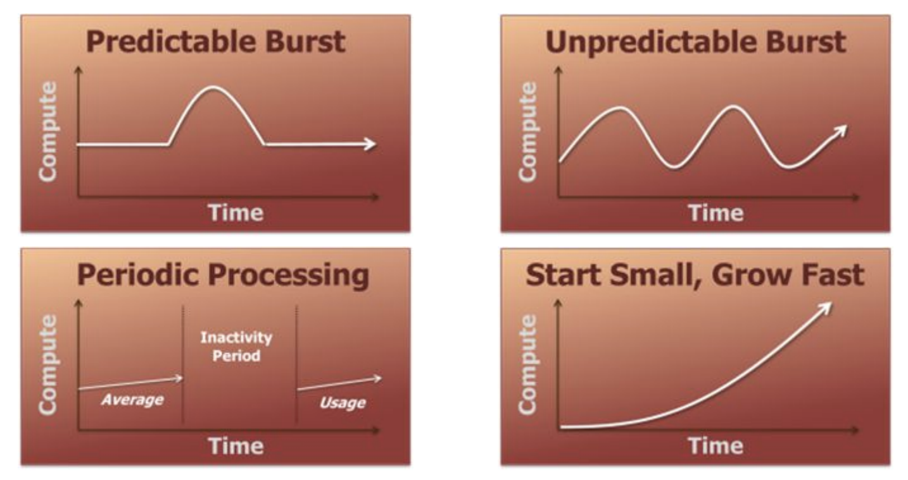
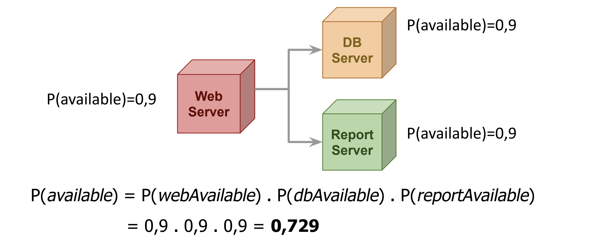
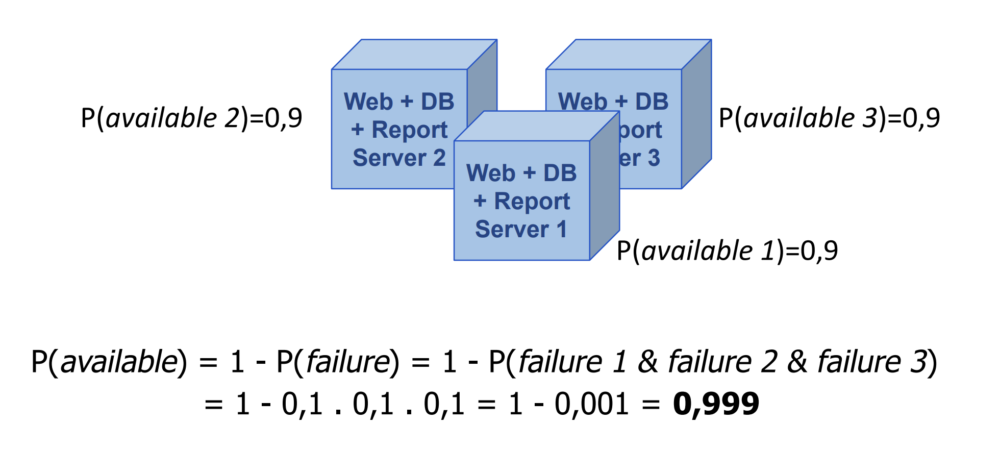
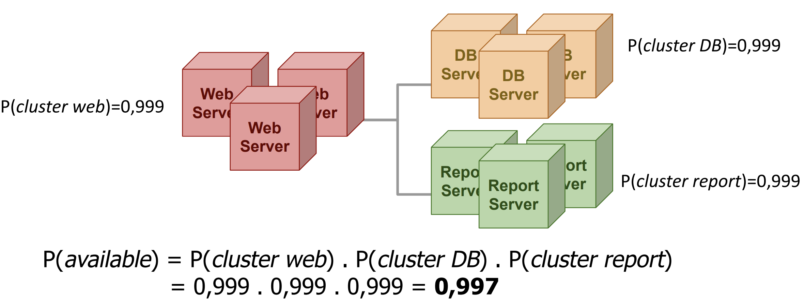
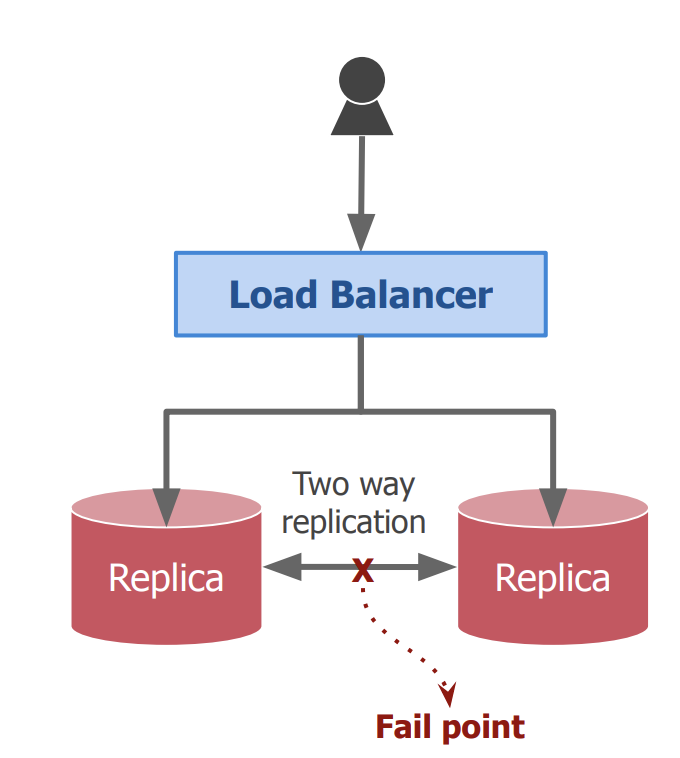
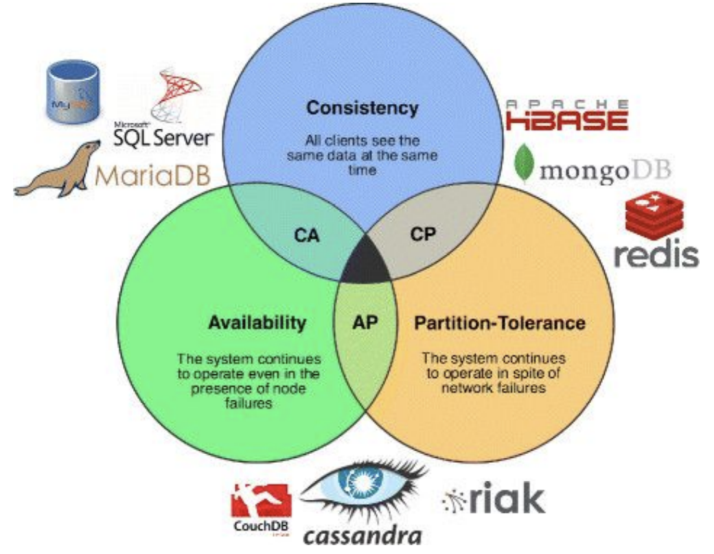

# Clase 9

## Escalabilidad

El objetivo de escalabilidad es el crecimiento,

- Respecto del tamaño: Agregando usuarios o recursos a controlar.
- Respecto de la distribución geográfica:
  - Permitiendo dispersión.
- Respecto de los objetivos administrativos del sistema: Nuevas sintaxis, semánticas y servicios ofrecidos.

## Caracteristicas de la plataforma

No siempre sirve con poner más computadoras.

- Plataformas de alta concurrencia(nos referimos a las plataformas cloud)

  - Aplicar en patrones ya conocidos y probados
  - Escalamiento automatico -- Se puede setear algunos limites --
  - Vinculación fuerte con una infraestructura

- Arquitecturas Ad-Hoc y personalizadas
  - Necesidad de configuración y soporte
  - Escalamiento manual o automatizado por humanos
  - Posibilidad de migraciones a distintas plataformas() --- si tengo un sistema de tiendas y lo que hago es subirme a una aplicación para que me de más computo. Puede pasar la situación en la que mi sistema quede atado a una plataforma de cloud, esto no es la idea.

Se busca no tener un "vendor loc" (buscar que es).

## Patrones de carga de aplicaciones web

   

- Predictable Burst: En este caso es cuando se que va a venir una subida de peticiones, se que viene y puedo actuar al respecto(puedo comprar más maquinas, alquilarlas temporalmente o más cloud para esta situación)
- Unpredictable Burst: No se en que momento van a estar las subidas de peticiones.
- Periodic processing: Algunos sistemas o partes de un sistema por las caracteristicas que tienen durante un periodo del día se encolan procesando datos, luego merman la actividad y luego vulve a arrancar(en el mismo día o al día siguiente). En este periodo en el que merma la actividad de una parte del sistema, lo que se puede hacer es aprovechar el computo para realizar otro tipo de tareas, como el procesamiento en batch de datos.
  - Ej:
    - El caso de una banco: Realizan unicamente las transferencias en horario bancario, entonces hay un periodo del día en el cual no estan realizando esa acción, esto no quiere decir que no esten haciendo otras cosas, pero si que no estan realizando transferencias.
    - La bolsa.
- Start Small. Grow Fast: Lo podemos relacionar con una Startup exitosa, que en primer lugar comienza con poca carga ya que tiene poca cantidad de usuarios, pero a medida que va creciendo la cantidad de usuarios, la carga del sistema va creciendo y se va adaptando a esta nueva carga. En este caso lo que se busca es que el sistema pueda crecer de forma rápida y eficiente.

**A cuanta capacidad tiene que estar un servidor?**

La idea es que depende de como es el comportamiento que recibe normalmente. Si yo se que es predecible y siempre es el mismo busco usar la mayor capacidad dejando siempre un margen para imprevistos. Pero en el caso que yo se que tengo comportamiento impredecible va a pasar que si tengo el servidor utilizandolo cerca del 100% no voy a poder llevar adelante esta subida de recursos a utilizar para cumplir lo esperado.

## Limitaciones

Los canales por los que estas intercambiando mensajes tienen la latencia esperada?
Ancho de banda -- capacidad de información que puedo enviar en paralelo

- Arquitecturas y algoritmos: Si la arquitectura no esta bien diseñada, no voy a poder escalar. Si tengo un algoritmo que no es eficiente, no voy a poder escalar.

- Red (latencia de ancho de banda): Tenemos un sistema que esta dando un servicio y podemos vernos limitados por el ancho de banda que tenemos disponible. Nos llegan más request de lo que podemos procesar, pero también nos llegan más datos de lo que nuestra red física soporta(no tanto de los datos que entran en el sistema, sino que de la forma que yo lo proceso dentro del sistema).

- Datos(4 V´s --> Volumen, Velocidad, Variedad y Veracidad):

  - Volumen: Cantidad de datos que se manejan. Si tengo un sistema que maneja muchos datos, voy a necesitar más recursos para poder procesarlos.
  - Velocidad: La velocidad con la que llegan los datos. Si los datos llegan muy rápido, voy a necesitar un sistema que pueda procesarlos en tiempo real.
  - Variedad: Tipos de datos que se manejan. Si manejo diferentes tipos de datos, voy a necesitar un sistema flexible que pueda adaptarse a estos cambios.
  - Veracidad: Calidad de los datos. Si los datos no son confiables, el sistema puede fallar.

  Tenemos que procesar datos y almacenar datos en nuestro sistema, y si no entedemos o no medimos bien cual va a ser el volumen de los datos recibidos nos podemos llegar a encontrar con los siguientes problemas:

  - Problema de capacidad:no podemos almacenar más información.
  - Problema de procesamiento: Puedo almacenar la información que recibo, pero no tengo la capacidad de computo para hacer el procesamiento en real-time(no lo puedo hacer en el tiempo que se espera). Por lo tanto nuestro sistema empieza a fallar.

- Restricciones legales y de negocio: Ej:

  - Redistribución de datos medicos. Son sensibles y no se pueden estar pasando porque si. Un caso puede ser que un usuario se va de viaje y tiene un accidente en otro país, entonces yo quiero pasasr la información medica del usuario de antemano para evitar la latencia, pero esto no se puede hacer justamente porque no se puede estar compartiendo libremente este tipo de información.

  - Restricciones entre paises: En algunos países no se pueden compartir datos entre ellos, por lo que si tengo un sistema que maneja datos de diferentes países, tengo que tener en cuenta estas restricciones.

## Tecnicas

- Escalamiento vertical: Agregar recursos a un nodo. Más RAM, compro una maquina que tenga más recursos o agrego más recursos a la existente.

- Escalamiento horizontal: Más nodos. Se necesita que la arquitectura del sistema este preparada para esto. Agrego más nodos al sistema, y estos nodos pueden ser iguales o diferentes.

  - Se necesita redundancia. En lugar de tener un servidor que se encargue de manejar la peticiones de los usuarios, tener varios nodos que se encaguen de esto y tener la capacidad de hacer el balance de carga entre ellos.

  - Balanceamento de cargas: Distribuir las peticiones entre los nodos disponibles para evitar que un nodo se sature y otros queden sin uso.

  - Proximidad geografica -- siempre esta la información donde se necesita, puedo encofar a los recursos en donde más lo necesito. Puedo llevar la arquitectura a las zonas donde más lo necesito.

- Optimización de algoritmos(cuando estoy dentro de una misma computadoras)

  - Performance
  - Mesajeria
    - Resuelvo bien las consultas, no envio mensajes de forma innecesaria
    - Buena coordinación de mensajes.

- Fragmentación de los datos

  - Fraccionar para optimizar -- pasar la información necesaria solo a los nodos que la requieren.
  - Manetener juntos datos "cargados"

- Asincronismo

  - Mantener sincronico unicamente lo estrictamenxte necesario.
  - Limitado por el negocio. Si el negocio permite que tengamos un sistema asincronico, podemos aprovechar esto para mejorar la escalabilidad del sistema. Por ejemplo, si tenemos un sistema de reservas de vuelos, podemos hacer que el usuario no tenga que esperar a que se confirme su reserva, sino que pueda seguir navegando por el sitio y recibir la confirmación más tarde.

- Componentización
  - Separar servicios. En lugar de tenenr un sistema monolítico, separar los servicios en diferentes componentes que puedan escalar de forma independiente. Esto permite que cada componente pueda escalar de forma independiente y adaptarse a las necesidades del sistema. Es importante que estos se puedan comunicar entre ellos de forma eficiente y que se puedan integrar de forma sencilla.

## Elasticidad

- Escalabilidad
  - Capacidad de un sistema para poder adaptarse a diferentes ambientes (environments) modificando los recursos del sistema
  - Término utilizado en muchos contextos

En terminos de la materia y del trabajo practico sería que nosotros podemos configurar nuestro sistema, la arquitectura inicial que vamos a utilizar, para poder adaptarnos a diferentes situaciones de carga y procesamiento(para adaptarnos a diferentes patrones de carga).

- Elasticidad
  - **Capacidad de un sistema para poder modificar dinámicamente los recursos del sistema adaptándose a patrones de carga**
  - Término utilizado en Arquitecturas Cloud. Requiere soporte de la infraestructura

Tener en cuenta en modificar dinamicamente los recursos del sistema para adaptarse a patrones de carga. Me viene 3 usuarios más y lo que quiero es escalar lo más rapido posible en un tiempo razonable para poder procesar la información.

### Componentes

- Application Load Balancer

  - Servicios / instancias nuevas reciben tráfico
  - Servicios / instancias dados de baja / caídos / degradados dejan de recibir
    tráfico
  - Cómo detectamos estado de un servicio / instancia ?
  - El reporte de cada nodo lo hace el mismo, pero el encargado del reporte de todo el sistema es el middleware.

- Autoscaler

  - Scale In/Scale Out en función de las métricas recolectadas, esta constantemente recicbiendo las metricas de servicios / instancias y cuando se cumple cierta condición, realiza una acción, ya sea para el aumento como la diminución de recursos utilizados.
  - Scale Out: Incrementa instancias
  - Scale In: Decrementar instancias

- Monitoring Automático
  - Métricas sobre CPU, memoria, I/O, networking, etc. por cada servicio / instancia

## Ejemplos

### AWS

- Application Load Balancer (Amazon Elastic Load Balancer)

  - Redirecciona tráfico a instancias (EC2), incluso en diferentes zonas
  - Interactúa con instancias para verificar estado (/status endpoint). Se comunica a través del endpoint para verificar su estado y determinar si esta instancia esta activa o no, y así poder redirigir el tráfico a las instancias que estén activas.

- Autoscaler (Amazon Autoscaling)
  - Autoscaling group permite definir min, desired and max instances
  - Diferentes policies para lograr diferentes objetivos (dynamic vs manual scaling)
- Monitoring Automático (Amazon CloudWatch)
  - Métricas globales automatizadas
  - Admite agregar métricas propias

## Alta disponibilidad y tolerancia a fallos

## Alta disponibilidad

Aún cuando ciertas propiedades de confiabilidad fallen para sistemas públicos, nos interesa que siempre estén disponibles:

P(system available ) = 1- P(failure)

Como P(system available ) < 1 siempre, lo importante es definir cuán cerca de 1 se encuentra:

- P(system available) ~ 0,9 => 36,5 días caídos al año
- P(system available) ~ 0,999 => 8,76 horas caídas al año

            La disponibilidad de un sistema se mide por la cantidad de 9’s

No se puede tener probabilidad 1 de estar disponible.

## Calculo de 9's

### Escenario 1 - Sistema distribuido con un componente por nodo

   

### Escenario 2 - Sistema con redundancia con todos los componentes en cada nodo.

   

Cada un a de las unidades es autosuficiente, por lo tanto para que nuestro sistema se encuentre caido los 3 nodos tienen que estar caidos al mismo tiempo.

Tiene una muy buena dispobilidad. Pero no podemos normalmente que nuestro sistema cumpla con esta estructura, por ejemplo hacer que la bdd se distribuya de esta forma en todos los nodos de forma independiente.

### Escenario 3 - Clusters - Sistemas distribuidos con clusters oara cada componente

La evolución natural de este despliugue es hacer high avaiable cada una de las cajas(cada uno de los nodos) sin mezclar a las mismas.

   

### Terminología en la empresa

- SLA: Service Level Agreement
  - Contrato / Acuerdo de disponibilidad pactado con el cliente
  - Definición de qué sucede si el mismo no se respeta (e.g. BigQuery SLA)
- SLO: Service Level Objectives
  - Lo que se debe cumplir para no invalidar el SLA
  - E.g. Availability > 99.95%
- SLI: Service Level Indicators
  - Métricas a ser comparadas con los SLOs
  - Siempre deben ser superiores al threshold del SLO
  - Por lo general requiere una plataforma de observability
  - Analizar impacto del despliegue de los servicios

## CAP Theorem - Problema frente a particiones

En sistemas distribuidos con almacenamiento es posibe garantizar solo 2 de los sigiuente atributos:

- Consistencia: También conocido como repetibilidad de respuestas de todos los nodos frente a un mismo pedido. Si uno tiene datos replicados en distintos nodos cuando vaya a pegarle a cada uno de los nodos todos me van a devolver con el mismo pedido.

- Avaiability: Capacidad del sistema de responder a cualquier pedido. Le pego a un nodo de mi sistema que no este caido y me va a responder algo, la data puede ser que no sea la correcta.

- Partition tolerance: Capacidad de lidiar con la formación de grupos aislados de nodos. Tuve la posibilidad de poder partir mis datos y hacer que algunas instancias me devulevan un dato y otros que me devuelvan otro.

   

### Ejemplos

- Se puede sacrificar Consistency o Availability. Pero no necesariamente es todo o nada.
- Sacrificar Particion Tolerance significa no proveer un sistema distribuido.

   

- CA: vamos a tener las bdd relacionales, que estan todas en un mismo nodo que tienen mucho hardware que no tienen problemas de partition tolerance porque no estan particionados.

- CP: para que nuestro sistema sea tolerante a particiones y consistente vamos a tener distintas replicas de nuestro sistema y vamos a tener un algoritmo de consenso para que todas las replicas se pongan de acucerdo. Este sistema no tiene alta disponibilidad ya que tiene que haber un lider y este lider se puede caer, por lo tanto durante el lider se cae los demás nodos tienen que ponerse de acuerdo para elegir un nuevo lider y en este intervalo de tiempo el sistema no va a estar disponible. Recién cuando se elige un nuevo lider es cuando vuelve al funcionamiento.

- AP: Tomamos el caso de Cassandra. Funcionan teniendo en cuenta que un dato se commitea en la bdd cuando un cierto porcentaje de las particiones ya poseen el dato guardado, entonces en este caso no hay un lider, sino que hay un porcentaje de los nodos que tiene el dato actualizado. Entonces me puede pasar la situación que si consulto a dos nodos diferentes no obtenga la misma información.

# Evolución de arquitecturas

## COMPLETAR
