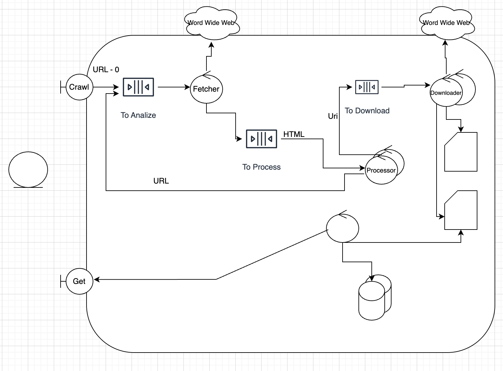

# Web Crawler

## Requerimientos Funcionales

- Dada una URL, obtener el HTML y analizarlo.
- Detectar nuevas URLs e identificar archivos multimedia, documentos y otras páginas Web.
- Descargar los archivos multimedia (.jpg, .png, .mp3, .ogg, etc)
- Descargar los documentos (.pdf, .odt, etc)
- Agendar el procesamiento de las nuevas páginas Web encontradas
- Detener el análisis de nuevos links luego de N anidaciones.

## Requerimientos No Funcionales

- Las descargas y el análisis se deben ejecutar en paralelo.
- Realizar un monitoreo constante en un archivo de texto con cantidades de:
  - URLs analizadas
  - Archivos descargados por extensión
  - Procesos en cada uno de los siguientes estados:
    - Obteniendo HTML
    - Procesando HTML
    - Descargando recurso

## Requerimientos(concat)

- Dada una URL, obtener el HTML y analizarlo.
- Detectar nuevas URLs e identificar archivos multimedia, documentos y otras páginas Web.
- Descargar los archivos multimedia (.jpg, .png, .mp3, .ogg, etc)
- Descargar los documentos (.pdf, .odt, etc)
- Agendar el procesamiento de las nuevas páginas Web encontradas
- Detener el análisis de nuevos links luego de N anidaciones.
- Las descargas y el análisis se deben ejecutar en paralelo.
- Realizar un monitoreo constante en un archivo de texto con cantidades de:
  - URLs analizadas
  - Archivos descargados por extensión
  - Procesos en cada uno de los siguientes estados:
    - Obteniendo HTML
    - Procesando HTML
    - Descargando recurso

## Resolución -- A completar

Un web crawler es un programa que navega automáticamente por Internet para recopilar información de páginas web. Es la base de motores de búsqueda como Google, pero también se usa en muchas otras aplicaciones, como análisis de datos y monitoreo de cambios en sitios web.

- Es un programa que se encarga de navegar por la web y recolectar información.
- Como arranca el sistema - alguien entra a la pagina(URL) y le dice que empiece a navegar.
- Arranca el fetch de la URL.

Quiero hacer pasos más grandes e ir rapido.

### Pasos:

Aplicación cliente donde esta el web crawler.

1. Este le pasa a un sistema el pedido
2. esto va a entrar en una queue
3. y va a haber un sistema que va a estar procesando estos pedidos para poder hacer alguna de las tareas(por ejemplo el fetch), este va a ser el fetch controller.

Diagrama de robustez:

- Control(Controler) -- ejecutar == CPU == algo vivo haciendo computo -- procesamiento de información
- Entity -- algo que tiene estado y que se puede guardar en una base de datos
- Boundary -- algo que se comunica con el exterior. Capa limite de cierto sistema, con la cual se comunica con el exterior.

   

### Algunas definiciones

- **URL**: Uniform Resource Locator, es un tipo de URI, pero con la particularidad de que siempre proporciona una manera de acceder al recurso. Incluye el protocolo (HTTP, HTTPS, FTP, etc.), el dominio o IP, y opcionalmente un path hacia el recurso.
- **URI**: Uniform Resource Identifier, es un identificador general que puede referirse a cualquier recurso en la web, ya sea una página, un archivo, un correo, etc. Puede ser local o remoto, y no necesariamente tiene que ser accesible a través de la web.
