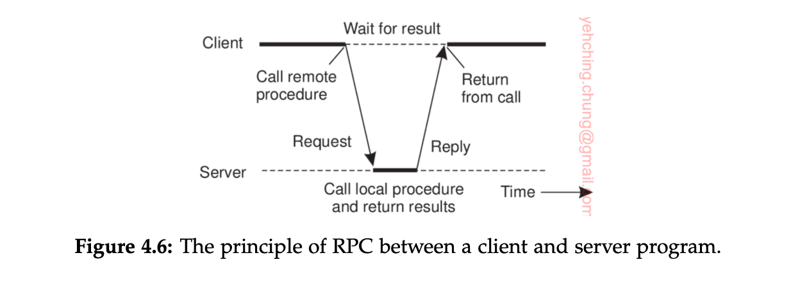
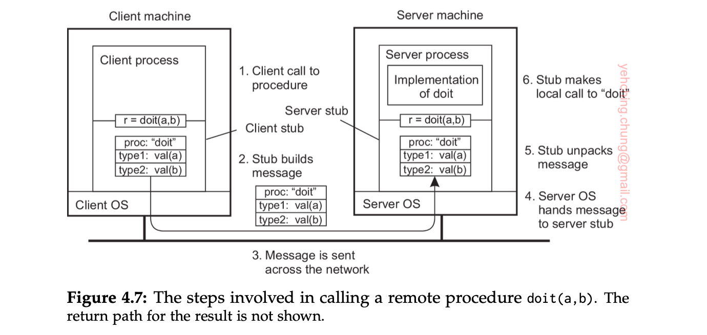
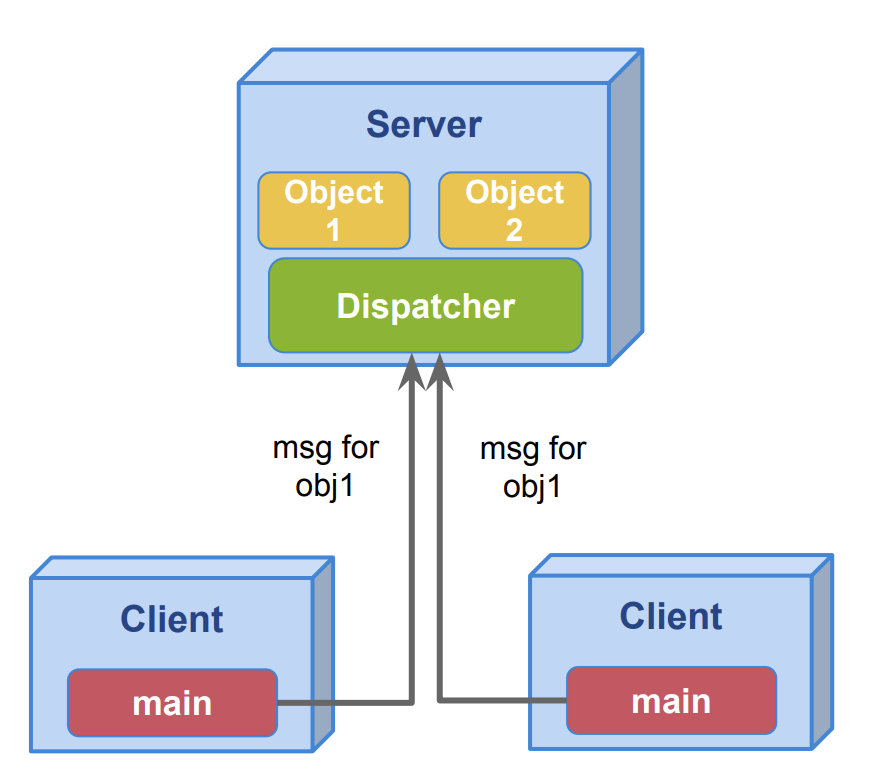
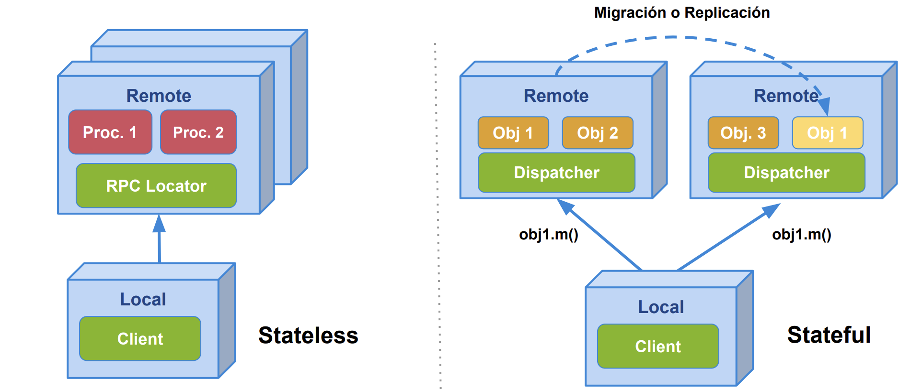
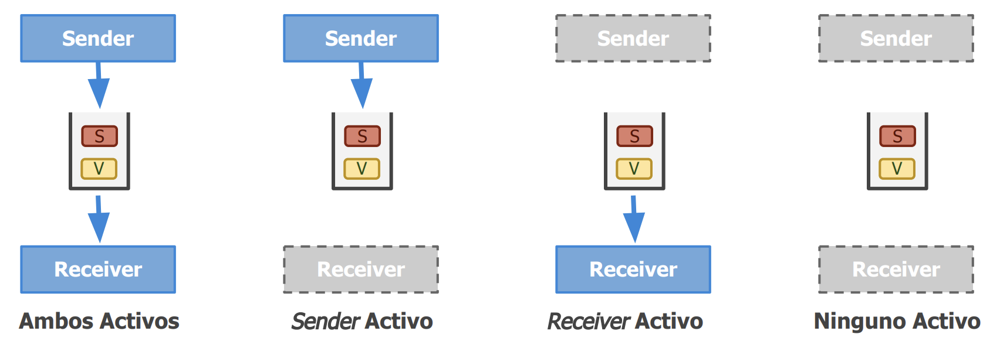

# Comunicación

## Tipos de comunicación

Antes de hablar de los servicios de comunicación de alto nivel en middleware, es importante entender algunos criterios generales para clasificar los tipos de comunicación.

El middleware se puede ver como un servicio adicional en un modelo cliente-servidor. Por ejemplo, en un sistema de correo electrónico, el middleware sería el sistema de entrega de mensajes entre usuarios, funcionando como un servicio intermedio que permite enviar y recibir correos aun cuando los usuarios no estén activos al mismo tiempo.

### Comunicación persistente vs. transitoria

Comunicación persistente:
El mensaje se almacena en el middleware hasta que pueda ser entregado al destinatario. No es necesario que el emisor o el receptor estén activos al mismo tiempo. Ejemplo: correo electrónico.

Comunicación transitoria:
El mensaje solo se mantiene mientras ambas aplicaciones (emisor y receptor) estén activas. Si el receptor no está disponible, el mensaje se pierde. Es típico de servicios de transporte como TCP/IP.

### Comunicación sincrónica vs. asincrónica

Comunicación asincrónica:
El emisor no espera una respuesta; sigue ejecutándose después de enviar el mensaje. El mensaje se almacena temporalmente en el middleware.

Comunicación sincrónica:
El emisor espera hasta cierto punto antes de continuar. Puede esperar:

- Hasta que el middleware acepte el mensaje.

- Hasta que el mensaje llegue al receptor.

- Hasta que el receptor procese el mensaje y devuelva una respuesta.

### Combinaciones comunes

En la práctica, se combinan distintos tipos de persistencia y sincronización:

Persistente + sincrónica al enviar: común en sistemas de colas de mensajes.

Transitoria + sincrónica hasta recibir respuesta: corresponde al modelo de Remote Procedure Call (RPC).

# RPC (Remote Procedure Call)

RPC es un modelo de comunicación que permite a un programa ejecutar procedimientos en otro espacio de direcciones, como si fueran locales. El cliente realiza una llamada a un procedimiento remoto, y el servidor responde con el resultado.

En resumen, la propuesta consistía en permitir que los programas pudieran llamar a procedimientos ubicados en otras máquinas. Cuando un proceso en la máquina A llama a un procedimiento en la máquina B, el proceso que hace la llamada en A se suspende, y la ejecución del procedimiento llamado ocurre en B. La información puede trasladarse del que llama al que recibe mediante los parámetros, y puede regresar como resultado del procedimiento. El paso de mensajes no es visible para el programador en absoluto. Este método se conoce como llamada a procedimiento remoto, o simplemente RPC.

La idea es que una llamada a un procedimiento remoto se vea igual que una llamada local. El programador no debería notar que el procedimiento se ejecuta en otra máquina. Toda la lógica de envío y recepción de mensajes está oculta



### Ejemplo de RPC

Imaginemos que tenemos un procedimiento llamado `append` que agrega un elemento a una lista. Si este procedimiento se ejecuta en la misma máquina, simplemente se llama directamente:

```python
lista = []
def append(element):
    lista.append(element)
```

Cuando append es remoto, el programa no llama directamente al procedimiento real, sino a un stub(fragmento de código que actúa como intermediario entre el programa del usuario y la función remota) del cliente, que simula la llamada local.

Este stub:

1. Empaqueta los parámetros en un mensaje.
2. Envía ese mensaje al servidor.

En el servidor:

1. El sistema operativo entrega el mensaje a un stub del servidor.
2. El stub del servidor desempaqueta los parámetros y llama al procedimiento real.
3. El resultado se empaqueta en otro mensaje y se envía de vuelta al cliente.
4. El stub del cliente recibe el mensaje, desempaqueta el resultado y lo entrega al programa como si fuera una función local.

#### Pasos de una llamada RPC



1. El cliente llama al stub del cliente como si fuera una función normal.
2. El stub crea un mensaje con los parámetros.
3. El SO del cliente envía el mensaje al SO del servidor.
4. El SO del servidor lo pasa al stub del servidor.
5. El stub llama al procedimiento real con los parámetros.
6. El procedimiento ejecuta y devuelve un resultado.
7. El stub del servidor empaqueta el resultado.
8. El SO del servidor lo envía al cliente.
9. El cliente recibe el mensaje.
10. El stub del cliente desempaqueta el resultado y se lo da al programa.

El RPC permite que los programas llamen funciones remotas como si fueran locales, ocultando toda la complejidad de la red. Esto facilita el desarrollo de aplicaciones distribuidas sin exponer al programador al manejo de mensajes, sockets o protocolos.

### IDL(Interface Definition Language)

La IDL (Interface Definition Language) es un lenguaje especializado que se utiliza para describir las interfaces (funciones, métodos, estructuras de datos, etc.) que pueden ser llamadas de manera remota entre programas que pueden estar escritos en lenguajes diferentes y ejecutándose en máquinas distintas.

🧩 ¿Para qué sirve la IDL?
En el contexto de sistemas distribuidos o RPC, la IDL permite definir qué funciones existen, qué parámetros reciben, y qué devuelven, sin importar el lenguaje en el que están implementadas.

📌 Objetivo principal: que el cliente y el servidor puedan comunicarse correctamente, aunque estén en lenguajes o plataformas distintas.

🧠 ¿Cómo funciona?
El desarrollador escribe una interfaz en IDL. Por ejemplo:

```idl
interface Calculadora {
int sumar(int a, int b);
float dividir(float a, float b);
}
```

A partir de esa definición, se generan automáticamente:

- El stub del cliente.

- El stub del servidor.

- El código de serialización/deserialización (para enviar datos por la red).

Luego, cada parte del sistema puede implementar su lógica en el lenguaje que desee (C++, Java, Python, etc.), pero todos usan la misma definición de la interfaz.

#### Algunas características principales

- Diseñados para permitir que diferentes lenguajes puedan invocarse entre sí
- Interfaz definida en función de datos de entrada (Input) y datos de salida (output)
  - Acceso a métodos permitido
  - Pasaje de variables por valor
  - Punteros no permitidos
- Definición de tipos de mensajes a enviar como para del IDL
- Ejemplo: google protocol buffers

### Tolerancia a fallos

Pueden fallar por cuestiones de red

- A diferencia de Local Procedure Calls (LPCs), un procedimiento puede o no ser ejecutado
- Diferentes estrategias para garantizar Delivery de mensajes:
  - Request-Retry con Timeout
  - Filtrado de operaciones duplicadas
  - Retransmisión / Re-ejecución de operación si se pierde retry

Según las estrategias adoptadas para asegurar el delivery de mensajes, los mensajes pueden llegar a ser recibidos 0, 1 o muchas veces:


# Objetos Distribuidos

- Los servidores ya no proveen servicios sino objetos
- Existe un middleware que oculta la complejidad de:

  - Referencias a Obj. remotos
  - Invocación de acciones
  - Errores (excepciones)
  - Recolección de basura

El usuario piensa que pasa en un su maquina pero en realiadad no es así. Los objetos están distribuidos en diferentes máquinas. El dispacher es el que se encarga de hacer la comunicación entre los objetos. El cliente no tiene que preocuparse por la comunicación, el cliente solo tiene que preocuparse por la lógica de negocio.

<div style="text-align: center;">
   
</div>

## RPC vs Objetos Distribuidos

<div style="text-align: center;">
   
</div>

RPC: Al hablar de funciones dentro de una computadora, tenemos la ventaja de que tenemos un sistema stateless, no tenemos que preocuparnos por el estado de la función(puedo comunicarme con cualquier maquina sin ningun problema). En el caso de los objetos distribuidos, tenemos que preocuparnos por el estado del objeto, y eso implica que tenemos que tener un sistema stateful. Los servidore van a tener una parte de la verdad, y estos objetos hay que ubicarlos, hay que saber a que servidor hablar para que me de acceso a ese objeto. Entonces si yo me equicovo de servidor no voy a poder hacer nada.

En el segundo caso, lo que se puede hacer es migrar el objeto a la maquina que lo necesita(el trafico que estaba recibiendo cuando hago esto se detiene hasta que termino la transición y tengo que comunicar que ya no tengo más a ese objeto).

# Comunicación orientada a mensajes

## The message-Pasing interface

En la busqueda de escribir aplicaciones de alta eficiencia se busco operaciones orientadas a mensajes que lo permitieran.

Los sockets para este caso son insuficientes por dos razones:

- Nivel equivocado de abstracción ya que solo soportan operaciones basicas de envio y recepción de mensajes
- Los sockets fueron diseñados para comunicarse a traves de la red con el protocolo de proposito general TCP/IP. Lo cual no es suficiente para los protocolos desarrolados para las redes de interconección de alta velocidad.

Como resultado fue que las redes de interconección de alta velocidad desarrollaron sus propias interfaces de paso de mensajes, que son más eficientes que los sockets. Pero dio lugar a un problema de compatibilidad. Por lo tanto aparecio la interfaz de paso de mensajes (MPI), que es un estándar para la comunicación entre procesos en sistemas distribuidos.

Tiene las siguientes características:

- Esta diseñaada para aplicaciones paralelas y distribuidas.
- Tiene un uso directo de la red subyacente.
- Asume que los errores como crash de procesos o particiones de red son fatales y por lo tanto no tiene mecanismos de recuperación asociado.

Cuando hablamos de la transferencia de mensajes con MPI, podemos encontrar tanto operaciones sincronicas como asincronicas. En ambos casos, no tenemos una queue de mensajes en donde se van encolando cada uno de los mensajes, sino que lo que se hace al enviar un mensaje es hacer una copia en el buffer local en el MPI runtime system, y luego el runtime de MPI se hace cargo de remover el mensajes del buffer y transmitirlo a través de la red.

## Message-oriented persistent communication(MoM)

- Funcionan como un sistema de messajeria entre las aplcaciones que usen el midleware.
- Pueden enviarse mensajes bajo cierto "tópico" para que aquellos intereados los reciban(inforamtion Bus). INVESTINGAR
- Pueden enviarse mensajes con un destinatario definido (modo queue).

Provee un extenso soporte de comunicación asincrónica y persistente entre aplicaciones distribuidas. Permite que las aplicaciones se comuniquen a través de mensajes, sin necesidad de que estén activas al mismo tiempo.

La esencia de MoM es que los mensajes se almacenan en un sistema de mensajería, lo que permite que los procesos envíen y reciban mensajes en diferentes momentos. Esto es especialmente útil en sistemas distribuidos donde los procesos pueden estar en diferentes máquinas o incluso en diferentes redes. No es necesario que ambas entidades(sender y receiver) estén activas al mismo tiempo, lo que permite una mayor flexibilidad y escalabilidad en la comunicación.

Una diferencia importante con los sockets y con MPI es que MoM esta orientado a soportar transferencia de mensajes que pueden llegar a tomar minutos en lugar de segundos o milisegundos.

La idea basica de este modelo es que en sender inserta el mensaje en la queue de mensajes del receiver con el cual se quiere comunicar, es importante destacar que se da la garantia al emisor que el mensajes se va a insertar en la queue pero no que el receiver vaya a procesar este mensaje. Luego el receiver puede leer el mensaje de la queue en cualquier momento, incluso si el sender ya no esta activo. Esto permite que los mensajes se almacenen de manera persistente y se procesen en un momento posterior.

En una primera implementación cada uno de las identidades tiene una queue asociada, pero puede suceder la situación en la que varias entidades compartan una misma queue.

- Implementan la comunicación de grupo de forma transparente a las aplicaciones que la requieren.
- Basan su funcionamiento en el simple concepto de comunicar mensajes entre aplicaciones.
- Resuelve problemas de transparencia respecto de ubicación, fallos, performance y escalabilidad.

<div style="text-align: center;">
   
</div>

## Centralizado vs Distribuido

<div style="text-align: center;">
   
</div>

## Bus de Información vs Colas de Mensajes

Tengo dos aplicaciones, en la primera le interesan los dos tipos de paquetes, a la otra aplicación le interesa solo un tipo de paquete, pero emite los dos.

Tengo que hay una aplicación que solo escuchan, y que no producen. Puede pasar la situación en la que hay un productor pero no hay un consumidor, por lo cual esto puede ser un problema(pierde los paquetes producidos). En el bus no se retienen los mensajes.

En cambio en el segundo caso, lo que se hace es el modelo de colas es que el que tiene que pushear a las colas correspodientes para que las demás entidades lo puedan popear de su propia cola. Es importante notar en este caso que cada una de las entidades(puede ser más de una maquina)tiene su propia cola para poder consumir.

<div style="text-align: center;">
   
</div>

## MOM Sincrocnico

<div style="text-align: center;">
   
</div>

**Pros**

- Se modela como una conexión punto a punto
- Permite obtener respuestas instantáneas a pedidos concretos

**Contras**

- No permite implementar transparencia frente a errores. Puede intentar de reconectarse varias veces, y no lo puede resolver. Es bloqueante.

## MOM Asincronico

**Pros**

- Se modela naturalmente con colas
- La arquitectura soporta períodos de discontinuidad del transporte

<div style="text-align: center;">
   
</div>
Es necesario tener un storage para poder guardar las cosas que tengo en el aire, esto puede pasar en el caso de que el cliente que estaba conectado se desconecto, porque si esta conectado no va haber casi nada en el aire.

**Contras**

- Es complejo recibir respuesta a pedidos realizados (mínimamente es necesario contar con colas para el retorno de info).

<div style="text-align: center;">
   
</div>

No esta diseñado para que el cliente espere la respuesta, sino que el cliente hace un pedido y se va.

### Operaciones de un MOM

- put: publicación de un cierto mensaje
- get: esperar hasta que un mensaje sea detectado. Luego, eliminarlo de la cola y retornarlo
- poll: revisar mensajes pendientes, sin bloquear
- notify: asociar un callback utilizado por el MOM para ser ejecutado frente a publicación de ciertos mensajes

## Colas de mensajes y Brokers

- Pueden existir varias definidas dentro del MOM
- Tienen nombre y longitud definidas
- Los clientes suelen contar con colas privadas intermedias
- Garantía al Emisor de que el mensaje será insertado

<div style="text-align: center;">
   
</div>

### Broker(intermediario)

- Proveen transparencia de localización tanto al Emisor como al Receptor.
- Soportan lógica en el middleware para filtrar y modificar mensajes.
- Brindan un punto de control y monitoreo.

<div style="text-align: center;">
   
</div>

Intercepta los paquetes, los filtra y los modifica. No siempre es FIFO.

- Proveen transparencia de localización tanto al Emisor como al Receptor.
- Soportan lógica en el middleware para filtrar y modificar mensajes.
- Brindan un punto de control y monitoreo

Una de las aplicaciones más importantes de los sistemas de colas de mensajes es la integración de aplicaciones nuevas y existentes dentro de un sistema distribuido coherente. Para que esto funcione, las aplicaciones deben entender los mensajes que reciben, lo cual implica compartir no solo el formato sino también la semántica de los mensajes: deben hablar el mismo “lenguaje” o protocolo.

El problema surge cuando una nueva aplicación con su propio protocolo se une al sistema. Para comunicarse con las demás aplicaciones, habría que desarrollar convertidores de mensajes entre cada par, lo que escalaría a N × N convertidores en un sistema con N aplicaciones.

La solución práctica es aceptar las diferencias y facilitar la conversión de mensajes mediante componentes especializados llamados **brokers de mensajes**. Estos brokers funcionan como puentes entre aplicaciones, transformando los mensajes al formato que la aplicación destino puede entender. A veces solo cambian el formato (por ejemplo, delimitadores de registros o longitudes de campos), pero en casos más complejos pueden incluir plugins que manejan múltiples protocolos.

En contextos empresariales avanzados, los brokers también gestionan la integración de aplicaciones mediante un modelo publicador-suscriptor: las aplicaciones publican mensa sobre ciertos temas, y los brokers los distribuyen a las aplicaciones que se hayan suscrito a esos temas.

Finalmente, la lógica del broker se basa en reglas de transformación, almacenadas en un repositorio. Aunque muchos productos comerciales ofrecen herramientas sofisticadas para construir estas reglas, la “inteligencia” real proviene de los expertos que las definen y configuran.
